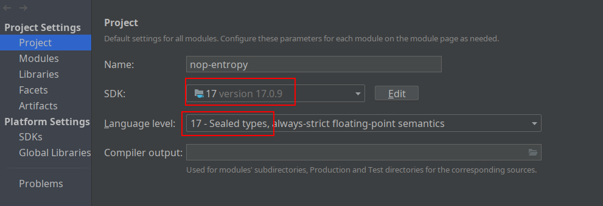
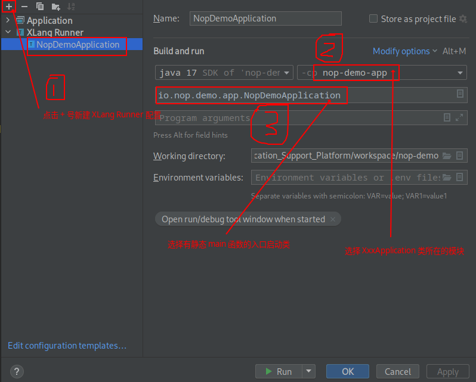
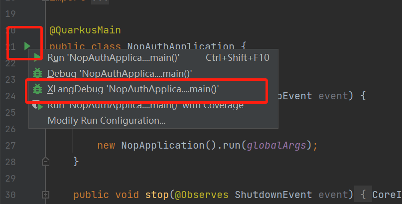
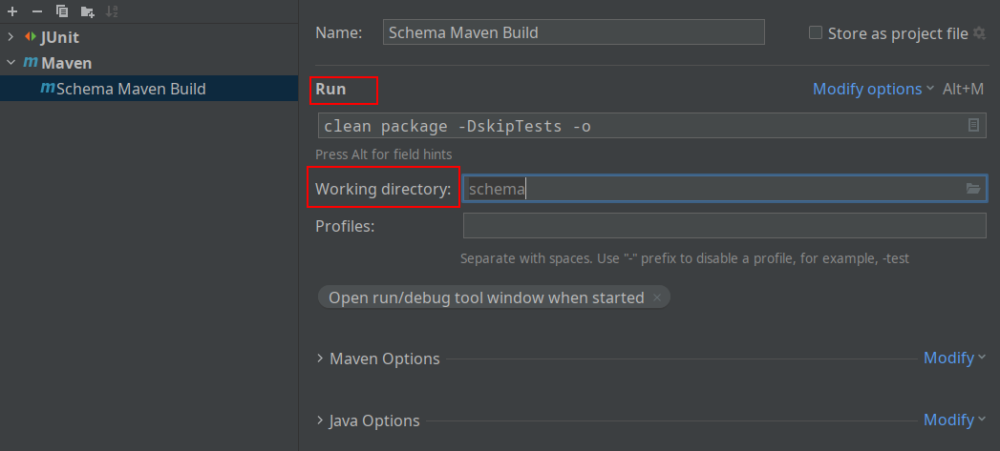

import Header from '@site/docs/\_header.md';

<Header />

> 可以直接按照 https://nop.repo.crazydan.io/
> 的说明在本地开发环境中引入其提供的 Maven 仓库，以快速进行项目开发。

## 源码构建 {#local-building}

环境要求：

- JDK 17+
- Maven 3.9.3+

本地构建并发布：

```bash
# 注意，请根据当前运行环境修改 JDK 17+ 的安装路径
export JAVA_HOME=/usr/lib/jvm/java-17-openjdk

git clone https://gitee.com/canonical-entropy/nop-entropy

cd nop-entropy
mvn clean install -DskipTests -Dquarkus.package.type=uber-jar
```

> 以上命令也是为了便于拉取 Maven 依赖包，避免 IDEA 下载依赖出现问题。

在 IDEA 导入项目后，需调整项目配置（File -> Project Structure...）：



> 确保 IDEA 的 Maven 配置（`File -> Settings -> Build, Execution, Deployment -> Maven -> Local repository`）
> 指向了与 `mvn` 命令相同的仓库路径。

## Nop IDEA 插件构建 {#idea-plugin-building}

```bash
# 注意，请根据当前运行环境修改 JDK 17+ 的安装路径
export JAVA_HOME=/usr/lib/jvm/java-17-openjdk

cd nop-idea-plugin
bash ./gradlew buildPlugin
```

> 可以直接下载并使用每日构建的该插件安装包
> [nop-idea-plugin-1.0-SNAPSHOT.zip](https://nop.repo.crazydan.io/nop-idea-plugin-1.0-SNAPSHOT.zip)。

构建完成后，进入 IDEA 的插件管理（`File -> Settings -> Plugins`），
点击齿轮图标，并选择 `Install Plugin from Disk ...`，再选中构建的插件
`nop-idea-plugin/build/distributions/nop-idea-plugin-1.0-SNAPSHOT.zip`
以安装到 IDEA 中。

安装后，需要清空 IDEA 缓存并重启：`File -> Invalidate Caches...`。

在启动 XLang 调试之前，需要为带静态 `#main` 函数的启动类 `XxxApplication`
新建一个 `XLang Runner` 类型的 `Run/Debug` 配置：



然后，选择 `XLangDebug` 以调试模式启动 `XxxApplication`：



## 对 Maven 构建的调试 {#idea-maven-debug}

编辑 IDEA 的构建配置，并新增 Maven 类型的构建：



> - `Run` 下填写 `mvn` 的构建配置项
> - `Working directory` 为执行 `mvn` 的模块根目录

完成配置后，便可以以调试模式执行 `mvn` 命令，如果引入 Maven 源码，
则可以调试 Maven 代码，若是需要调试 XDSL 的代码生成逻辑，则在
`XCodeGenerator` 内设置断点即可。

## 内置的开发与调试工具 {#internal-dev-api}

- Quarkus 开发工具: `/q/dev`, `/q/dev-ui`
- GraphQL 调试工具: `/q/graphql-ui`
- 查看后台所有的 GraphQL 服务以及类型定义: `/r/DevDoc__graphql`
- 查看当前应用所加载的 bean: `/r/DevDoc__beans`
- 查看当前启用的配置变量集合: `/r/DevDoc__configVars`
- 查看系统中定义的全局函数: `/r/DevDoc__globalFunctions`
- 查看系统中定义的全局对象: `/r/DevDoc__globalVars`
