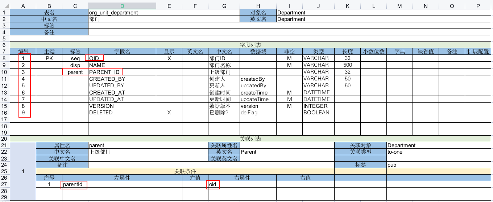
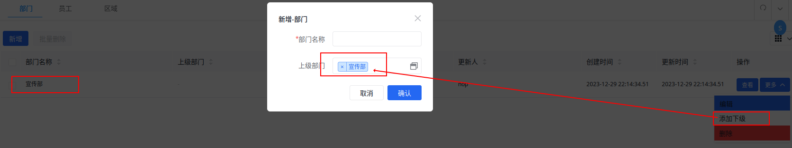

import Header from '@site/docs/\_header.md';
import {NopDocLink, NopVfsLink} from '@site/docs/NopLink';

<Header />

这一版将实现对 `Department`、`Region`、`JobTitle` 和 `Employee` 基本信息的增删改，
以及对关联关系的绑定。

下载 [nop-demo.orm.v1.xlsx](./files/nop-demo.orm.v1.xlsx) 并覆盖工程目录下的
`model/nop-demo.orm.xlsx` 文件，再通过 `nop-cli gen` 生成模型和前端页面：

```bash
# 注意，请根据当前运行环境修改 JDK 17+ 的安装路径
export JAVA_HOME=/usr/lib/jvm/java-17-openjdk

${JAVA_HOME}/bin/java \
  -Dfile.encoding=UTF8 \
  -jar ./nop-cli.jar \
  gen -t=/nop/templates/orm \
  ./model/nop-demo.orm.xlsx
```

## 模型定义

完整的 Excel 数据模型结构见 Nop
平台的 <NopVfsLink module="nop-orm-model" path="/nop/orm/imp/orm.imp.xml" />，
并阅读文档<NopDocLink title="《Excel 数据模型》" path="/dev-guide/model/excel-model.md" />。



定义 Excel 数据模型需注意以下几点：

- 【**字段列表**】中的【**编号**】必须是唯一的，不能重复，其将被用于识别字段的 Delta 变更。
  其大小顺序即为各字段在前端列表中的默认显示顺序，取值范围为 `1 ~ 1999`。
  按字段添加的先后顺序进行递增（注意，不是按相对位置递增），待删除的字段，仅需在【**标签**】中添加
  `del` 标记，其余部分保持不变。
  <u>注：【关联条件】下的【序号】列的数字不要求连续和唯一性，其仅用于标识行的有效性（其他表单中的【序号】列都是如此）</u>
- 所有的实体模型都必须定义一个【**主键**】（值为 `PK`）以及一个在前端的显示名称（【**标签**】包含 `disp` 的字段），
  若不指定 `disp` 字段，则默认以主键列的值作为显示内容
- 【**标签**】包含 `seq` 的 `VARCHAR` 类型的字段将默认使用 UUID 值，其字符串长度为 `32`
- 【**标签**】包含 `parent` 的字段代表该对象的父级属性，在前端维护对象的父子关系时将能够自动识别并正确赋值，
  比如，在列表【操作】列点击【更多】下拉菜单中的【添加下级】时，将会在编辑框中自动设置新数据的父对象为当前行数据



- 关联字段 `PARENT_ID` 在前端将实际显示为被关联对象的 `disp` 字段值，
  因此，需将该字段视为被关联对象，在 【**中文名**】或【**英文名**】中不能再包含 `ID`
  之类的字符（如，`上级部门ID` 需直接命名为 `上级部门`）
- 【**字段名**】将自动与对象的属性进行映射，并**按照驼峰命名规则，将字段名转换为属性名**，
  如，`PARENT_ID` 映射属性名为 `parentId`
- 作为主键的【**字段名**】一般不命名为 `ID`，建议采用 `OID` 或 `DEP_ID` 形式，
  因为，`id` 是 Nop 平台的保留名字，字段名 `ID` 映射的属性将被自动重命名为
  `id_`，从而可能会产生预期之外的错误。若是必须使用 `ID` 作为主键名，则需要在**【配置】**表单中添加变量
  `allowIdAsColName` 并设置为 `true`
- 【**关联列表**】中的【**属性名**】为必填项，其内容为当前对象与被关联对象绑定时的属性名称（命名规范自定），
  【**关联条件**】中的【**左属性**】与【**右属性**】分别为当前对象和被关联对象在数据库层面做
  join 的字段所映射的对象属性名称，例如，连接条件为 `JOIN c.PARENT_ID = p.OID`，
  则左右属性分别为 `parentId` 和 `oid`
- 表单 `org_staff_employee` 将采用自定义属性 `fullName` 做显示属性，
  故而，未在【**字段列表**】中标记 `disp` 字段，同时将 `FIRST_NAME` 和 `LAST_NAME`
  的【**显示**】设置为 `L`，即，不在列表中显示


## 自定义修改

先按照[定制化准备](start#定制化准备)的说明，准备 Delta 专用模块。

> 向 Delta 层中新增的定制文件不会被自动识别，需要重新构建并重启服务。

### 修改应用名称

> 前端框架编译后的代码存放在 Nop 平台的 `nop-web-site` 工程中，
> 该工程的源代码在 [nop-chaos](https://gitee.com/canonical-entropy/nop-chaos) 项目中。

未发现可定制化调整的位置，暂时不支持修改。

### 合并员工姓名

```xml {5,8,13-15} title="nop-demo-delta/src/main/resources/_vfs/_delta/v1/nop/demo/model/Employee/Employee.xmeta"
<?xml version="1.0" encoding="UTF-8" ?>
<!-- x:extends="super" 表示继承自上一层 Delta -->
<meta xmlns:x="/nop/schema/xdsl.xdef"
      x:schema="/nop/schema/xmeta.xdef"
      x:extends="super">

  <!-- 前端显示属性修改为 fullName -->
  <displayProp>fullName</displayProp>

  <props>
    <!-- 新增计算属性 fullName -->
    <prop name="fullName" displayName="姓名">
      <getter>
        entity.lastName + entity.firstName
      </getter>
    </prop>
  </props>
</meta>
```

> 修改了 `*.xmeta` 需要重新构建 `nop-demo-web` 项目，
> 可通过启动 `io.nop.demo.web.NopDemoWebCodeGen#main` 编译 XView 视图。

**计算属性** `fullName` 没有配置 `<schema/>` 子节点，
也即，其不是映射到数据库字段的属性，故而，默认不会将其添加到前端的显示列表中，
需要自行在 XView 视图中通过 Delta 机制添加：

```xml {5,10,20} title="nop-demo-delta/src/main/resources/_vfs/_delta/v1/nop/demo/pages/Employee/Employee.view.xml"
<?xml version="1.0" encoding="UTF-8" ?>
<!-- x:extends="super" 表示继承自上一层 Delta -->
<view xmlns:x="/nop/schema/xdsl.xdef"
      x:schema="/nop/schema/xui/xview.xdef"
      x:extends="super">

  <grids>
    <grid id="list">
      <!-- 在最开始位置增加 姓名 列 -->
      <cols x:override="prepend">
        <col id="fullName"/>
      </cols>
    </grid>
  </grids>

  <forms>
    <form id="view">
      <!-- 查看表单只显示 fullName -->
      <layout>
        fullName[姓名]
        regionId[地区]
        departmentId[部门]
        jobTitleId[职位]
        createdBy[创建人] updatedBy[更新人]
        createdAt[创建时间] updatedAt[更新时间]
      </layout>
    </form>
    <form id="edit">
      <!-- 编辑表单在一行内显示姓与名 -->
      <layout>
          lastName[姓] firstName[名]
          regionId[地区]
          departmentId[部门]
          jobTitleId[职位]
      </layout>
    </form>
  </forms>
</view>
```

> 这里通过在 `cols` 节点设置 `x:override="prepend"` 以在列表最开始位置插入其子节点。

若是需在列表中的指定位置插入新节点，则需采用`x:override`
的<NopDocLink title="保序算法" path="/dev-guide/xlang/x-override.md#%E4%BF%9D%E5%BA%8F%E7%AE%97%E6%B3%95" />。
例如，将 `fullName` 插入到 `regionId` 之前：

```xml {6}
  <grids>
    <grid id="list">
      <cols>
        <col id="fullName"/>
        <!-- 在自动生成的列 regionId 之前插入 fullName 列 -->
        <col id="regionId"/>
      </cols>
    </grid>
  </grids>
```

需要注意的是，在 `nop-demo-web/src/main/resources/_vfs/nop/demo/pages/Employee/Employee.view.xml`
中只引入了组件但未设置其他属性：

```xml
  <grids>
    <grid id="list"/>
    <grid id="pick-list"/>
  </grids>

  <forms>
    <form id="view"/>
    <form id="edit"/>
  </forms>

  <pages>
    <crud name="main"/>
    <picker name="picker"/>
  </pages>
```

这不是为了占位用的，而是在其继承的
`nop-demo-web/src/main/resources/_vfs/nop/demo/pages/Employee/_gen/_Employee.view.xml`
中，这些组件都被标记为 `x:abstract="true"`，也就是模板组件，在合并 DSL 时会被移除，
所以，在实现层必须显示引入，否则，页面将为空。

### 在前端列表显示数据版本

【**数据域**】为 `version` 的字段为后端维护数据，默认在前端不显示，在 Excel 中无法开启显示。
若需要让其显示在列表中，则需要在 `*.xmeta` 中将其 `internal` 设置为 `false`：

```xml title="nop-demo-delta/src/main/resources/_vfs/_delta/v1/nop/demo/model/Employee/Employee.xmeta"
  <props>
    <!-- ... -->
    <prop name="version" internal="false"/>
  </props>
```

> 注意，需重新构建 XView 视图。

### 修改一级菜单名称

```xml {5,8} title="nop-demo-delta/src/main/resources/_vfs/_delta/v1/nop/demo/auth/nop-demo.action-auth.xml"
<?xml version="1.0" encoding="UTF-8" ?>
<!-- x:extends="super" 表示继承自上一层 Delta -->
<auth xmlns:x="/nop/schema/xdsl.xdef"
      x:schema="/nop/schema/action-auth.xdef"
      x:extends="super">

  <site id="main">
    <resource id="test-orm-nop-demo" displayName="组织管理">
      <children/>
    </resource>
  </site>
</auth>
```

### 调整二级菜单项顺序

```xml {5,10-14} title="nop-demo-delta/src/main/resources/_vfs/_delta/v1/nop/demo/auth/nop-demo.action-auth.xml"
<?xml version="1.0" encoding="UTF-8" ?>
<!-- x:extends="super" 表示继承自上一层 Delta -->
<auth xmlns:x="/nop/schema/xdsl.xdef"
      x:schema="/nop/schema/action-auth.xdef"
      x:extends="super">

  <site id="main">
    <resource id="test-orm-nop-demo" displayName="组织管理">
      <children>
        <!-- Note：前端以 orderNo 为排序依据 -->
        <resource id="Employee-main" orderNo="10000"/>
        <resource id="Region-main" orderNo="10010"/>
        <resource id="Department-main" orderNo="10020"/>
        <resource id="JobTitle-main" orderNo="10030"/>
      </children>
    </resource>
  </site>
</auth>
```

### 修改一级菜单资源的 id

```xml {5,8,10} title="nop-demo-delta/src/main/resources/_vfs/_delta/v1/nop/demo/auth/nop-demo.action-auth.xml"
<?xml version="1.0" encoding="UTF-8" ?>
<!-- x:extends="super" 表示继承自上一层 Delta -->
<auth xmlns:x="/nop/schema/xdsl.xdef"
      x:schema="/nop/schema/action-auth.xdef"
      x:extends="super">

  <site id="main">
    <resource id="test-orm-nop-demo" x:abstract="true"/>
    <resource id="org-management"
              x:prototype="test-orm-nop-demo"
              displayName="组织管理" routePath="/org-management">
      <!-- 其他合并内容 -->
    </resource>
  </site>
</auth>
```

也就是，将待修改的菜单资源标记为 `x:abstract`，让其可以从合并结果中被删除，
再让新节点 `org-management` 通过 `x:prototype` 继承该节点，
从而实现对 `test-orm-nop-demo` 资源的 `id` 的修改。

### 拆分二级菜单到新的一级菜单中

```xml {5,8,13,20} title="nop-demo-delta/src/main/resources/_vfs/_delta/v1/nop/demo/auth/nop-demo.action-auth.xml"
<?xml version="1.0" encoding="UTF-8" ?>
<!-- x:extends="super" 表示继承自上一层 Delta -->
<auth xmlns:x="/nop/schema/xdsl.xdef"
      x:schema="/nop/schema/action-auth.xdef"
      x:extends="super">

  <site id="main">
    <resource id="test-orm-nop-demo" x:abstract="true"/>

    <resource id="org-management" x:prototype="test-orm-nop-demo"
              displayName="组织管理" routePath="/org-management">
      <children>
        <resource id="Employee-main" x:override="remove"/>
        <!-- 其他合并内容 -->
      </children>
    </resource>

    <resource id="staff-management" x:prototype="test-orm-nop-demo"
              displayName="人员管理" routePath="/staff-management">
      <children x:prototype-override="bounded-merge">
        <resource id="Employee-main"/>
      </children>
    </resource>
  </site>
</auth>
```

首先，将待拆分的一级菜单 `test-orm-nop-demo` 标记为 `x:abstract="true"`。

然后，新增两个继承（`x:prototype`）自 `test-orm-nop-demo`
的一级菜单：`org-management` 和 `staff-management`。

接着，从一级菜单 `org-management` 中移除（`x:override="remove"`）待拆分的二级菜单
`Employee-main`。

最后，在一级菜单 `staff-management` 中通过 `x:prototype-override="bounded-merge"`
合并 `test-orm-nop-demo` 的 `children` 节点，以仅保留待拆分出来的二级菜单：

```xml
      <children x:prototype-override="bounded-merge">
        <resource id="Employee-main"/>
      </children>
```

## 注意事项

- 若修改了 `*.xmeta`，则需要重新编译 XView 视图，
  可通过启动 `io.nop.demo.web.NopDemoWebCodeGen#main` 实现
- 在 Nop 平台的模板
  `nop-codegen/src/main/resources/_vfs/nop/templates/orm-web/src/main/resources/_vfs/{moduleId}/pages/{metaInfo.forEntity}{metaInfo.baseObjName}/_gen/_{metaInfo.objName}.view.xml.xgen`
  中会过滤掉 `prop.schema?.simpleSchema` 为 `false`
  或者 `prop.internal` 为 `true` 的属性
- Nop 平台内置的数据域在 `nop-codegen/src/main/resources/_vfs/nop/codegen/xlib/meta-gen.xlib`
  中识别

## 参考资料

- <NopDocLink title="Excel 数据模型" path="/dev-guide/model/excel-model.md" />：
  了解各列的配置及作用
- <NopDocLink title="可逆计算理论中的 Delta 合并算法" path="/dev-guide/xlang/x-override.md" />：
  了解可用的合并方式
- <NopDocLink title="XMeta 元数据" path="/dev-guide/xlang/xmeta.md" />：
  了解 XMeta 的结构
