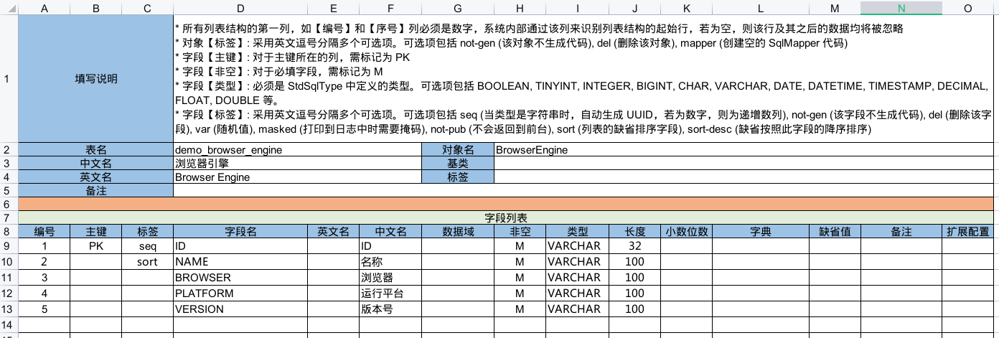
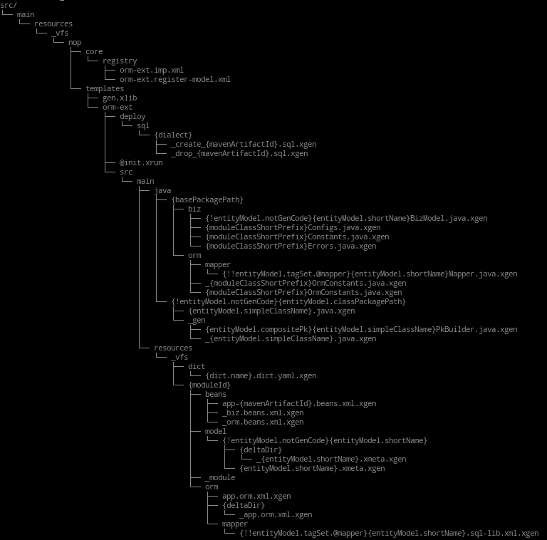
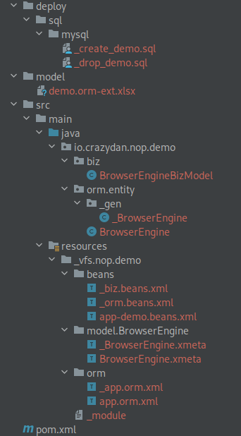

import Header from '@site/docs/\_header.md';
import {NopDocLink} from '@site/docs/NopLink';

<Header />

本文以 Spring Boot + Nop 框架的组合模式为例，
力求在不引入可逆计算、差量机制等概念的情况下，
阐述如何基于 Nop 平台进行传统方式的开发。

注意：在开始前，请按照 [Nop 本地构建](/practice/build)
的指导说明自行构建 Nop 源代码，或者参考
https://nop.repo.crazydan.io/ 的说明引入第三方 Maven 仓库。

## 代码组织结构 {#code-structure}

```plantuml
[Web 容器层（Spring Boot）] as web
[业务层（Nop BizModel）] as biz
[持久化层（Nop ORM）] as orm

web <--> biz
biz <--> orm
```

在 Spring Boot + Nop 的开发组合框架中，Spring Boot 仅作为 Web 容器层，
剩下的 Controller、Service 和 ORM 层均通过 Nop 进行实现。

> 若是对 Nop 不熟悉，也可以继续使用 Spring MVC 模式进行开发，
> 但一般建议优先使用 Nop 框架，其先进性远高于其他现有框架。

基于 Nop 框架的代码结构主要分为以下两层：

- **业务层**：负责实现业务处理逻辑，并定义相关的业务数据模型结构
- **持久化层**：负责对 ORM 模型做增删改查，除了内置的标准处理函数以外，
  还支持编写 <NopDocLink title="EQL" path="/dev-guide/orm/eql.md" />
  做复杂查询

是的，Nop 没有 Controller 层，其业务层做的便是传统的 Controller + Service
的工作，当然，其并不是简单的合并这两层，
而是[可逆计算理论](https://zhuanlan.zhihu.com/p/64004026)这一整套开发架构中的一环。

在 Nop 的业务层中包含以下两类核心模型：

- [必须] **业务数据模型**（`XMeta`）：在用户层面的模型结构，即，直接面向用户端的模型，
  其可能与最终的 ORM 模型一致，也可能由多个 ORM 模型的部分或全部信息组合而成，
  还可能包含一些 ORM 模型不存在的结构，甚至不需要映射 ORM 模型。
  本质上，其是在业务层面上的一类**聚合模型**，在业务处理模型中完成多个模型的聚合后再返回给用户侧
- [必须] **业务处理模型**（`XxxBizModel`）：提供各种针对业务数据模型进行业务处理的函数，
  其职能与 GraphQL 类似，负责聚合 ORM 模型，向用户返回最终的业务数据模型

而在其持久化（ORM）层也包含两类模型：

- [必须] **持久化实体**（`Entity`）：定义 ORM 模型的存储结构，
  声明实体属性与数据库表字段的映射。Nop 可以通过其定义生成持久化实体的 Java Class 代码，
  也可以为 MySQL 等数据库生成创建表的 DDL 代码
- [可选] **持久化映射**（`XxxMapper`）：类似于 MyBatis 框架，将查询 SQL 与 `XxxMapper`
  接口进行绑定，实现在调用 `XxxMapper` 接口时，自动做 SQL 查询，并返回自动转换后的 ORM 实体对象

因此，按照 Nop 的代码分层结构，在此约定各个 Maven 模块的代码组织结构如下（不需要的层无需创建）：

```java
src/main/
├── java/
│   └── com/{xxx}/{yyy}/{zzz}/   # Java 包名
│       ├── biz/                 # 业务处理层，固定名称
│       │   ├── {Xxx}BizModel.java
│       │   └── {Yyy}BizModel.java
│       └── orm/           # 持久化层，固定名称
│           ├── entity/    # 持久化实体层，固定名称
│           └── mapper/    # 持久化映射层，固定名称
│               └── {Xxx}Mapper.java
└── resources/
    └── _vfs/{xxx}/{yyy}/ # Nop 模块资源目录
        ├── _module       # 空文件，用于标识 Nop 模块
        ├── beans/        # Nop Beans 定义文件目录
        │   └── app-{zzz}.beans.xml
        ├── model/        # 业务数据模型定义目录
        │   ├── {Xxx}/    # 业务数据模型名称
        │   │   └── {Xxx}.xmeta
        │   └── {Yyy}/    # 业务数据模型名称
        │       └── {Yyy}.xmeta
        └── orm/             # 持久化实体定义文件目录，固定名称
            ├── app.orm.xml  # 持久化实体定义文件，固定名称
            └── mapper/      # 持久化映射定义文件目录
                └── {xxx}.sql-lib.xml
```

- Nop 要求将模块资源放在结构为 `_vfs/{xxx}/{yyy}/`
  形式的目录中，也即，在 `_vfs` 目录下的第二级子目录 `{yyy}`
  中放置 Nop 的模块资源，该子目录即为 Nop 的**模块资源目录**。
  **注**：第一二级子目录的名称要求均为小写字母，且不含其他字符
- 在 `_vfs/{xxx}/{yyy}/` 中必须放置空文件 `_module`
  以指示该目录是一个 Nop 模块资源目录，Nop 是根据该文件所在的位置来识别模块，
  再扫描和加载 `beans`、`model` 和 `orm` 等资源的
- `beans/app-{zzz}.beans.xml` 为固定命名形式，`{xxx}` 可使用当前
  Maven 模块的 `artifactId`。Nop 不采用扫描注解的方式加载
  Java Bean，只有在该文件中显式声明的 Bean 才会被 Nop 加载。
  **注**：在该文件内可以通过 `import` 标签引入拆分后的 `*.beans.xml`
- 业务数据模型的结构定义在 `model/{bizObjName}/{bizObjName}.xmeta`
  中，该路径形式是固定的，只有按照该路径定义的业务数据模型才能被识别
- 业务处理模型的 Java Class 一般命名为 `{bizObjName}BizModel`
  形式，其中，`{bizObjName}` 对应业务数据模型名称，如，`NopAuthUser`。
  **注**：持久化映射接口也采用相同的命名形式 `{bizObjName}Mapper`
- 工程内所有的持久化模型均定义在 `orm/app.orm.xml` 中，
  只有在该文件内定义的 ORM 模型才能被识别
- `orm/mapper/{xxx}.sql-lib.xml` 为本文约定的项目规范，`{xxx}`
  可以为任意`小写字母+数字+下划线+短横线`的组合，其最终是在
  `XxxMapper` 上通过 `@SqlLibMapper` 注解引入的，因此没有强制规范

## 引入 Nop 组件依赖 {#import-nop-modules}

在 Maven 工程的 `pom.xml` 中引入 Nop 组件：

```xml
<project>
  <!-- ... -->

  <!-- 直接使用 Nop 的外部依赖和构建配置 -->
  <parent>
    <groupId>io.github.entropy-cloud</groupId>
    <artifactId>nop-entropy</artifactId>
    <version>2.0.0-SNAPSHOT</version>
  </parent>

  <dependencies>
    <!-- Nop 与 Spring Boot 的集成依赖 -->
    <dependency>
      <groupId>io.github.entropy-cloud</groupId>
      <artifactId>nop-spring-web-orm-starter</artifactId>
      <exclusions>
        <!-- 不引入 Nop 提供的用户认证和鉴权机制 -->
        <exclusion>
          <groupId>io.github.entropy-cloud</groupId>
          <artifactId>nop-auth-core</artifactId>
        </exclusion>
      </exclusions>
    </dependency>

    <!-- 核心的 Nop 组件 -->
    <dependency>
      <groupId>io.github.entropy-cloud</groupId>
      <artifactId>nop-core</artifactId>
    </dependency>
    <dependency>
      <groupId>io.github.entropy-cloud</groupId>
      <artifactId>nop-orm</artifactId>
    </dependency>
    <dependency>
      <groupId>io.github.entropy-cloud</groupId>
      <artifactId>nop-biz</artifactId>
    </dependency>

    <!--
    引入 XCodeGenerator 工具类，用于代码生成。
    仅开发期在 IDE 中使用（详见本文后续内容对 NopCodeGen 的说明）
    -->
    <dependency>
      <groupId>io.github.entropy-cloud</groupId>
      <artifactId>nop-codegen</artifactId>
      <scope>provided</scope>
    </dependency>

    <!-- ... -->
  </dependencies>

  <!-- ... -->
</project>
```

注意，在使用 Spring 生态的用户认证和鉴权机制时，需排除依赖
`io.github.entropy-cloud:nop-auth-core` 以禁用 Nop
提供的实现方案。

## 一个简单的业务处理模型 {#a-simple-biz-model}

```java
@BizModel("Demo")
public class DemoBizModel {

    @BizQuery
    public String hello(
        @Name("message") String message
    ) {
        return "Hi, " + message;
    }

    @BizMutation
    public DemoResponse testOk(
        @RequestBean DemoRequest request
    ) {
        DemoResponse ret = new DemoResponse();
        ret.setName(request.getName());
        ret.setResult("ok");

        return ret;
    }

    public static class DemoRequest {
        private String name;
        // ... getter/setter
    }

    public static class DemoResponse {
        private String name;
        private String result;
        // ... getter/setter
    }
}
```

> 按前述规范需将 `DemoBizModel` 定义在 `biz` 包中。

以上定义了一个简单的包括查询和修改函数的业务处理模型，
没有持久化，也不需要定义业务数据模型，不需要做参数适配转换，
更不需要对响应对象做 JSON 序列化，简单几行代码便能够以标准方式轻松完成传统的
Controller + Service 层的工作，也无需关注在 Web 层面的数据转换工作，
仅需要**专注于业务逻辑的开发并返回处理结果**即可。

接着，在 Nop 模块资源目录的 `beans/app-{zzz}.beans.xml`
中声明该业务处理模型，如此，便能够支持对前端请求的响应处理：

```xml
<?xml version="1.0" encoding="UTF-8" ?>
<beans xmlns:x="/nop/schema/xdsl.xdef" xmlns:ioc="ioc"
       x:schema="/nop/schema/beans.xdef">

    <bean id="DemoBizModel"
          class="com.xxx.yyy.zzz.biz.DemoBizModel"
          ioc:default="true" />
</beans>
```

> 一般情况下，只需要设置 `bean` 标签的 `id` 和 `class`
> 属性，其余的保持不变即可。

最后，在前端只需要调用 Nop 标准的 Web 端点 `/r/{bizObjName}__{bizAction}`
即可：

```js
fetch('/r/Demo__hello?message=World')
  .then((res) => res.json())
  .then(console.log);
// 响应数据为: {data: 'Hi, World', status: 0}

fetch('/r/Demo__testOk', {
  method: 'POST',
  body: JSON.stringify({ name: 'test' })
})
  .then((res) => res.json())
  .then(console.log);
// 响应数据为: {"data": { "name": "test", "result": "ok" }, "status": 0}
```

> - `{bizObjName}` 和 `DemoBizModel` 上 `@BizModel` 注解的 `value` 值相同
> - `{bizAction}` 是 `DemoBizModel` 上标注了 `@BizQuery` 或 `@BizMutation`
>   的方法的名称
> - `{bizObjName}` 与 `{bizAction}` 之间是两条下划线

`POST` 方式的传参均为 JSON 字符串，其参数结构与业务处理模型的函数参数一致。
对于简单结构的参数也是相同的传参方式，比如，`Demo__hello` 的参数 `message`
改为 `POST` 后的方式如下：

```js
fetch('/r/Demo__hello', {
  method: 'POST',
  body: JSON.stringify({ message: 'World' })
})
  .then((res) => res.json())
  .then(console.log);
```

## 一个简单的持久化模型 {#a-simple-orm-model}

假设有如下结构的一个 ORM 模型 `BrowserEngine`：

```plantuml
class BrowserEngine {
  String id
  String name
  String browser
  String platform
}
```

首先，在 Nop 模块资源目录的 `orm/app.orm.xml` 中定义模型结构：

```xml
<?xml version="1.0" encoding="UTF-8" ?>
<orm xmlns:x="/nop/schema/xdsl.xdef"
     xmlns:orm-gen="orm-gen" xmlns:xpl="xpl"
     x:schema="/nop/schema/orm/orm.xdef"
>

  <x:post-extends x:override="replace">
    <orm-gen:DefaultPostExtends xpl:lib="/nop/orm/xlib/orm-gen.xlib" />
  </x:post-extends>

  <entities>
    <entity name="com.xxx.yyy.zzz.orm.entity.BrowserEngine"
            className="com.xxx.yyy.zzz.orm.entity.BrowserEngine"
            tableName="browser_engine">
      <columns>
        <column propId="1"
                name="id" code="ID"
                tagSet="seq" primary="true"
                mandatory="true" precision="32"
                stdSqlType="VARCHAR" />
        <column propId="2"
                name="name" code="NAME"
                mandatory="true" precision="100"
                stdSqlType="VARCHAR" />
        <column propId="3"
                name="browser" code="BROWSER"
                mandatory="true" precision="100"
                stdSqlType="VARCHAR" />
        <column propId="4"
                name="platform" code="PLATFORM"
                mandatory="true" precision="100"
                stdSqlType="VARCHAR" />
      </columns>
    </entity>
  </entities>
</orm>
```

需要注意的是，Nop 没有采用 JPA 注解来定义 ORM 实体对象，这与其差量机制的实现技术相关，
而不是为了不同而不同。从 Hibernate 过来的朋友需要从心理上适应一下该改变，
不要以排斥态度看待此类不同。现在的示例只是 Nop 的基础能力，其在 xml
之上还有更加强大和灵活的扩展和自动推理能力（`x:post-extends` 既是此能力的体现）。

在当前理解程度下，只需要关注 `entity` 标签的结构和属性，其余的均视为默认的固定配置即可：

<!-- prettier-ignore -->
| 属性名 | 必要性 | 属性解释 | 备注 |
| ----- | ----- | ------- | --- |
| `entity#name` | 必须 | ORM 实体名称 | 一般与 `entity#className` 保持一致 |
| `entity#className` | 必须 | ORM 实体的 Java Class 名称 | Nop 根据该值确定 Java 类名 |
| `entity#tableName` | 必须 | ORM 实体的存储表名 | 该实体在数据库中的表名称 |
| `column#propId` | 必须 | ORM 实体属性的序号 | 取值范围从 1 到 1999，不能重复，新增属性时按当前最大序号递增，删除属性时，保持各属性的该值不变 |
| `column#name` | 必须 | ORM 实体属性名 | 对应其 Java Class 的属性名 |
| `column#code` | 必须 | ORM 实体属性存储表字段名 | 对应其在数据库中的表字段名称 |
| `column#stdSqlType` | 必须 | 表字段类型 | 取值范围与数据库的字段类型相同 |
| `column#mandatory` | 可选 | 是否必要 | 也就是表字段是否可为 `NULL` |
| `column#precision` | 可选 | 表字段精度 | 字段类型长度 |
| `column#tagSet` | 可选 | ORM 实体属性的标注信息 | `seq` 表示为该属性自动生成随机的 UUID 值 |
| `column#primary` | 可选 | 是否为主键 | 配合 `tagSet="seq"` 可为 ORM 实体自动生成 UUID 作为主键 |

> 更多的 ORM 实体配置，可参考 Nop 依赖中的 `_vfs/nop/schema/orm/entity.xdef`。

接着，在 Nop 模块资源目录中为 ORM 模型 `BrowserEngine`
创建对应的业务数据模型 `model/BrowserEngine/BrowserEngine.xmeta`：

```xml
<?xml version="1.0" encoding="UTF-8" ?>
<meta xmlns:x="/nop/schema/xdsl.xdef"
      xmlns:xpl="xpl" xmlns:meta-gen="meta-gen"
      x:schema="/nop/schema/xmeta.xdef"
>

  <x:gen-extends>
    <meta-gen:DefaultMetaGenExtends xpl:lib="/nop/core/xlib/meta-gen.xlib" />
  </x:gen-extends>
  <x:post-extends>
    <meta-gen:DefaultMetaPostExtends xpl:lib="/nop/core/xlib/meta-gen.xlib" />
  </x:post-extends>

  <props>
    <prop name="id"
          queryable="false" sortable="false"
          insertable="false" updatable="false" />
    <prop name="name"
          mandatory="true"
          queryable="true" sortable="true"
          allowFilterOp="contains,eq" />
    <prop name="browser"
          mandatory="true"
          queryable="true" sortable="true"
          allowFilterOp="contains,eq" />
    <prop name="platform"
          mandatory="true"
          queryable="true" sortable="true"
          allowFilterOp="contains,eq" />
  </props>
</meta>
```

同样的，在当前示例中只需要关注 `prop` 标签的结构和属性即可，其它的也视为固定配置：

<!-- prettier-ignore -->
| 属性名 | 必要性 | 属性解释 | 备注 |
| ----- | ----- | ------- | --- |
| `prop#name` | 必须 | 业务模型属性名称 | 与映射的 ORM 实体属性名称保持一致 |
| `prop#mandatory` | 可选 | 是否必须赋值 | 为 `true` 时，Nop 会自动校验传参对象的该属性是否有值，若未赋值，则会抛出异常，不允许更新或新增数据 |
| `prop#queryable` | 可选 | 是否可参与查询 | 只有为 `true` 的属性才能够作为过滤条件参与查询，并配合 `allowFilterOp` 来控制运算方式 |
| `prop#allowFilterOp` | 可选 | 允许应用的过滤函数 | 只有在该列表中的过滤函数才能被应用到当前属性上，其可选值定义在 `io.nop.core.model.query.FilterOp` 中，以逗号分隔多个值 |
| `prop#sortable` | 可选 | 是否可参与排序 | 只有为 `true` 的属性才能够参与排序 |
| `prop#insertable` | 可选 | 是否可新增 | 只有为 `true` 的属性才能够赋值到新增数据上 |
| `prop#updatable` | 可选 | 是否可更新 | 只有为 `true` 的属性才能够在待更新数据中被修改 |

到这里，可能会出现这样的疑问：业务数据模型看上去和 ORM 模型好像是一样的，为什么要在两处地方重复定义呢？

在当前示例中，二者虽然是基本相同的，但从本质上来看，二者面向的领域其实是存在很大不同的。
业务数据模型面向的是业务领域，直接面向业务用户，描述的是业务数据结构，
而后者面向的是数据库，是对数据存储结构的描述。

```plantuml
actor "用户" as user
component "业务数据模型" as xmeta
component "ORM 模型" as orm
database "数据库" as db

user <-> xmeta
xmeta <-(0)-> orm
orm <-> db
```

用户所看到和处理的是业务数据，他不用关心最终数据如何存储落地，
而在 ORM 层也只需要关心要保存哪些属性，而不用管哪些属性可以参与过滤，
哪些属性对用户又是不可见的等问题。

所以，由于面对的领域不同，业务数据模型与 ORM 模型最终也会出现差异，
而如果将不同领域的差异合并在一个模型中管理，势必会增加代码的复杂性和维护难度，
而这正是可逆计算所要避免和解决的问题。

完成了业务数据模型和 ORM 模型的定义，接下来，便可以开始编写业务处理模型了。
不过，由于当前 Nop 的生态还不完善，ORM 实体的
Java Class 代码不能完全自动生成，还需要一些手工操作才行。

先在当前工程的根目录下创建文件 `precompile2/gen-orm.xgen`：

```xml title="precompile2/gen-orm.xgen"
<?xml version="1.0" encoding="UTF-8" ?>
<c:script xmlns:c="c"><![CDATA[
  codeGenerator
    // 设置生成代码的存放位置，其相对于当前工程的根目录
    .withTargetDir('src/main/java')
    .renderModel(
      // 设置 ORM 模型定义文件路径，其位置相对于该 xgen 脚本所在的目录
      '../src/main/resources/_vfs/{xxx}/{yyy}/orm/app.orm.xml',
      // 代码模板资源的 classpath 位置
      '/nop/templates/orm-entity',
      // 以下参数保持不变
      '/', $scope
    );
]]></c:script>
```

> 注意替换 `{xxx}/{yyy}` 为实际 Nop 模块资源目录。

并在 `pom.xml` 中启用插件 `exec-maven-plugin`
以支持在 Maven 编译阶段执行 `precompile2/gen-orm.xgen`：

```xml title="pom.xml"
  <build>
    <plugins>
      <!-- Note：该插件的配置见 io.github.entropy-cloud:nop-entropy -->
      <plugin>
        <groupId>org.codehaus.mojo</groupId>
        <artifactId>exec-maven-plugin</artifactId>
      </plugin>
    </plugins>
  </build>
```

再在工程的 `test/java` 中定义一个 `NopCodeGen` 工具类：

```java title="NopCodeGen.java"
public class NopCodeGen {

  public static void main(String[] args) {
    AppConfig.getConfigProvider()
              .updateConfigValue(CoreConfigs.CFG_CORE_MAX_INITIALIZE_LEVEL,
                                CoreConstants.INITIALIZER_PRIORITY_ANALYZE);

    CoreInitialization.initialize();
    try {
      File projectDir = MavenDirHelper.projectDir(NopCodeGen.class);

      XCodeGenerator.runPrecompile(projectDir, "/", false);
      XCodeGenerator.runPrecompile2(projectDir, "/", false);
      XCodeGenerator.runPostcompile(projectDir, "/", false);
    } finally {
      CoreInitialization.destroy();
    }
  }
}
```

在以上准备工作就绪后，便可以以下两种方式生成 ORM 实体的 Java Class 代码：

- 在当前工程的根目录下执行 Maven 编译：`mvn compile`
- 通过 IDE 运行 `NopCodeGen#main` 函数

> 以上两种方式的本质是一样的，都是执行 `precompile2` 目录下的
> `*.xgen`，只是触发方式不同，可根据情况任选一种。

上面任何一种方式都可以在当前工程内根据 `orm/app.orm.xml` 中的
`entity#className` 生成 Java Class 代码。每个 ORM 实体类均包含两部分：

- ORM 实体对象主体 `BrowserEngine`，可在该 Class 中添加自己的逻辑。
  其继承自 `_gen/_BrowserEngine`
- `_gen/_BrowserEngine` 为 Nop 根据 ORM
  模型结构所自动生成，并其结构发生变化时覆盖更新该 Class，
  所以，不能在该代码中添加或修改代码

完成 ORM 实体类的代码生成后，便可为 `BrowserEngine` 添加业务处理模型
`BrowserEngineBizModel` 了：

```java
@BizModel("BrowserEngine")
public class BrowserEngineBizModel
                extends CrudBizModel<BrowserEngine> {

  public BrowserEngineBizModel() {
    setEntityName(BrowserEngine.class.getName());
  }
}
```

- 要求 `@BizModel#value` 的值与业务数据模型名称（后面用
  `{bizObjName}` 指代）一致
- 约定业务处理模型类名结构为 `{bizObjName}BizModel`

一般情况下，对单一 ORM 模型进行增删改查的业务处理模型，直接继承
`CrudBizModel` 即可，其已内置分页查询（`findPage`）、新增（`save`）、
更新（`update`）、删除（`delete`）、批量删除（`batchDelete`）、
批量更新（`batchUpdate`）等处理函数，可以直接使用。

经过以上三步，后端业务逻辑便开发完毕，在前端按需调用相应的业务处理函数即可：

```js
// 新增数据
fetch('/r/BrowserEngine__save', {
  method: 'POST',
  // 回传 json 字符串，并将业务数据放在 data 属性上
  body: JSON.stringify({
    data: {
      name: 'Trident - 3sxsog',
      browser: 'Internet Explorer 5.0',
      platform: 'Win 95+'
    }
  })
})
  .then((res) => res.json())
  .then(console.log);

// 带条件的分页查询
fetch(
  '/r/BrowserEngine__findPage?@selection=' +
    // @selection 用于指定返回哪些属性，从而过滤掉无关属性数据
    encodeURIComponent('total,items{id,name,browser,platform}'),
  {
    method: 'POST',
    // 过滤条件以 json 形式回传，并放在 query 属性上
    body: JSON.stringify({
      query: {
        // 分页参数可直接放在 url 上
        offset: 0,
        limit: 10,
        // 等价于: browser like '%Internet%' and platform like 'Win'
        filter: {
          $type: 'and',
          $body: [
            {
              $type: 'contains',
              name: 'browser',
              value: 'Internet'
            },
            {
              $type: 'contains',
              name: 'platform',
              value: 'Win'
            }
          ]
        }
      }
    })
  }
)
  .then((res) => res.json())
  .then(console.log);
```

## 通过 Excel 定义和维护模型结构 {#excel-define-orm-models}

在前面章节讲述了以手工方式定义 ORM 实体和业务数据模型，
但这种方式还是有较高的门槛，需要掌握的信息较多，
并且在维护模型之间的关联和变动时的工作量很大，出错概率也更高。
因此，在本章节将说明如何通过 Excel 来定义和维护模型结构。

首先，创建一个 Maven 模块，这里假设模块名为 `demo`。

然后，将演示用的 Excel 数据模型文件
[demo.orm-ext.xlsx](./files/demo.orm-ext.xlsx) 下载到
`demo/model` 目录中。在该文件内定义了一个前一章节提到的
ORM 实体对象 `BrowserEngine` 的结构：



接着，下载 [nop-orm-template.zip](./files/nop-orm-template.zip)
并将其解压到 `demo` 目录中，该包会将**针对本案例而定制**的
Nop 代码生成模板 **`orm-ext`** 释放到 `src/main/resources/` 资源目录下：



该模板是一种动态的文件组织结构，其将根据 Excel 数据模型文件 `*.orm-ext.xlsx`
内填写的信息动态生成目标代码，并按规划的目录结构放置代码。
对该组织结构的说明详见<NopDocLink title="这里" path="/dev-guide/codegen.md#%E4%B8%80-12-%E9%80%9A%E8%BF%87%E6%A8%A1%E6%9D%BF%E8%B7%AF%E5%BE%84%E7%BC%96%E7%A0%81%E5%88%A4%E6%96%AD%E5%92%8C%E5%BE%AA%E7%8E%AF" />。

> 注意，模板 `orm-ext` 只能对以 `.orm-ext.xlsx` 为后缀的 Excel
> 数据模型文件有效，在自建数据模型文件时，请不要修改该后缀。

最后，按照 [一个简单的持久化模型](#a-simple-orm-model) 章节的说明确定一种代码生成方式，
并修改 `precompile2/gen-orm.xgen` 的内容为：

```xml {5,8,10} title="precompile2/gen-orm.xgen"
<?xml version="1.0" encoding="UTF-8" ?>
<c:script xmlns:c="c"><![CDATA[
  codeGenerator
    // 设置生成代码的存放位置，其相对于当前工程的根目录
    .withTargetDir('./')
    .renderModel(
      // 设置 ORM 模型定义文件，其位置相对于该 xgen 脚本所在的目录
      '../model/demo.orm-ext.xlsx',
      // 代码模板资源的 classpath 位置
      '/nop/templates/orm-ext',
      // 以下参数保持不变
      '/', $scope
    );
]]></c:script>
```

Nop 将自动根据 Excel 数据模型文件和代码生成模板生成或更新相关的代码：



> 代码生成模板 `orm-ext` 是按照 [代码组织结构](#code-structure)
> 章节中的文件结构进行代码组织的。

以下划线开头的文件会在下次执行代码生成时被覆盖，
因此，不要在这些文件内增减代码，新增逻辑可以在同名的不含下划线的文件中编写。
以 `model/BrowserEngine/BrowserEngine.xmeta` 为例，
由于在 Excel 数据模型文件中还没有提供字段过滤条件的配置，
此时便可以在 `BrowserEngine.xmeta` 中添加该配置：

```xml {4,10,12,14} title="model/BrowserEngine/BrowserEngine.xmeta"
<?xml version="1.0" encoding="UTF-8" ?>
<meta xmlns:x="/nop/schema/xdsl.xdef"
      x:schema="/nop/schema/xmeta.xdef"
      x:extends="_BrowserEngine.xmeta"
>

  <props>
    <!-- 补充缺失配置 -->
    <prop name="name"
          allowFilterOp="contains,eq" />
    <prop name="browser"
          allowFilterOp="contains,eq" />
    <prop name="platform"
          allowFilterOp="contains,eq" />
  </props>
</meta>
```

> `BrowserEngine.xmeta` 和 `_BrowserEngine.xmeta`
> 中的配置将被合并在一起，因此，在 `BrowserEngine.xmeta`
> 中仅需定义新增的差异配置内容，该合并过程便是由 Nop 的差量机制提供支持。

以上便是以 Excel 数据模型文件来定义模型和生成代码的操作过程，
后续可以直接在该 Excel 内调整或新增模型，并重复执行代码生成即可。

可以看出，通过 Excel 能够更加直观和方便地维护和管理实体模型，
在效率和准确性上均有极大提升。

## 参考资料 {#references}

- <NopDocLink title="Nop 开发示例" path="/tutorial/tutorial.md" />
- <NopDocLink title="EQL 对象查询语言" path="/dev-guide/orm/eql.md" />
- <NopDocLink title="Excel 数据模型" path="/dev-guide/model/excel-model.md" />:
  包含详细的 Excel 模板的填写说明
