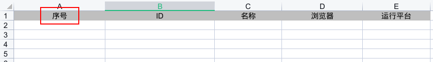
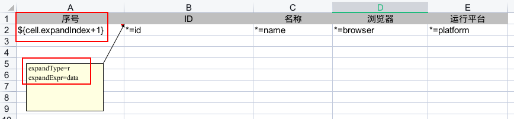
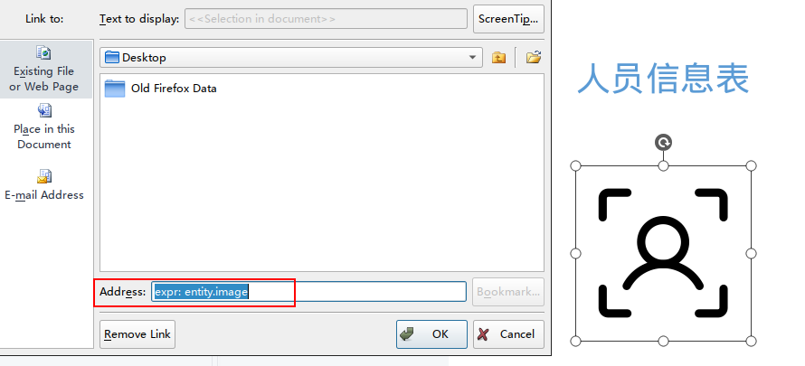
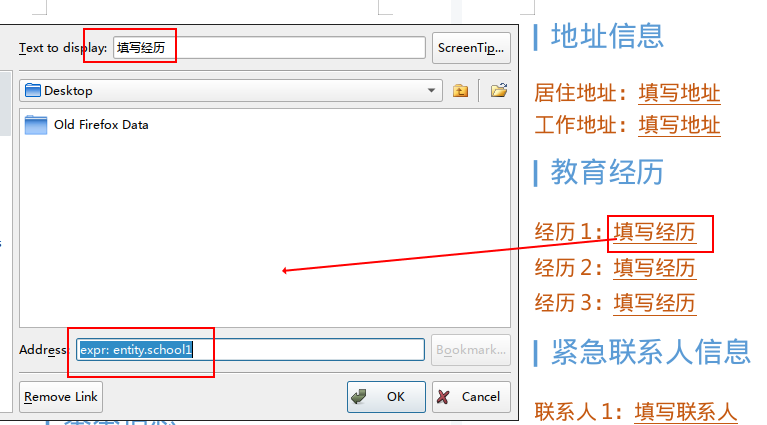

import Header from '@site/docs/\_header.md';

<Header />

在 Nop 中，对上传文件的数据处理（含数据导入）均需先通过 Web 端点
`/f/upload` 将文件上传到文件服务（由 `nop-file` 模块实现）中，
然后，将该端点返回的文件访问地址 `/f/download/{fileId}`
随其他参数一并传给业务处理模型 `XxxBizModel`，接着，在
`BizModel` 中通过 `IOrmEntityFileStore` 获取
`/f/download/{fileId}` 所对应的上传文件，再继续后续的数据处理。

> 参考说明 [Nop 文件上传/下载](https://gitee.com/canonical-entropy/nop-entropy/blob/master/docs/dev-guide/graphql/upload.md)。

<!-- https://plantuml.com/sequence-diagram -->

```plantuml
autonumber "<b>[000]"

entity "客户端" as client
entity "XxxBizModel" as biz
entity "Nop File" as file

client -> file: 上传文件至 /f/upload 端点
activate file
  file -> file: 保存文件

  file -> client: 返回文件地址 /f/download/{fileId}
deactivate file

client -> biz: 携带上传文件的地址 /f/download/{fileId}，\n与其他参数一并提交给业务处理端点
activate biz
  biz -> biz: 获取文件
  activate biz
    biz -> biz: 通过 IOrmEntityFileStore#decodeFileId\n解析文件地址 /f/download/{fileId}\n得到文件标识 fileId
    biz -> biz: 调用 IOrmEntityFileStore#getFileResource\n得到上传文件
  deactivate biz

  biz -> biz: 处理文件

  biz -> client: 返回文件处理结果
deactivate biz
```

也就是，要实现数据导入功能至少需要两个分离的操作步骤，第一步是上传文件，第二步是导入文件，
而不支持将文件上传和文件导入在同一个操作中完成。

`nop-file` 模块支持本地文件存储和 OSS 存储，前者只需设置配置项
`nop.file.store-dir` 的值为本地文件路径即可，而后者需要按如下配置：

```yaml
nop:
  file:
    store-impl: oss
  integration:
    oss:
      enabled: true
      access-key: user
      secret-key: password
      endpoint: http://oss-server.com
      default-bucket-name: bucket-name
      # 阿里云要求 pathStyleAccess 必须设置为 false
      #path-style-access: false
```

OSS 存储可以采用第三方的服务，也可以自行部署 [MinIO](https://min.io)。
通过 Docker/Podman 等可以很方便地部署一个 MinIO 服务，用于本地开发测试：

```bash
# MinIO 容器部署文档: https://min.io/docs/minio/container/operations/install-deploy-manage/deploy-minio-single-node-single-drive.html#minio-snsd
docker run -dt \
  --name minio \
  -p 9000:9000 -p 9001:9001 \
  -e "MINIO_VOLUMES=/data" \
  -e "MINIO_OPTS=--console-address :9001" \
  -e "MINIO_ROOT_USER=user" \
  -e "MINIO_ROOT_PASSWORD=password" \
  minio/minio server
```

## Excel 数据导入 {#import-by-excel}

> 开始前，请先阅读
> [Nop Excel 导入/导出](https://gitee.com/canonical-entropy/nop-entropy/blob/master/docs/dev-guide/report/excel-import.md)。

本案例将演示实现以下功能需求：

- 支持导入 Excel 中的多个 Sheet 数据，每个 Sheet 内都是集合数据
- 利用已有的数据新增/更新接口导入数据，避免重复编写数据入库逻辑

假设需要导入模型 `BrowserEngine` 的多条数据：

```plantuml
class BrowserEngine {
  String id
  String name
  String browser
  String platform
}
```

在导入 Excel 中的数据之前，需要首先定义 Excel 中的数据模型结构，
以便于按照指定的结构从 Excel 中读取模型的对象数据。
在 Nop 中，Excel 的导入数据定义在模型定义文件 `*.imp.xml` 中：

````xml {3} title="_vfs/demo/templates/demo-import.imp.xml"
<?xml version="1.0" encoding="UTF-8" ?>
<imp xmlns:x="/nop/schema/xdsl.xdef"
     x:schema="/nop/schema/excel/imp.xdef"
>

  <sheets>
    <!--
    - `field="entities"`：表示解析结果放在结果对象的 entities 属性中
    - `list="true"`：表示当前 sheet 解析得到的结果是一个 List
    - `multiple="true"`：表示按此结构匹配多个 sheet
    - `multipleAsMap="true"`：表示按照 sheet 的名称，
       将 sheet 的解析结果组装成一个 Map 集合
    - `mandatory="true"`：表示此列数据不能为空

    最终解析得到的结果对象结构为：
    ```json
    {
      entities: {
        [sheetName]: [{...}, ...]
      }
    }
    ```
    -->
    <sheet name="entity" namePattern=".*"
            field="entities" list="true"
            multiple="true" multipleAsMap="true"
    >
      <fields>
        <field name="id" displayName="ID"
                mandatory="false">
          <schema stdDomain="string" />
        </field>
        <field name="name" displayName="名称"
                mandatory="true">
          <schema stdDomain="string" />
        </field>
        <field name="browser" displayName="浏览器"
                mandatory="true">
          <schema stdDomain="string" />
        </field>
        <field name="platform" displayName="运行平台"
                mandatory="true">
          <schema stdDomain="string" />
        </field>
      </fields>
    </sheet>
  </sheets>
</imp>
````

> 对该 DSL 的结构说明，详见 `/nop/schema/excel/imp.xdef` 的定义。

在 `<sheet/>` 标签上可以设置 `resultType` 为 `BrowserEngine`，
这样，该 sheet 中的解析结果将被转换为 `BrowserEngine` 对象，
方便对该类对象做进一步处理。若未指定 `resultType`，则 sheet
的解析结果将被封装为 `DynamicObject` 对象。

由于，在本案例中将直接调用 `CrudBizModel` 的 `save_update`
函数做数据新增和更新，而该函数接受的参数为 `Map` 类型，
故而，不设置 `resultType`，以便于直接通过 `DynamicObject#toMap`
函数得到 `CrudBizModel#save_update` 的入参数据。

下面，按下图所示准备 Excel 数据模板：



可以发现，除了在 `demo-import.imp.xml` 中定义的 `field`
以外，还必须在第一列添加一个【**序号**】列。

【**序号**】列是 Nop 用于识别集合数据的有效数据行的标识列，
在数据导入时，集合数据都必须包含该列，并且，该列的值必须是数字，
但不要求数字递增，也不要求唯一。有数字的行均被视为有效数据行，
序号在哪一行结束，对 Excel 行的解析就会在哪一行结束。

> 对于不做导入的冗余列，也必须在 `*.imp.xml` 中定义，
> 并将该列标记为虚拟列，即，设置属性 `virtual="true"`，
> 否则，将出现解析校验异常。

然后，在 `BizModel` 中实现导入函数 `importExcel`：

```java {15,17,21,27,31,40}
@BizModel("BrowserEngine")
public class BrowserEngineBizModel
                extends CrudBizModel<BrowserEngine> {
  // 注意，字段不能声明为 private，Nop IoC 无法注入私有成员变量
  @Inject
  IOrmEntityFileStore fileStore;

  @BizMutation
  public void importExcel(
    @Name("importFile") String importFile,
    IServiceContext context
  ) {
    String fileId = this.fileStore.decodeFileId(importFile);

    IResource resource = this.fileStore.getFileResource(
      fileId,
      getBizObjName(), "__TEMP__", "importFile"
    );

    DynamicObject results =
        (DynamicObject) ExcelReportHelper.loadXlsxObject(
          "/demo/templates/demo-import.imp.xml",
          resource
        );

    Map<String, List<DynamicObject>> entities =
        (Map<String, List<DynamicObject>>) results.prop_get("entities");
    if (entities != null) {
      entities.forEach((key, list) ->
        list.forEach((entity) ->
          save_update(entity.toMap(), context)
        )
      );
    }

    // 在导入成功后，才删除上传文件，
    // 以支持出现异常后，可重复执行导入，而无需反复上传相同文件
    this.fileStore.detachFile(
      fileId,
      getBizObjName(), "__TEMP__", "importFile"
    );
  }
}
```

其中，`@Name("importFile")` 表示回传数据（其为 JSON 对象）的 `importFile`
属性为待导入文件的访问地址。

在获取到导入文件后，先调用 `ExcelReportHelper#loadXlsxObject`
函数，并根据导入数据模型定义文件 `/demo/templates/demo-import.imp.xml`
从 Excel 导入文件中**提取出**待导入数据。再调用 `CrudBizModel#save_update`
逐条新增或更新数据。

需要注意的是，`IOrmEntityFileStore#getFileResource`
的后面三个参数必须与上传文件时回传的附加数据保持一致：

```js
const formData = new FormData();
// 与文件记录相关的附加数据
formData.append('bizObjName', 'BrowserEngine');
formData.append('bizObjId', '__TEMP__');
formData.append('fieldName', 'importFile');

const file = document.querySelector('input[type="file"]');
formData.append('file', file.files[0]);

fetch('/f/upload', {
  method: 'POST',
  body: formData
});
```

由于本案例中的导入文件是临时性的，不需要与业务数据绑定，
故而，`bizObjId` 与 `fieldName` 可以为任意值，
只要在存取文件时使用的是相同的值即可。而 `bizObjName`
应该始终与 `@BizModel#value` 的值保持一致。

> 在关联绑定场景中，`bizObjId` 为业务实体对象的 id，`fieldName`
> 为对应的业务实体对象的属性名称。

## Excel 数据导出 {#export-by-excel}

> 开始前，请先阅读
> [Nop Excel 导入/导出](https://gitee.com/canonical-entropy/nop-entropy/blob/master/docs/dev-guide/report/excel-import.md)。

本案例将演示实现以下功能需求：

- 利用已有的分页查询函数做数据查询，实现从数据库查询并导出分页数据
- 导出数据需包含【**序号**】列，并自动递增，以支持做数据的更新导入

数据导出相对于导入会比较简单，不需要预先定义导出数据的结构，
仅需要在导出模板中按数据模型的结构进行引用即可。

同样以模型 `BrowserEngine` 为例，其 Excel 导出模板（假设命名为
`/demo/templates/demo-export.xpt.xlsx`）按下图所示进行配置：



> 为了便于直接查看模板的配置，应该让备注始终显示，尽量不要隐藏配置信息。

【**序号**】列需要按行递增，因此，可直接引用 `cell` 变量的序号属性
`expandIndex`，不过其值是从 `0` 开始的，因此需要
`+1`，即，在单元格内填写 xpl 表达式 `${cell.expandIndex + 1}`。

对于多行数据需要在**数据行**的**开始单元格**上设置数据的展开方向，
也就是，指定从开始单元格出发，各数据是横向填充后续单元格，还是纵向填充后续单元格。

展开方向由 `expandType` 指定，其值为 `r` 时，表示横向展开，
为 `c` 时，表示纵向展开。而 `expandExpr` 指定的是待展开的集合数据变量名称，
该变量代表的是将要被展开到行内的全部数据，在行的单元格内仅需以
`*=fieldName` 形式直接引用该变量内的集合元素的属性 `fieldName` 即可。

需要注意的是，`expandType` 和 `expandExpr` 只能在**开始单元格**的备注中配置，
并各自为一行。

然后，在后端导出函数中将查询出的分页数据通过 `IReportEngine` 展开到 Excel 模板中：

```java {10,18,21,27}
@BizModel("BrowserEngine")
public class BrowserEngineBizModel
                extends CrudBizModel<BrowserEngine> {
  // 注意，字段不能声明为 private，Nop IoC 无法注入私有成员变量
  @Inject
  IOrmEntityFileStore fileStore;

  @BizQuery
  public WebContentBean exportExcel(
    @Name("fileName") String fileName,
    IServiceContext context
  ) {
    QueryBean query = new QueryBean();
    query.setOffset(0);
    query.setLimit(Integer.MAX_VALUE);

    // 直接利用已有的分页查询接口。如此，还可以支持数据访问控制
    PageBean<DemoForm> pageBean = findPage(query, null, context);

    IReportEngine reportEngine = BeanContainer.getBeanByType(IReportEngine.class);
    ITemplateOutput output = reportEngine.getRenderer(
      "/demo/templates/demo-export.xpt.xlsx",
      "xlsx"
    );

    IEvalScope scope = XLang.newEvalScope();
    scope.setLocalValue("data", pageBean.getItems());

    String timestamp = DateHelper.formatJavaDate(
      new Date(), "_yyyy-MM-dd_HH-mm-ss"
    );
    // Note：注意处理文件较大的情况
    byte[] bytes = output.generateBytes(scope);

    return new WebContentBean(
      "application/octet-stream",
      bytes,
      fileName + timestamp + ".xlsx"
    );
  }
}
```

> 在导出数据量很大的情况下，可考虑分批次导出到多个 Excel 文件中，再打包后下载。

分页数据直接调用 `CrudBizModel#findPage` 得到，其参数可根据实际情况自行构造。
再将查询出的数据放在 `IEvalScope` 的本地变量表中，并保证变量名称与模板中引用的名称是一致的。
最后，构造 `WebContentBean` 对象并返回即可，剩余的文件下载工作将由 Web 容器完成。

## Word 数据导出 {#export-by-word}

> 开始前，请先阅读
> [Nop Word 模板配置](https://gitee.com/canonical-entropy/nop-entropy/blob/master/docs/dev-guide/report/word-template.md)。

本案例将演示实现以下功能需求：

- 支持在 Word 中导出与待导出数据绑定的图片

假设需要导出一条 `User` 数据：

```plantuml
class User {
  String id
  String name
  int age
  String home
  String jobAddress
  String school1
  String school2
  String school3
  String contact1
  String contact2
  String contact3
}
```

为了演示方便，本案例采用
[word-export-tpl.xpt.docx](./files/word-export-tpl.xpt.docx)
模板直接导出前端回传的数据：


在占位图片上需添加**超链接**，并设置地址为
`expr: entity.image`（`entity` 为待导出数据，`image`
为数据对象的属性）：



> 占位图片可自由调整位置、大小、样式等，实际导出后的图片也将与占位图片的设置一致。

其他文本替换内容，如，`填写姓名` 等也以超链接形式填充待导出数据：



模板准备好后，便可在后端通过 `WordTemplateParser` 向
Word 模板填充待导出数据：

```java {8,21,24,27,35-36}
  // 注意，字段不能声明为 private，Nop IoC 无法注入私有成员变量
  @Inject
  IOrmEntityFileStore fileStore;

  @BizQuery
  public WebContentBean exportWord(
    @Name("fileName") String fileName,
    @Name("data") Map<String, Object> data,
    IServiceContext context
  ) {
    String fileId = this.fileStore.decodeFileId(
      // avatar 此刻为上传图片的访问地址
      data.get("avatar").toString()
    );

    // 这里假设图片与导出数据建立的是持久化绑定，而非临时绑定
    String bizObjId = data.get("id").toString();
    String bizObjName = "User";
    IResource avatar = this.fileStore.getFileResource(
      fileId,
      bizObjName, bizObjId, "avatar"
    );
    // 将 avatar 覆盖为图片资源，其将在 Word 中插入该图片
    data.put("avatar", avatar);

    IEvalScope scope = XLang.newEvalScope();
    scope.setLocalValue("entity", data);

    // 读取 Nop 虚拟文件系统中的 word 模板
    IResource tplResource =
        VirtualFileSystem
          .instance()
          .getResource("/demo/templates/word-export-tpl.xpt.docx");
    WordTemplate tpl =
        new WordTemplateParser()
          .parseFromResource(tplResource);

    byte[] bytes = tpl.generateBytes(scope);

    String timestamp = DateHelper.formatJavaDate(
      new Date(), "_yyyy-MM-dd_HH-mm-ss"
    );
    return new WebContentBean(
      "application/octet-stream",
      bytes,
      fileName + timestamp + ".docx"
    );
  }
```

注意，这里 `@Name("data")` 映射的数据类型直接使用 `Map`
而非 `User`，以便于修改其 `avatar` 属性值为图片资源的引用，
以避免对相同数据的重复转换。

最后，在前端发起 Word 导出请求：

```js
fetch('/p/User__exportWord', {
  fileName: '人员信息',
  data: {
    id: 'ac3f48e0b12d0ac2',
    // Note：此处填写 avatar 上传后返回的图片访问地址
    avatar: '/f/download/c2d4fea8b10a',
    name: '张三',
    age: 20,
    home: '四川成都',
    jobAddress: '待业'
  }
})
  .then((res) => res.blob())
  .then((blob) => {
    var file = window.URL.createObjectURL(blob);
    window.location.assign(file);
  });
```

> 注意，上传图片时的 `bizObjName`、`bizObjId`、`fieldName`
> 的参数值必须与导出函数中 `IOrmEntityFileStore#getFileResource`
> 的后三个参数值一致。

## 参考资料

- [Nop Excel 导入/导出](https://gitee.com/canonical-entropy/nop-entropy/blob/master/docs/dev-guide/report/excel-import.md)
  - [按条件设置单元格样式](https://gitee.com/canonical-entropy/nop-entropy/blob/master/docs/dev-guide/report/excel-import.md#%E5%8A%A8%E6%80%81%E8%AE%BE%E7%BD%AE%E5%8D%95%E5%85%83%E6%A0%BC%E6%A0%B7%E5%BC%8F)
  - [使用场景说明](https://gitee.com/canonical-entropy/nop-entropy/blob/master/docs/user-guide/report.md)
- [Nop 文件上传/下载](https://gitee.com/canonical-entropy/nop-entropy/blob/master/docs/dev-guide/graphql/upload.md):
  支持 MinIO 等云存储
- [Nop Word 模板配置](https://gitee.com/canonical-entropy/nop-entropy/blob/master/docs/dev-guide/report/word-template.md)
