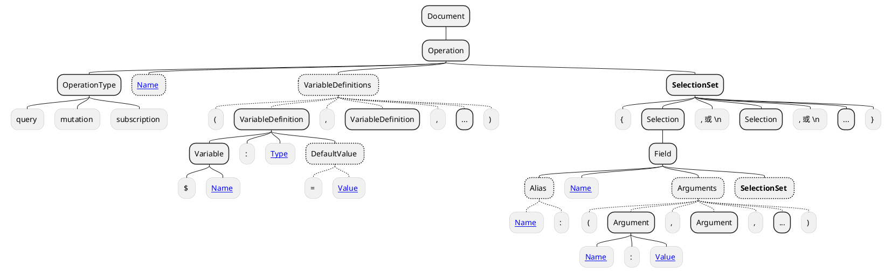

import Header from '@site/docs/\_header.md';

<Header />

:::warning

本文还在编写中，内容随时会发生变化，也会存在大量错误，请谨慎阅读！

:::

NopGraphQL 引擎为 Nop 平台的业务层实现方案，其负责对业务对象的业务处理，
还可以通过 [NopORM 引擎](./orm)对数据进行存取操作。

与传统的 MVC 架构模式不同的是，NopGraphQL
引擎同时替代了控制器层（Controller）和服务层（Service）的职能，
让应用的层级结构变得更加简单。并且，NopGraphQL 引擎自身是
[框架中立](https://gitee.com/canonical-entropy/nop-entropy/blob/master/docs/theory/framework-agnostic.md)
的，没有依赖于 Web Servlet、Hibernate 等具体实现，
因此，在自动化测试，非 Web 应用开发，以及与其他框架集成等方面，具有更加灵活的优势。

## 术语解释 {#term}

- **客户端**：浏览器、第三方调用等 Web 接口调用的发起方，均统称为客户端；
- **业务对象**：描述并承载应用业务数据的对象；
- **业务处理函数**：对业务对象进行相关处理的代码实现；

## 关于 GraphQL {#about-graphql}

> - 关于 GraphQL 的详细介绍请阅读 [《GraphQL 从入门到起飞》](https://juejin.cn/post/6897173001373483021)
> - [Nop 平台采用 GraphQL 作为服务实现的原因？](https://chatglm.cn/share/Fj0iT)

顾名思义，NopGraphQL 引擎本质是 [GraphQL](https://graphql.org/learn/) 的服务端实现，
其会按照客户端给定的 [GraphQL Document](https://spec.graphql.org/October2021/#sec-Document)
执行 [GraphQL Operation](https://spec.graphql.org/October2021/#sec-Language.Operations)
并返回相应的 [GraphQL Field](https://spec.graphql.org/October2021/#sec-Language.Fields)
数据。当然，NopGraphQL 对 GraphQL 也做了增强处理，同时去掉了一些无关的设计，让 GraphQL
更加适配 Nop 平台的要求。

GraphQL Document（GraphQL 文档）语法的主要结构如下：



例如，在 GraphQL Document 中定义一个 `OperationType`（操作类型）为 `query`，
但未指定 `Name`（名字）的 `Operation`（操作）：

<!-- prettier-ignore -->
```graphql
# 定义 Operation
query (
  # 定义 VariableDefinition，
  # 其中，QueryBeanInput 为
  # NopGraphQL 的内置输入类型
  $query: QueryBeanInput
) {
  # 定义 Field
  UserEntity__findPage(
    # 定义 Argument，并引用 Operation
    # 中的变量 $query 作为参数 query 的值
    query: $query
  ) {
    total
    items {
      id, name
      # 定义指定了 Alias 的 Field
      roles: roleList(limit: 10) {
        items { id, name }
      }
    }
  }
}
```

上例中，在 GraphQL Operation 上定义了一个类型为 `QueryBeanInput`
的变量 `$query`，该变量需由客户端随 GraphQL 端点调用一起传给服务端，
再由服务端将其转换（采用 JSON 反序列化等方式）为 `QueryBeanInput` 对象后，
传递到 GraphQL Field 的参数列表中。

在 GraphQL Operation 中定义的 `SelectionSet` 为嵌套的选择字段（`GraphQL Field Selection`），
最终执行 GraphQL Operation 的结果需按该嵌套结构逐级钻取后，再返回给客户端，比如：

```json
{
  "data": {
    "UserEntity__findPage": {
      "total": 10,
      "items": [{
        "id": 123456789,
        "name": "abc",
        "roles": {
          "items": [{
            "id": 35426178,
            "name": "guest"
          }, { ... }, ...]
        }
      }, { ... }, ...]
    }
  }
}
```

可以看到，GraphQL Field Selection 与返回数据的结构是按层级而相互对应的，
GraphQL Field 的名字（`Name`）或别名（`Alias`）将作为返回数据的属性名，
且别名优先于名字。

实际上，NopGraphQL 引擎在解析 GraphQL Document 的过程中会为每个 GraphQL Field
绑定一个 `IDataFetcher`，用于获取对应的 GraphQL Field 的值，并且，如果当前字段的值是一个对象，
则需要继续向下钻取，在其子层级的 `IDataFetcher` 中将会以该字段值作为源数据，
直接从该对象中取对应属性的值，或者，将其作为关联查询的主要条件，进行过滤查询。

向下钻取将会按照 GraphQL Document 的结构一直进行下去，
直到遇到字段值为[标量类型](https://graphql.org/learn/schema/#scalar-types)（Scalar
types，即整型、字符、布尔等非结构化数据）时才终止。

因此，在前例中，可以这样理解 GraphQL Document 的数据钻取过程：

- 调用 `UserEntity__findPage` 字段绑定的 `IDataFetcher`，并传入参数
  `query`（其值来自于变量 `$query`），以获取分页结果 `PageBean`；
- 得到 `PageBean` 后，继续钻取其属性 `total` 和 `items`，由于 `total` 为标量类型，
  故而，对其的钻取结束，而 `items` 是一个列表，故而，需继续向下钻取；
- 遍历 `items` 列表（假设其元素类型为 `UserEntity`），依次钻取其各个元素的 `id`、`name`
  和 `roleList` 属性。这里只有 `roleList` 是一个列表，因此，继续向下钻取 `roleList`；
- `roleList` 对应的是一个关联查询，并且，在 GraphQL Document 中设置了参数 `limit` 为 `10`，
  表示仅取前 `10` 条数据，因此，该字段绑定的 `IDataFetcher` 将以上一级的 `UserEntity`
  对象作为过滤条件，以查询与上一级对象关联的 `role` 数据；
- 由于在字段 `roleList` 上设置了别名 `roles`，因此，`roleList` 的钻取结果将被赋值到返回结果的
  `roles` 属性上；
- 钻取结束，返回 GraphQL 查询结果；

注意，`IDataFetcher` 是一个通用的 GraphQL Field 钻取接口，其实现类除了可以做列表查询，
还可以调用上一级对象的 getter 方法获取 GraphQL Field 指定的属性的值，
比如，钻取 `PageBean` 的 `total` 和 `items` 属性时，便是直接调用的方法
`getTotal()` 和 `getItems()`。

但是，GraphQL Field 与 `IDataFetcher` 不是随意绑定的，而是由
[GraphQL Schema](https://graphql.org/learn/schema/)（即对 GraphQL Document 的类型定义）确定的，
而在 NopGraphQL 中，GraphQL Schema 则是根据 [XMeta](../../manual/xmeta)
和 [BizModel](../../manual/xbiz) 动态生成的。

得益于 GraphQL Field 相互间互不干扰的取值（`fetcher`）机制，
使得 GraphQL 能够自由地**选择**和**组合**输出字段，为定制输出数据提供了极大的灵活性和自由度，
客户端完全可以按照自身需求指定包括子查询在内的复杂的数据钻取，
甚至可以在一个 GraphQL Operation 中同时指定多个相关取值：

```graphql
query (
  $id: String,
  $id2: String,
  $query: String
) {
  entity1: MyEntity__get(id: $id) {
    name
    children2: children {
      desc2: desc
      extField
    }
  }

  entity2: MyEntity__get(id: $id2) {
    id
    children {
      name
      myName
    }
  }

  MyEntity__findPage(query: $query) {
    items {
      id
      name
      children {
        name
        value
      }
    }
  }
}
```

> NopGraphQL 通过配置项 `nop.graphql.query.max-operation-count`
> 控制 GraphQL Operation 中允许的 GraphQL Selection 的最大数量，缺省为 `10`。

而这种字段选择和组合能力并不会造成开发的额外负担，大部分 GraphQL Field 都可以通过推理自动绑定上相应的
`IDataFetcher`。即使需要应对复杂的数据钻取需求，在 NopGraphQL 中也可以通过
[XMeta](../../manual/xmeta) 和 [BizModel](../../manual/xbiz) 动态实现，
并且，其原生支持差量机制，从而让 GraphQL 具备了无限可能。

最后，列举一些 `OperationType` 为 `mutation` 的 GraphQL Document 样例，
以便于更全面了解 GraphQL 的编写形式：

```graphql title="新增数据"
mutation {
  NopAuthUser__save(data: $data) {
    id
    name
    status
  }
}
```

```graphql title="更新数据"
mutation {
  NopAuthUser__update(data: $data) {
    id
    name
    status
  }
}
```

```graphql title="删除数据"
mutation {
  NopAuthUser__batchDelete(ids: $ids)
}
```

## 引擎实现分析 {#engine-impl}

> 在阅读本章节前，请先对 GraphQL 做一些[简单了解](#about-graphql)。

虽然 NopGraphQL 引擎是 GraphQL 的服务端实现方案，
但其满足可逆计算理论所要求的[形式等价变换](https://gitee.com/canonical-entropy/nop-entropy/blob/master/docs/theory/graphql-vs-rest.md)，
可以将 REST、gRPC 等协议等价变换为 GraphQL 协议，
所以，其同样支持以 REST、gRPC 等形式的 Web 接口调用。

```plantuml
actor "GraphQL\nREST\ngRPC\n..." as client
control "[[#impl-parse-graphql-doc 解析 GraphQL Document]]" as parse_doc
control "[[#impl-init-graphql-doc 初始化 GraphQLDocument]]" as init_doc
control "[[#impl-fetch-graphql-field-data 取 GraphQLDocument 字段值]]" as fetch_data
file "~*.xmeta" as xmeta
file "~*.xbiz" as xbiz

xmeta -up-> init_doc: IObjMeta
xbiz -up-> init_doc: IBizModel

client -right-> parse_doc: 提交 GraphQL Document
parse_doc -down-> init_doc: 生成 GraphQLDocument
init_doc -left-> fetch_data: 提供 GraphQLDocument
fetch_data -up-> client: 返回字段取值结果
```

如上图所示，客户端可以 GraphQL、REST、gRPC 等形式发起接口调用，
在 NopGraphQL 中会将不同形式的调用所携带的数据统一转换为 `GraphQLDocument`
对象，从而在引擎核心 `GraphQLEngine` 中便只需专注于对 `GraphQLDocument` 的处理即可。

> 为了便于清晰阐述 NopGraphQL 的处理逻辑，本文将以 GraphQL 形式的调用为主，
> 而对 REST 和 gRPC 的形式转换，则可以分别阅读 `GraphQLWebService#runRest`
> 和 `GraphQLServerCallHandler#startCall` 的实现代码。

### 解析 GraphQL Document {#impl-parse-graphql-doc}

假设客户端向 NopGraphQL 提交的 GraphQL Document 如下：

<!-- prettier-ignore -->
```graphql
query ($query: QueryBeanInput, $id: String) {
  UserEntity__findPage(query: $query) {
    total
    items { id, name }
  }

  UserEntity__get(id: $id) {
    id, name
  }
}
```

则客户端需要调用 Web 接口 `/graphql`，并以 JSON 对象形式，向服务端同时回传以上
GraphQL Document 的文本内容和变量 `$query`、`$id` 的值：

```json
{
  // GraphQL Document 的文本内容
  "query": "query ($query: QueryBeanInput, $id: String) { ... }",
  // 存放 GraphQL Operation 上声明的变量的值，
  // 不过，变量名需去掉开头的 `$`
  "variables": {
    "query": { ... },
    "id": 123456
  }
}
```

NopGraphQL 在接收到客户端的调用请求后，将按照以下过程解析 GraphQL Document 文本，
以得到原始的 `GraphQLDocument` 对象：

<!-- https://plantuml.com/sequence-diagram -->

```plantuml
autonumber "<b>[000]"

entity "客户端" as client
entity "GraphQLWebService" as service
entity "GraphQLEngine" as engine
entity "GraphQLDocumentParser" as parser

client -> service: 提交 JSON 数据：\n{ query: "query ...",\n  variables: { ... } }
activate service
  service -> service: 反序列化 JSON 字符串为\nGraphQLRequestBean

  service -> engine: 提供参数\nGraphQLRequestBean
  activate engine
    engine -> engine: 获取 GraphQL Document 文本：\nGraphQLRequestBean#query

    engine -> engine: 调用 ~#parseOperation(query)
    activate engine
      engine -> engine: 调用\n~#parseOperationFromText(\n  query\n)
      activate engine
        engine -> parser: 提供参数 query
        activate parser
          parser -> parser: 调用\n~#parseFromText(query)
          activate parser
            parser -> parser: 解析 query 文本
            parser -> parser: 返回 GraphQLDocument
          deactivate parser

          parser -> engine: 返回 GraphQLDocument
        deactivate parser

        engine -> engine: <color:red>初始化 GraphQLDocument</color>
      deactivate engine
    deactivate engine
  deactivate engine
deactivate service
```

> **解析 query 文本**是对 GraphQL 语法树的解析，可以阅读
> `GraphQLDocumentParser#doParse` 的实现代码以深入了解其解析过程。

但是，原始的 `GraphQLDocument` 对象仅包含 GraphQL Document 的结构，并不包含字段定义，
所以，在 `GraphQLEngine` 中还将校验其结构的有效性，并为 GraphQL Field 补充字段定义（即
`GraphQLFieldDefinition`），从而完成对 `GraphQLDocument` 的初始化。

### 初始化 GraphQLDocument {#impl-init-graphql-doc}

NopGraphQL 要求在 GraphQL Operation 内的第一级 GraphQL Field Selection（可以有多个）按
`{bizObjName}__{bizAction}` 形式命名，如，`UserEntity__findPage`，
其中，双下划线 `__` 作为确定的分隔符，将左右两侧的名字分隔开来，
其左侧 `{bizObjName}` 表示 [BizModel](#biz-model) 的名字 `UserEntity`，
而右侧 `{bizAction}` 则表示在 `{bizObjName}` 上定义的操作函数 `findPage`，
并且，在 `{bizObjName}` 和 `{bizAction}` 中不能再出现双下划线。

> 在一个 GraphQL Document 中只能定义唯一一个 GraphQL Operation。

对 `GraphQLDocument` 的初始化也将按照以上要求的形式，从对第一级 GraphQL Field Selection
名字的分解开始：

```plantuml
state "GraphQLEngine\n~#resolveSelections(doc)" as call_engine_resolveSelections
state "GraphQLSelectionResolver#resolveSelection(doc)" as call_resolver_resolveSelection: 从 doc 中得到 GraphQL Operation 对象 <b>op:GraphQLOperation</b>

[*] -down-> call_engine_resolveSelections: doc:GraphQLDocument
call_engine_resolveSelections -> call_resolver_resolveSelection: doc
call_resolver_resolveSelection -down-> call_resolver_resolveOperation: (doc, op)

state "GraphQLSelectionResolver#resolveOperation(doc, op)" as call_resolver_resolveOperation {
  state "遍历 op 中的第一级 GraphQL Field Selection" as get_field_from_op: 定义循环变量为 <b>field:GraphQLFieldSelection</b>
  state " " as split_objName_from_op: 取 field#name 中双下划线之前的部分作为 <b>objName</b>
  state has_op_field <<choice>>

  [*] -right-> get_field_from_op: op
  get_field_from_op -right-> has_op_field

  has_op_field -right-> [*]: 遍历结束
  has_op_field -down-> call_engine_getOperationDefinition: field

  call_engine_getOperationDefinition -down-> split_objName_from_op
  split_objName_from_op -down-> call_resolver_resolveFieldSelection: (objName, fieldDef, field)

  state "GraphQLEngine~#getOperationDefinition(field#name)" as call_engine_getOperationDefinition {
    [*] -right-> call_bizObj_getOperationDefinition: field#name
    call_bizObj_getOperationDefinition -down-> [*]: fieldDef

    state "BizObjectManager#getOperationDefinition(field#name)" as call_bizObj_getOperationDefinition {
      state " " as split_field_name: 按照 **{bizObjName}__{bizAction}**\n形式从 field#name 中提取出\n**bizObjName** 和 **bizAction**
      state "<color:red>BizObjectManager\n<color:red>~#getBizObject(bizObjName)" as call_biz_obj_man_getBizObject: 根据 bizObjName 得到\n业务根对象<b>bizObj:IBizObject</b>
      state "bizObj\n~#getOperationDefinition(bizAction)" as call_biz_obj_getOperationDefinition: 根据 bizAction 获取字段 **{bizObjName}__{bizAction}**\n的字段定义 <b>fieldDef:GraphQLFieldDefinition</b>

      [*] -right-> split_field_name: field#name
      split_field_name -down-> call_biz_obj_man_getBizObject: (bizObjName, bizAction)
      call_biz_obj_man_getBizObject -left-> call_biz_obj_getOperationDefinition: (bizObj, bizAction)
      call_biz_obj_getOperationDefinition -down-> [*]: fieldDef
    }
  }

  state "GraphQLSelectionResolver~#resolveFieldSelection" as call_resolver_resolveFieldSelection {
    state "field#setFieldDefinition(fieldDef)" as call_field_setFieldDefinition: 为字段 <b>field</b> 补充字段定义 <b>fieldDef</b>
    state " " as validate_field_args: 为 field 校验并补充\nGraphQL Field Argument 定义\nGraphQLArgumentDefinition
    state top_has_sub_field <<choice>>

    state "GraphQLEngine#getTypeDefinition(objName)" as call_engine_getTypeDefinition: 得到第一级 GraphQL Field Selection 的类型定义\n<b>objDef:GraphQLObjectDefinition</b>，其代表\nbizObjName 对应的业务对象的结构
    state "遍历 field 中的子级 GraphQL Field Selection" as get_field_from_field: 定义循环变量为 <b>subField:GraphQLFieldSelection</b>
    state "objDef#getField(subField#name)" as call_obj_def_getField: 获取 subField 的字段定义\n<b>subFieldDef:GraphQLFieldDefinition</b>
    state has_sub_field <<choice>>
    state start <<start>>
    state end0 <<end>>
    state end1 <<end>>

    start -right-> call_field_setFieldDefinition: (objName, fieldDef, field)
    call_field_setFieldDefinition -right-> validate_field_args
    validate_field_args -down-> top_has_sub_field

    top_has_sub_field -left-> end0: 无子级字段
    top_has_sub_field -down-> call_engine_getTypeDefinition: objName

    call_engine_getTypeDefinition -left-> get_field_from_field: (objDef, field)
    get_field_from_field -up-> has_sub_field

    has_sub_field -right-> end1: 遍历结束
    has_sub_field -up-> call_obj_def_getField: (objDef, subField#name)

    call_obj_def_getField -up-> start: (objDef#name, subFieldDef, subField)
  }
}
```

客户端提交的 GraphQL Document 还需要通过预先定义的 GraphQL Schema 进行校验，
以确保其有效性。而在 NopGraphQL 中并不需要在开发时定义 GraphQL Schema，其对
GraphQL Document 的校验是依据业务对象的 [XMeta](../../manual/xmeta) 结构来处理的，
其 XMeta 定义在 DSL 文件 `{bizObjName}.xmeta` 中。

还是以以下 GraphQL Document 为例：

<!-- prettier-ignore -->
```graphql
query ($query: QueryBeanInput, $id: String) {
  UserEntity__findPage(query: $query) {
    total
    items { id, name }
  }

  UserEntity__get(id: $id) {
    id, name
  }
}
```

GraphQL 字段 `UserEntity__findPage` 和 `UserEntity__get` 为
GraphQL Operation 中的第一级字段，其名字由业务对象名字 `UserEntity`
和业务处理函数 `findPage` 与 `get`，也就是，
一级字段实际上对应的是[业务模型](#biz-model)的[处理函数](#biz-action)，
并且，字段的参数也会作为处理函数的参数被使用。

找到了一级字段对应的业务处理函数（`BizAction`）后，便可得到该函数的返回值类型，
比如，`findPage` 的返回类型为 `PageBean`，通过对其结构的分析，
便可得到其所包含的有效属性及其属性类型、属性值约束等信息。

需要注意的是，`PageBean` 的属性是用 `@PropMeta` 注解做了标注，
所以，对其结构的分析，在本质上也是在构造其 XMeta 结构。
因此，能够在 GraphQL Document 中作为字段的对象，都必须有相应的 XMeta 结构。

> 对 `PageBean` 的结构分析逻辑见 `ReflectionGraphQLTypeFactory#buildPageBeanType`。

在找到一级字段的字段定义后，便可以该字段定义为根节点，沿着客户端提供的 GraphQL Document
的结构做广度+深度遍历，并在遍历过程中获取到当前字段的字段定义，若字段没有字段定义，
则其结构无效，中止遍历，否则，将字段与其字段定义绑定在一起，以便于后续进行**字段取值**操作。

> `BizObjectManager#getBizObject(bizObjName)` 只是从缓存中根据 `bizObjName`
> 获取其业务对象定义而已，而对业务对象构造过程的详细分析请阅读章节 [BizObject](#biz-object)。

完成对 `GraphQLDocument` 的初始化后，接下来，便需要沿着其结构获取字段值了。

### 取 GraphQLDocument 字段值 {#impl-fetch-graphql-field-data}

## BizObject {#biz-object}

```plantuml
interface "IBizObject" as biz_obj {
  bizModel: IBizModel
  objMeta: IObjMeta
}

interface "IBizModel" as biz_model {
  actions: List<IBizActionModel>
}

interface "IBizActionModel" as biz_action {
}

interface "IObjMeta" as obj_meta {
  props: List<IObjPropMeta>
}

interface "IObjPropMeta" as obj_prop_meta {
}

interface "IOrmEntity" as orm_entity {
}

biz_obj "1" *-- "1" biz_model: 包含 >
biz_obj "1" *-- "1" obj_meta: 包含 >

biz_model "1" *-- "*" biz_action: 包含 >
obj_meta "1" *-- "*" obj_prop_meta: 包含 >

obj_meta -right- orm_entity: 映射
```

### BizModel {#biz-model}

#### BizAction {#biz-action}

### ObjMeta {#obj-meta}

## BizLoader {#biz-loader}

## 数据权限控制 {#data-auth}

<!--
## 聚合根

聚合不是为了实现事务

- 主分解维度，门面模式
  面向对象而不是面向 DTO，不是面向 ID
- 全局关系 + 内部的局部关系。不同比例尺的地图
- 信息尽在指尖
- 实体 + 延迟加载 + session 缓存：结构聚合
- BizObject: 行为聚合
- GraphQL: 结构的选择和组合

聚合根首先是逻辑的聚合，BizModel 的切片构造就是一种聚合方式，
这种做法不是传统的面向对象中的继承方式和组合方式。
另外聚合的对偶概念是动态切片，GraphQL 恰好提供了一种在获取信息时的一种动态切片能力，
使得我们可以在概念层面上维持一个庞大的聚合根概念，但是在实际层面每次都只加载少量数据。
没有对偶的切片概念，本身聚合根就会非常臃肿，成为性能的拖累。

## 利用 XMeta 元数据模型统一动态处理模式

一般的函数复用只是复用一模一样的处理逻辑，最多是通过几个回调函数来提供有限的扩展点，
但很多时候并不存在完全一样的处理逻辑，**我们能够抽象只是一种处理模式**。
例如，save 函数的基本处理逻辑如下：

1. 验证前台提交的字段信息
2. 对于支持逻辑删除的实体，需要检查是否存在标记为删除的实体
3. 检查数据库中不存在重复的记录，比如不允许多个用户具有同样的身份证等
4. 根据请求数据创建实体对象，对于复杂的主子表结构需要进行特殊处理

每种不同实体的 save 逻辑的整体结构是完全一致的，但具体的细节不同。
比如每个字段的类型和校验规则都不同，部分字段还需要执行转换逻辑，
将前台传入的值转换为后台要求的格式等。不同实体上用于区分唯一性的字段也不同。
在 Nop 平台中每个业务对象都可以关联一个 XMeta 文件，通过它可以定义业务对象的元数据。

> XMeta 元数据比 Java 的注解要更加灵活和强大，它支持元编程和自定义扩展，
> 通过 XDef 元模型自动进行结构校验。

使用 XMeta 还有一个好处是支持 Delta 定制。
我们在不同的应用中对于同一个业务对象可以使用不同的 XMeta 模型，
从而定制实际处理的内容。如果使用强类型的 DTO 对象就很难在不修改基础产品源码的情况下实现逻辑定制。

GraphQL 的对象组合能力与 XMeta 的对象结构抽象能力，
以及可逆计算的差量化能力结合在一起，可以将大部分 CRUD 相关的逻辑固化下来。
一般不需要编写 CRUD 相关的代码，也不需要针对不同的场景生成大量代码，
通过统一的实现即可完成主体需求，我们最多只需要向 CRUD 模型补充偏离标准 CRUD 处理过程的差量信息即可。

CrudBizModel 采用的是元数据驱动的实现方式，它会读取 xmeta 配置文件中的内容，
内置实现了数据验证、自动初始化、级联删除、逻辑删除、数据权限等多种常见需求，
所以一般情况下只需要调整 xmeta 和 xbiz 配置文件，并不需要编写定制逻辑。

1. 数据验证：类似于 GraphQL 的输出选择，NopGraphQL 可以对输入字段进行选择性验证和转换，这体现了**输入和输出的对偶性**。

   ```js
   validatedData = new ObjMetaBasedValidator(
     bizObjManager,
     bizObjName,
     objMeta,
     context,
     checkWriteAuth
   ).validateForSave(input, inputSelection);
   ```

2. 自动初始化：在 meta 中可以配置字段的 autoExpr 表达式，
   更新或者修改的时候可以根据该配置自动初始化字段值。autoExpr
   表达式可以根据数据模型中的 domain 配置自动生成。

3. 自动转换：根据 meta 中配置 transformIn 表达式，对输入的属性值进行适配转换。
   transformIn 表达式可以根据数据模型中的 domain 配置自动生成。

4. 级联删除：标记为 cascade-delete 的子表数据会随着主表数据的删除一并删除，
   而且会执行子表对应的 BizObject 业务对象上的定义的删除逻辑。

5. 逻辑删除：如果启用 delFlag 逻辑删除标记字段，则底层的 ORM
   引擎会自动将删除调用转换为修改 delFlag 的操作，并且对所有查询都自动应用
   delFlag=0 的过滤条件，除非明确在 SQL 对象上设置 disableLogicalDelete 属性。

6. 数据权限：所有读取到的实体记录都会自动验证是否满足数据权限要求。

## GraphQL 对象：BizModel {#biz-model}

NopGraphQL 引擎在初始化的时候会利用 IoC 容器的动态扫描能力发现所有标记了`@BizModel`注解的
bean，并把它们按照 BizObjName 配置进行归类合并。

NopAuthUserBizModel 和 NopAuthUserBizModelEx 的 BizObjectName 都是
NopAuthUser，它们的方法会叠加在一起共同生成 NopAuthUser 业务对象上的方法。当出现同名的函数时，会按照`@Priority`
优先级配置选择优先级更高的实现。如果优先级相同且函数名相同，则会抛出异常。

NopGraphQL 引擎在构造 BizObject 的时候还会检查 xbiz 扩展模型，我们可以通过在 NopAuthUser.xbiz
模型文件中增加方法来扩展 BizObject，这个模型文件可以在线更新，更新后会即时起效，无需重新初始化 GraphQL
类型定义。xbiz 文件中定义的方法优先级最高，它会自动覆盖 JavaBean 中定义的业务方法。

如果把对象名相同的 BizModel 看作是对象的一个切片，则 NopGraphQL
引擎相当于是在系统初始化的时候动态收集这些对象切片，然后像 docker
镜像一样把它们叠加在一起，构成完整的对象定义。在运行时，最上层的
xbiz 切片可以被动态修改，并覆盖下层切片的功能。

> BizModel 切片的概念有些类似于游戏开发领域中的 Entity Component System (ECS)模式，只是它累加的是动态行为而不是局部状态。

与 Gather 对偶的能力是 Scatter：我们经常需要做一些全局规则的抽象，
需要将某些公共知识自动推送到不同的业务对象中。NopGraphQL 主要通过
AOP 机制和元编程机制来实现信息的分发：

1. 公共的机制可以作为 AOP 拦截器作用于符合条件的业务方法上

2. xbiz 文件中可以通过 XLang 中通用的 x:gen-extends 元编程机制动态生成方法定义。
   也可以使用外部的 CodeGenerator 来生成代码。

在 xbiz 文件中可以直接编写 query,muation, loader 等函数定义，它们会覆盖 Java 的 BizModel 中的相应函数实现。
也就是说，对外暴露的 BizObject 是由所有的 BizModel 类以及 XBiz 模型文件中定义的所有函数所组成的，在 BizObjectManager 启动的时候会扫描
系统中所有的 BizModel 类，以及 XBiz 模型文件，生成对应的 BizObject 对象。

**XBiz 中定义的函数优先级最高，如果与已有的函数同名，则会自动覆盖**

- nop-graphql-core 提供了 GraphQL 的执行引擎，协调多个 DataFetcher 并行获取数据，并且提供了 RPC 调用接口封装

- nop-graphql-orm 提供了使用 NopORM 引擎实现的各种 DataFetcher

- nop-dao 提供了 JDBC 封装、事务封装以及数据库 Dialect 机制

- nop-orm-model 提供了实体模型定义，而 nop-orm-eql 提供了 EQL 语法的解析器。这两个模块可以独立于 nop-orm 引擎被使用

- nop-orm 实现了一个包含 Hibernate 和 MyBatis 所有核心功能的 ORM 引擎

- nop-biz 中的 BizObjectManager 提供了 IGraphQLSchemaLoader 接口的实现，将 GraphQL 调用映射到 BizModel 的方法上。
  这个过程类似于 REST 框架将 URL 链接映射到 Controler 类的方法上。nop-biz 模块内置了 CRUD 服务和字典表服务。

- nop-biz 通过 nop-fsm 内置了有限自动机机制，可以描述某些简单的业务流程

- nop-biz 并不强依赖于 NopIoC 容器，但是依赖 nop-ioc 模块可以利用模块内置的 beans.xml 配置。

**服务函数可以看作是某种执行 DSL 的虚拟机，传入的参数不同会指导虚拟机执行不同的处理逻辑**。
举个具体的例子，CrudBizModel 中提供的 findPage/findList 等通用查询函数，
它们所接收的查询条件对象 QueryBean 就可以看作是一种 DSL，它描述了针对一个复杂对象结构的组合查询条件。

### 通过元编程增强 XBiz 模型

一旦引入 XBiz 这样的 DSL 模型文件，就可以立刻施展标准化的元编程套路，
为 DSL 模型引入更多的自定义扩展。例如，在 XBiz 文件中，我们可以通过如下方式引入逻辑编排支持。

```xml
<biz>
  <x:post-extends>
    <biz-gen:TaskFlowSupport xpl:lib="/nop/core/xlib/biz-gen.xlib"/>
  </x:post-extends>

  <actions>
    <mutation name="callTask" task:name="test/DemoTask"/>
  </actions>
</biz>
```

- `x:post-extends`在模型解析的编译期自动执行，通过`<biz-gen:TaskFlowSupport>`
  标签会自动对具有`task:name`的函数节点进行变换，自动生成调用 TaskFlowManager 的代码。

- 我们可以使用可视化的逻辑编排设计器来设计`Task`，然后在 XBiz 模型中只要为服务函数指定它所关联的`task:name`即可。

### BizLoader {#biz-model-biz-loader}

1. `@BizQuery`表示本方法将被映射为 GraphQL 中的 query 调用，`@BizMutation`
   将被映射为 GraphQL 中的 mutation 调用。

2. `@BizLoader`为 GraphQL 类型的属性提供 fetcher 和 loader 定义。
   注意，为了保证概念的简单性，NopGraphQL 要求所有属性都必须在 xmeta 文件中声明，
   BizModel 中仅是为已定义的属性提供定制的加载器。

3. 如果返回值类型为 CompletionStage，则表示该方法异步执行

4. 如果标注了`@BizLoader`注解的方法的 ContextSource 参数为 List
   类型，则表示它对应 GraphQL 的 DataLoader 实现，支持批量加载。

### 没有实体定义的情况下也可以写 BizModel 吗？

可以，Nop 平台的整体设计是分层的，后一层不依赖于前一层。
自己写一个 BizModel 类即可，参见 LoginApiBizModel。

通过 Nop 平台的代码生成器，我们可以根据 Excel 中的数据模型定义一路推导得到前端页面，
但是每个推导步骤都是可选步骤，并不一定需要前一个步骤的存在。

参考 LoginApiBizModel 的实现，我们可以在 Java 中直接编写一个 BizModel 类，
然后在某个 beans.xml 中注册，即可通过 NopGraphQL 引擎来调用。

> LoginApiBizModel 实现 ILoginSpi 接口仅仅是为了提高代码可读性和可维护性，
> 并不是必须的。一个 BizModel 类可以不继承任何基类，也不需要实现任何接口，
> 本质上 BizModel 与 Spring 框架中的 Controller 类似，只是它不依赖于任何 Web 运行时环境，
> 返回结果也不要求是 POJO 等可以直接进行 JSON 序列化的对象。
> （BizModel 中函数的返回值会经过 NopGraphQL 引擎处理后得到返回值）

使用 NopGraphQL，一般没有必要再区分 Controller 和 Service，
直接在 Service 上增加@BizModel 注解（并注册在 beans.xml）中即可直接将服务发布为 Web 服务。
通过 meta 层可以进行返回结果增强和后处理等，即 NopGraphQL 本身提供了一个弹性适配层，
很多情况下都没有必要再增加一个对象来实现适配。

## 数据权限控制 {#data-auth}

## 在 Biz 模型中调用 validator 模型 {#biz-validator}

Nop 平台中的后台服务函数不一定在 Java 类中实现。在进行无代码开发的时候，
后台服务函数可以写在 xbiz 模型文件中，biz 模型支持在线编辑、动态加载，
在不停机的情况下可以增加后台 GraphQL 服务函数，并立刻起效。

testValidator3 函数通过`biz:RunValidator`标签函数来装载外部的 validator 模型文件，
并执行验证逻辑。这样做的好处是未来可以通过 Delta 定制机制来修改验证逻辑，而不用修改 Demo.xbiz 文件。

```xml
<biz:RunValidator xpl:lib="/nop/core/xlib/biz.xlib"
                  validatorPath="/nop/demo/validator/process-card.validator.xml"
                  obj="${{entity,firstProductionOrder:entity.productionOrder,firstMaterial}}"/>

```

> Biz 模型是 XML 格式，因此可以通过一个可视化设计器来在线设计 Biz 模型。
> 对于具体的 Action，也可以通过可视化拖拽的方式来实现。
> 例如，将`<biz:RunValidator>`标签看作是一个组件，validatorPath 等是组件的属性，
> 可以从面板中拖拽对应的组件到 Action 容器中，从而实现可视化的逻辑编排

### 通过元编程将 Validator DSL 嵌入到 Biz 模型中

Demo.xbiz 文件中的 testValidator2 函数演示了另外一种执行 Validator 验证逻辑的方式。
它通过宏标签将 Validator 模型嵌入到 Biz 模型中，
在编译宏标签的时候将会把对应节点的内容传入 ValidatorParser 中进行解析得到 ValidatorModel，
在运行期直接使用作为全局变量存在的 ValidatorModel 即可。

```xml
<biz:Validator xpl:lib="/nop/core/xlib/biz.xlib" fatalSeverity="100"
               obj="${{entity,firstProductionOrder:entity.productionOrder,firstMaterial}}">

    <check id="checkTransferCode" errorCode="test.not-transfer-code"
           errorDescription="扫入的码不是流转码">
        <eq name="entity.flowMode" value="1"/>
    </check>
</biz:Validator>
```
-->

<!--
## 时序图

以 Quarkus 集成并发送如下请求为例：

```json title="/graphql"
{
  "query": "query PageProvider__getPage($path:String){\nPageProvider__getPage(path:$path)\n}",
  "variables": {
    "path": "/xxx/pages/Xxx/main.page.yaml"
  }
}
```

请响应逻辑如下：

```plantuml
autonumber "<b>[000]"

entity "浏览器" as browser
entity "QuarkusGraphQLWebService" as service
entity "GraphQLEngine" as engine
entity "GraphQLExecutor" as executor

browser -> service: /graphql:\n在请求 body 中携带\nJSON 格式的 GraphQL 数据
activate service
  service -> service: ~#about-graphql(body)
  activate service
    service -> service: ~#runGraphQL(body)
    activate service
      service -> service: BeanContainer#getBeanByType(\n  IGraphQLEngine.class\n):\n -> GraphQLEngine
      service -> service: 将 body 反序列化为\nGraphQLRequestBean: request

      service -> engine: ~#newGraphQLContext(request)
      activate engine
        engine -> engine: ~#parseOperation(\n  request.getQuery(): query\n)
        activate engine
          engine -> engine: ~#parseOperationFromText(query):\n-> GraphQLDocument

          engine -> engine: 返回 GraphQLDocument
        deactivate engine

        engine -> service: 返回携带 GraphQLDocument 的\nGraphQLExecutionContext: context
      deactivate engine

      service -> engine: ~#executeGraphQLAsync(context)
      activate engine
        engine -> executor: ~#executeAsync(context)
        activate executor
          executor -> executor: ~#invokeOperations
          activate executor
            executor -> executor: ~#_invokeOperations
            activate executor
              executor -> executor: ~#invokeOperationOrTry
              activate executor
                executor -> executor: GraphQLFieldDefinition\n~#getFetcher():\n-> ServiceActionFetcher

                executor -> executor: 返回异步 OperationResult:\n其由异步调用\nServiceActionFetcher#get\n得到
              deactivate executor

              executor -> executor: 返回异步 OperationResult
            deactivate executor

            executor -> executor: 返回异步 OperationResult
          deactivate executor

          executor -> executor: 异步转换 OperationResult\n为 GraphQLResponseBean
          executor -> engine: 返回异步\nGraphQLResponseBean
        deactivate executor

        engine -> service: 返回异步 GraphQLResponseBean
      deactivate engine

      service -> service: 异步转换 GraphQLResponseBean\n为 Response
      service -> service: 返回异步 Response
    deactivate service

    service -> service: 返回异步 Response
  deactivate service

  service -> browser: 返回 JSON 数据
deactivate service
```

`ServiceActionFetcher` 与对应的 `@BizModel` 进行绑定（在调用
`GraphQLEngine#parseOperationFromText` 时做的绑定），
在调用其 `#get` 函数时，将实际调用绑定的 `@BizModel`
对应的 `@BizQuery` 函数。

`GraphQLEngine#parseOperationFromText` 的执行逻辑如下：

```plantuml
autonumber "<b>[000]"

entity "GraphQLEngine" as engine
entity "GraphQLSelectionResolver" as resolver
entity "BizObjectManager" as biz_man
entity "BizObjectBuilder" as biz_builder

engine -> engine: ~#parseOperationFromText(query)
activate engine
  engine -> engine: GraphQLDocumentParser\n~#parseFromText(query):\n-> GraphQLDocument: doc

  engine -> engine: ~#initDocument(doc)
  activate engine
    engine -> engine: ~#resolveSelections(doc)

    engine -> resolver: ~#resolveSelection(doc)
    activate resolver
      resolver -> resolver: ~#resolveOperation(\n  doc, GraphQLOperation: op\n)

      resolver -> engine: ~#getOperationDefinition:\n获取 GraphQLFieldSelection\n的 GraphQLFieldDefinition
      activate engine
        engine -> biz_man: ~#getOperationDefinition
        activate biz_man
          biz_man -> biz_man: ~#getBizObject(bizObjName)
          activate biz_man
            biz_man -> biz_man: ~#buildBizObject(bizObjName)

            biz_man -> biz_builder: ~#buildBizObject(bizObjName)
            activate biz_builder
              biz_builder -> biz_builder: ~#loadBizObjFromModel(bizObjName):\n-> BizObjectImpl: bizObj

              biz_builder -> biz_builder: ~#buildOperations(bizObj)
              activate biz_builder
                biz_builder -> biz_builder: ~#buildActionOperation(bizObj)
                activate biz_builder
                  biz_builder -> biz_builder: BizModelToGraphQLDefinition\n~#toOperationDefinition:\n构造 GraphQLFieldDefinition，\n并与 ServiceActionFetcher 绑定

                  biz_builder -> biz_builder: 返回 GraphQLFieldDefinition
                deactivate biz_builder

                biz_builder -> biz_builder: BizObjectImpl 与\nGraphQLFieldDefinition 绑定
                biz_builder -> biz_builder:
              deactivate biz_builder

              biz_builder -> biz_man: 返回 BizObjectImpl
            deactivate biz_builder

            biz_man -> biz_man: 返回 BizObjectImpl
          deactivate biz_man

          biz_man -> biz_man: BizObjectImpl\n~#getOperationDefinition
          biz_man -> engine:
        deactivate biz_man

        engine -> resolver:
      deactivate engine

      resolver -> resolver: ~#resolveFieldSelection:\n绑定 GraphQLFieldSelection\n与 GraphQLFieldDefinition
      resolver -> engine:
    deactivate resolver

    engine -> engine:
  deactivate engine

  engine -> engine: 返回 GraphQLDocument
deactivate engine
```

在 `BizObjectBuilder#buildBizObject` 中会构造 `@BizModel`
的 GraphQL 对象结构，并与其 xmeta 定义进行合并。
-->

## 注意事项

## 参考资料

- [面向对象的 GraphQL](https://gitee.com/canonical-entropy/nop-entropy/blob/master/docs/dev-guide/graphql/graphql-java.md)
- [低代码平台中的分布式 RPC 框架](https://gitee.com/canonical-entropy/nop-entropy/blob/master/docs/dev-guide/microservice/rpc-design.md)
- [Nop 入门：极简服务层开发](https://gitee.com/canonical-entropy/nop-entropy/blob/master/docs/tutorial/simple/1-simple-service.md)
- [从可逆计算看后端服务函数的可扩展设计](https://gitee.com/canonical-entropy/nop-entropy/blob/master/docs/dev-guide/biz/biz-customization.md)
- [Biz 模型](https://gitee.com/canonical-entropy/nop-entropy/blob/master/docs/dev-guide/graphql/xbiz.md)
- [GraphQL 为什么流行不起来？是设计不足还是设计过度？](https://gitee.com/canonical-entropy/nop-entropy/blob/master/docs/dev-guide/graphql/qa-about-graphql.md)
- [验证模型](https://gitee.com/canonical-entropy/nop-entropy/blob/master/docs/dev-guide/biz/validator.md)
- [CrudBizModel 中的自动验证](https://gitee.com/canonical-entropy/nop-entropy/blob/master/docs/dev-guide/biz/validate.md)
