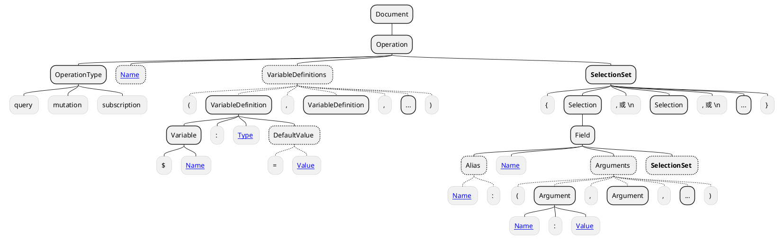
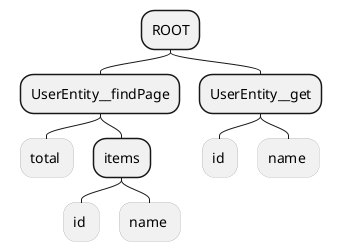
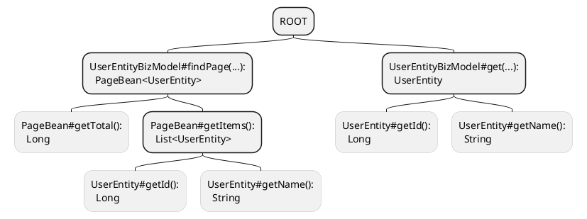

import {Table, TRow, TCol} from '@site/src/components/Table';
import Header from '@site/docs/\_header.md';
import {NopDocLink} from '@site/docs/NopLink';

<Header />

NopGraphQL 引擎是 Nop 平台默认提供的业务层实现方案，
其负责以统一且一致的形式向客户端提供对**业务对象**的操作服务，
并且在与 [NopORM 引擎](./orm)集成后还能够对业务数据进行增删改等持久化操作。

<!-- https://plantuml.com/component-diagram -->

```plantuml
actor "客户端" as client
database "数据库" as db

component "NopGraphQL 引擎" as graphql #yellow
component "[[./orm NopORM 引擎]]" as orm
component "第三方" as other

client -right-> graphql: 调用 GraphQL 接口

graphql -right-> other: 接口调用
graphql -down-> orm: ORM 增删改查

orm <-right-> db: 存取数据

graphql -> client: 返回 JSON 数据
orm -> graphql: 返回 ORM 实体
```

NopGraphQL 引擎自身是<NopDocLink title="框架中立" path="/theory/framework-agnostic.md" />的，
只需要编写少量的适配代码便可以支持除 GraphQL 以外的 REST、gRPC 等形式的 Web 调用，
并且，其也不依赖 Spring MVC、Hibernate 等技术框架，
因此，在自动化测试、非 Web 应用开发以及与其他框架集成等方面，NopGraphQL 具有更加灵活的优势。

## 术语解释 {#terms}

- **客户端**：浏览器、第三方应用等服务调用的发起方，均统称为客户端；
- **业务对象**：描述业务数据的**结构**和相关**业务操作函数**的对象，称为业务对象；
- **业务操作函数**：针对业务数据进行业务处理的函数；
- **元数据**：用于<u>描述某类数据的结构</u>的数据；
- **标量类型**：[Scalar Types](https://graphql.org/learn/schema/#scalar-types)，
  即整数、浮点数、字符串、布尔等非结构化数据类型；
- **对象类型**：[Object Types](https://graphql.org/learn/schema/#object-types-and-fields)，
  即存在结构的数据类型；
- **GraphQL 字段树**：在 GraphQL Document 中，由 GraphQL Field
  组成的结构是树形的，故而称其为**字段树**；
- **GraphQL 字段取值函数**：在 GraphQL Field 上绑定的用于获取字段值的函数被称为**字段取值函数**；
- **GraphQL 根字段**：在 GraphQL Document 中，处于**第一层级**的 GraphQL Field 被称为**根字段**；
- **GraphQL 操作字段**：在 GraphQL Document 中，取值函数被映射到**业务操作函数**的 GraphQL Field
  被称为**操作字段**；
- **GraphQL 对象类型**：其用于描述 GraphQL Document 中对象类型字段的结构，
  并以此限定 GraphQL 字段树的层级结构，从而确保 GraphQL Document 的有效性；

## 关于 GraphQL {#about-graphql}

> - 关于 GraphQL 的详细介绍请阅读 [《GraphQL 从入门到起飞》](https://juejin.cn/post/6897173001373483021)
> - [Nop 平台采用 GraphQL 作为服务实现的原因？](https://chatglm.cn/share/Fj0iT)

顾名思义，NopGraphQL 引擎可以看作是 [GraphQL](https://graphql.org/learn/) 协议的服务端实现，
其主要利用 GraphQL 的数据定制和组合能力，以构建出灵活、高效且易于维护的后端服务。

> 注意，NopGraphQL 的核心能力的是对以 DSL 模型进行设计和开发的业务对象的业务处理支持，GraphQL
> 只是其与客户端进行数据交互的一种外部表现形式。

GraphQL 的主要组成结构如下：



> 虚线框节点表示其为可选节点，需根据具体情况确定是否要在 GraphQL Document 中定义。

- [GraphQL Document](https://spec.graphql.org/October2021/#sec-Document):
  GraphQL 文档，也即整个 GraphQL 文本描述结构；
- [GraphQL Operation](https://spec.graphql.org/October2021/#sec-Language.Operations):
  GraphQL 操作，用于指定所要执行的数据操作类型，如 `query`（查询）、`mutation`（变更）等。
  同时，在 GraphQL Argument 中引用的变量也会在 GraphQL Operation 上进行定义。注意，在一个
  GraphQL Document 中只能定义一个 GraphQL Operation；
- [GraphQL Field](https://spec.graphql.org/October2021/#sec-Language.Fields):
  GraphQL 字段，用于对 GraphQL 的查询或变更结果做**字段选择**，
  也即，仅指定字段的值才会返回给客户端。GraphQL Field 是嵌套定义结构，可嵌套定义
  GraphQL SelectionSet，对于对象类型的字段值，则必须继续对其做字段选择；
- [GraphQL Selection](https://spec.graphql.org/October2021/#Selection):
  自身没有结构，可以等同视为 GraphQL Field，因此，GraphQL Field 也可称为
  GraphQL Field Selection；
- [GraphQL SelectionSet](https://spec.graphql.org/October2021/#SelectionSet):
  以一对花括号 `{`、`}` 包裹起来的 GraphQL Selection 集合，通过逗号 `,` 或换行符 `\n`
  分隔不同的 GraphQL Selection；
- [GraphQL Argument](https://spec.graphql.org/October2021/#Argument):
  GraphQL 字段参数，用于控制 GraphQL Field 的取值结果，比如，按照参数指定的过滤条件获取数据。
  其一般引用在 GraphQL Operation 上定义的变量，以支持参数的动态输入；
- [GraphQL VariableDefinition](https://spec.graphql.org/October2021/#VariableDefinition):
  GraphQL 变量定义，用于定义在 GraphQL Argument 中引用到的变量及其类型。
  客户端需按照变量的类型和结构提供相应的变量值。此为 GraphQL 动态输入特性的体现，可增强
  GraphQL Document 的复用性；

根据 GraphQL 的组成结构，可以定义一个做 `query` 查询操作的 GraphQL Document，例如:

<!-- prettier-ignore -->
```graphql {4,10,17,21}
# 定义匿名 Operation
query (
  # 定义 VariableDefinition
  $query: QueryBeanInput
) {
  # 定义 Field
  UserEntity__findPage(
    # 定义 Argument，并引用 Operation
    # 中的变量 $query 作为字段参数 query 的值
    query: $query
  ) {
    total
    items {
      id, name
      # 定义指定了 Alias 和 Argument 的 Field，
      # 其将使用 roles 作为字段选择结果的属性名
      roles: roleList(limit: 10) {
        items {
          id
          # 使用 roleName 作为字段选择结果的属性名
          roleName: name
        }
      }
    }
  }
}
```

> **注**：`QueryBeanInput` 为 NopGraphQL 内置的
> [GraphQL 输入类型](https://graphql.org/learn/schema/#input-types)。

可以看到，GraphQL Field 会自上而下形成一棵**字段树**，而其各个层级的**子字段树**，
则表示对父字段的<u>字段取值结果</u>做**字段选择**，也就是，在 GraphQL
的**字段选择结果**中，均只包含子字段对应的属性值，在父字段取值结果对象上的其他属性均会被忽略。
比如上例 GraphQL Document 的字段选择结果便为如下形式：

```json {2,7,10}
{
  "UserEntity__findPage": {
    "total": 10,
    "items": [{
      "id": 123456789,
      "name": "abc",
      "roles": {
        "items": [{
          "id": 35426178,
          "roleName": "guest"
        }, { ... }, ...]
      }
    }, { ... }, ...]
  }
}
```

在 GraphQL 字段选择结果中，默认会以对应的 GraphQL 字段名作为其属性名，而若是为字段指定了别名，
如 `roles: roleList` 和 `roleName: name`，则会优先以字段别名 `roles` 和 `roleName`
作为字段选择结果的属性名。并且，在字段取值结果是列表类型，且列表元素为对象类型时，如
`items`，GraphQL 会遍历该列表，并对列表元素做字段选择，再将各元素的字段选择结果按遍历顺序组装到最终的
GraphQL 字段选择结果中。

> 注意，对于元素为标量类型的列表不做字段选择。

而处于第一层级的字段，如 `UserEntity__findPage`，是 GraphQL 字段树进行字段选择的根节点，
并且其字段选择结果也不从属于某个具体的对象，因此，本文称其为 **GraphQL 根字段**。

通常情况下，可以将 GraphQL 字段名视为父字段取值结果对象的属性名，而对父字段做字段选择，
便是从其取值结果对象上取与子字段同名的属性的值。

但是，GraphQL 支持在字段上指定参数，例如 `UserEntity__findPage(query: $query)`
中的 `query` 和 `roleList(limit: 10)` 中的 `limit`，其作用是控制所属字段的取值结果，
比如，根据 `query` 参数中的过滤条件查询得到字段的值。

> 在 GraphQL 字段的参数列表中引用的变量的实际值需要由客户端在提交
> GraphQL Document 时一并回传给服务端。
> 回传数据的结构可参考[《解析 GraphQL Document》](#engine-parse-graphql-doc)章节的内容。

因此，不能简单地将 GraphQL 字段当作是其父字段取值结果对象的属性，
而应该将其视为一个**字段取值函数**：对于简单的字段取值，直接调用父字段取值结果对象的
getter 方法便可得到子字段的值，而对于带参数的字段取值，
则需要根据字段参数才能获取到与其父字段取值结果相关的数据。
并且，通过字段取值函数，可以屏蔽不同字段的取值差异，统一字段取值逻辑，使
GraphQL 的字段取值更加灵活方便，也能够支持如[批量加载](#biz-loader)、获取远程数据等复杂的取值需求。

对于上例中的 GraphQL Document，其字段选择过程则可以大致分为以下几个步骤：

- 调用在 `UserEntity__findPage` 字段上绑定的取值函数，并向取值函数传入参数
  `query`，从而得到符合参数过滤要求的 `UserEntity` 的分页查询结果，在 NopGraphQL
  中其类型为 `PageBean<UserEntity>`；
- 继续从 `PageBean<UserEntity>` 中取字段 `total` 和 `items` 对应的同名属性的值。
  由于 `total` 属性为标量类型，故而，在取得其值后便会结束该方向上的字段选择，而
  `items` 属性的类型为 `List<UserEntity>`，其为对象类型列表，继续对其做字段选择；
- 遍历 `PageBean#items` 列表元素，依次对其各个元素做字段选择：分别取出 `UserEntity`
  中字段 `id`、`name` 对应的属性值。而 `roleList` 字段带有参数，
  因此，其实际绑定的是一个复杂的取值函数，需要将参数 `limit` 的值 `10`
  传给该取值函数，以查询出与当前 `UserEntity` 关联的角色数据，并得到分页查询结果
  `PageBean<RoleEntity>`；
- 继续对 `PageBean<RoleEntity>` 做字段选择，直到遇到的字段值均为标量类型为止；
- 完成字段选择，以字段别名或字段名作为属性名组装并得到 GraphQL Document 的字段选择结果；

当然，以上分析的只是对包含单一根字段的 GraphQL Document 做字段选择的情况，
在复杂的场景下，还可以在同一个 GraphQL Document 中定义多个根字段，
并为根字段指定别名，例如：

<!-- prettier-ignore -->
```graphql {4,10,14}
query (
  $id: String, $id2: String, $query: String
) {
  entity1: MyEntity__get(id: $id) {
    name, children2: children {
      desc2: desc, extField
    }
  }

  entity2: MyEntity__get(id: $id2) {
    id, children { name, myName }
  }

  MyEntity__findPage(query: $query) {
    items {
      id, name, children { name, value }
    }
  }
}
```

其得到的 GraphQL Document 的字段选择结果为如下形式：

```json {2,8,14}
{
  "entity1": {
    "name": "xxx",
    "children2": [{
      "desc2": "xxx", "extField": "xxx"
    }, ...]
  },
  "entity2": {
    "id": "xxx",
    "children": [{
      "name": "xxx", "myName": "xxx"
    }, ...]
  },
  "MyEntity__findPage": {
    "items": [ ... ]
  }
}
```

此外，需要强调的是，GraphQL 是严格区分**数据变更**和**数据查询**操作的，不涉及数据变更的操作，
均需定义为 `query` 类型，而一切涉及到数据变更（增删改）的操作，则都必须定义为 `mutation`
类型，并且在 `query` 操作中不能做数据变更（当然，也没有措施严格履行该约定），而在 `mutation`
操作中也一般不包含仅做数据查询的 GraphQL 根字段，并且在其子字段中可以做数据查询，但不能做数据变更。

> 在 `query` 内的多个 GraphQL 根字段可以并发取值，但在 `mutation`
> 中的多个 GraphQL 根字段只能按顺序执行，因为变更操作存在顺序性，前面的操作可能影响后面的操作。

最后，再列举一些 `mutation` 类型的 GraphQL Document 样例，以便于了解其定义结构：

```graphql title="新增数据"
mutation {
  NopAuthUser__save(data: $data) {
    id
    name
    status
  }
}
```

```graphql title="更新数据"
mutation {
  NopAuthUser__update(data: $data) {
    id
    name
    status
  }
}
```

```graphql title="删除数据"
mutation {
  NopAuthUser__batchDelete(ids: $ids)
}
```

## 引擎实现分析 {#engine}

在对 GraphQL 有一个[基本的认识](#about-graphql)后，便可以继续深入了解
NopGraphQL 引擎的核心设计与实现了。

### 核心模型 {#engine-core-models}

```plantuml
interface "IBizObject" as biz_obj_inf {
}

class "BizObjectImpl" as biz_obj {
  bizObjName: String
  bizModel: IBizModel
  objMeta: IObjMeta
  objectDefinition: GraphQLObjectDefinition
  operations: Map<String, GraphQLFieldDefinition>
}
biz_obj_inf <|-- biz_obj


interface "IBizModel" as biz_model_inf {
}
class "BizModel" as biz_model {
  actions: List<IBizActionModel>
  loaders: List<BizLoaderModel>
}
biz_model_inf <|-- biz_model


interface "IBizActionModel" as biz_action_inf {
}
class "BizActionModel" as biz_action {
  source: IEvalAction
}
biz_action_inf <|-up- biz_action


interface "IObjMeta" as obj_meta_inf {
}
class "ObjMetaImpl" as obj_meta {
  props: List<IObjPropMeta>
}
obj_meta_inf <|-- obj_meta


interface "IObjPropMeta" as obj_prop_meta_inf {
}
class "ObjPropMetaImpl" as obj_prop_meta {
  name: String
}
obj_prop_meta_inf <|-up- obj_prop_meta


class "GraphQLObjectDefinition" as gql_obj_def {
  objMeta: IObjMeta
  fields: List<GraphQLFieldDefinition>
}

class "GraphQLFieldDefinition" as gql_field_def {
  propMeta: IObjPropMeta
  fetcher: IDataFetcher
}

class "GraphQLDocument" as gql_doc {
  getOperation(): GraphQLOperation
}

class "GraphQLOperation" as gql_op {
  getFieldSelections(): List<GraphQLFieldSelection>
}

class "GraphQLFieldSelection" as gql_field {
  fieldDefinition: GraphQLFieldDefinition
  getSelections(): List<GraphQLFieldSelection>
}


interface "IDataFetcher" as fetcher_inf {
}
class "ServiceActionFetcher" as fetcher_biz_action {
}
class "BeanPropertyFetcher" as fetcher_call_getter {
}
class "EvalActionDataFetcher" as fetcher_biz_loader {
}
fetcher_inf <|-- fetcher_biz_action
fetcher_inf <|-- fetcher_call_getter
fetcher_inf <|-- fetcher_biz_loader

biz_obj "1" *-- "1" biz_model: 包含 >
biz_obj "1" *-- "0..1" obj_meta: 包含 >
biz_obj "1" *-right- "1" gql_obj_def: 包含 >

biz_model "1" *-- "*" biz_action: 包含 >
obj_meta "1" *-- "*" obj_prop_meta: 包含 >

gql_obj_def "1" *-- "*" gql_field_def: 包含 >
gql_field_def "1" *-- "0..1" fetcher_inf: 包含 >

gql_doc "1" *-- "1" gql_op: 包含 >
gql_op "1" *-- "1..*" gql_field: 包含 >
gql_field "1" *-left- "1" gql_field_def: 包含 >
```

> 注意，为了确保类图的清晰和简洁性，部分类的结构做了些许变形，请以 NopGraphQL 的最终代码为准。

从以上类图可以发现，NopGraphQL 的核心模型是被明确地分为了两个部分：一个是
`IBizObject`，一个是 `GraphQLDocument`。前者描述的是**业务对象**的组成结构，后者描述的则是
GraphQL Document 的组成结构。

NopGraphQL 的功能设计和实现是围绕业务对象展开的，而 GraphQL Document
是服务端与客户端之间业务数据和业务操作的一种交互形式，其本质只是业务对象的一种表现方式。

业务对象 [`IBizObject`](#biz-object) 主要由 [`IBizModel`](#biz-model)（**业务模型**）和
[`IObjMeta`](#obj-meta)（**业务对象元数据**）组成。
前者定义了一组与业务对象相关的**业务操作函数** `actions: List<IBizActionModel>`，
以及一组与 GraphQL 字段相对应的数据加载函数 `loaders: List<BizLoaderModel>`；
而后者则描述了业务数据的结构，主要由业务对象的**属性元数据**列表 `props: List<IObjPropMeta>`
组成。其中，<u>`IObjMeta` 不是必须的</u>，因为，业务数据可能只是简单类型，并没有明确的结构，
但 <u>`IBizModel` 则是必须的</u>，因为，不需要做任何操作的业务对象，是不需要由应用系统管理的，
其存在没有意义。

> `IBizObject` 可以看作是一个[聚合根对象](https://github.com/keontang/work-notes/blob/master/DDD/9.md)，Nop
> 平台将其分解为**行为聚合**和**数据聚合**，前者由多个 `IBizModel` 行为切片聚合而成，
> 后者则由多个 `IObjMeta` 通过关联属性聚合而成。而通过 GraphQL 的 Selection
> 机制，则可以从聚合根对象上仅截取部分客户端所需要的信息，从而支持对数据的定制化需求。

GraphQL Document 是客户端所提供的 GraphQL 文本内容，其解析后由 `GraphQLDocument` 模型描述。
相应的，GraphQL Operation 对应 `GraphQLOperation` 模型，而 GraphQL Field 则对应
`GraphQLFieldSelection` 模型。其中， `GraphQLDocument` 拥有唯一的 `GraphQLOperation`，
而 `GraphQLOperation` 则拥有至少一个根字段 `GraphQLFieldSelection`。
`GraphQLFieldSelection` 模型自身为嵌套结构，在其子字段列表
`List<GraphQLFieldSelection>` 中可以有零个或多个子字段，因此，其能够完整描述
`GraphQLDocument` 的字段树结构。

传统的 GraphQL 在使用前，还必须为 GraphQL Document 定义相应的
[GraphQL Schema](https://graphql.org/learn/schema/)（GraphQL 模式），
以用于校验客户端提交的 GraphQL Document 的有效性。而在 GraphQL Schema 中最主要的组成部分为
[GraphQL Object Type](https://graphql.org/learn/schema/#object-types-and-fields)（GraphQL
对象类型），其用于限定**对象类型**的 GraphQL 字段的结构，比如下例中定义的两个对象类型
`UserEntity` 和 `PageBean_UserEntity`：

```graphql
type UserEntity {
  id: Long!
  name: String!
}

type PageBean_UserEntity {
  total: Long!
  items: [UserEntity]
}
```

> 在 NopGraphQL 中，分页查询结果 `PageBean<UserEntity>`
> 对应的 GraphQL 对象类型便是 `PageBean_UserEntity`。

对于任意层级的对象类型的字段，在 GraphQL Document 中都必须指定其子字段，
且其子字段的字段名、字段类型也必须与其在 **GraphQL 对象类型**中定义的相同，
因此，根据 GraphQL 对象类型的结构便可以实现对 GraphQL Document 的校验。

而 NopGraphQL 则要求 GraphQL 对象类型都必须由相应的**业务对象元数据** [`IObjMeta`](#obj-meta)
来描述其结构，从而通过 `IObjMeta` 便可以自动推导并构造出 GraphQL 对象类型的结构，该结构对应
`GraphQLObjectDefinition` 模型，并由字段定义列表 `fields: List<GraphQLFieldDefinition>`
组成，因此，不需要再手工编写 GraphQL Schema。

当然，编写 `IObjMeta` 并不是在换一种形式编写 GraphQL Schema，其主要目的是描述业务对象的结构，
只不过 GraphQL 对象类型恰好是同一对象在不同领域中的另一种表现形式而已，二者本质是相同的，
因此，在 NopGraphQL 中可以完全通过 `IObjMeta` 来统一描述和转换同一对象在不同领域中的表现形式，
避免编写大量的「胶水代码」，可从整体上降低应用的复杂度。

与一般 GraphQL 的服务端实现不同的是，NopGraphQL 要求客户端提供的
GraphQL Document 必须为如下形式：

<!-- prettier-ignore -->
```graphql {2}
query ( $query: QueryBeanInput ) {
  UserEntity__findPage( query: $query ) {
    # ...
  }
}
```

其中，GraphQL 根字段名 `UserEntity__findPage` 的结构必须是以双下划线 `__`
为分隔符的固定形式：在分隔符之前的部分对应的是业务对象名，如
`UserEntity`，而分隔符之后的部分对应的则是在 `IBizModel` 上定义的业务操作函数名，如
`findPage`，并且操作函数只能是被标注为 GraphQL `query` 或 `mutation` 的函数。

> `query` 函数由注解 `@BizQuery` 标注，而 `mutation` 函数则由注解 `@BizMutation`
> 标注。

也就是，NopGraphQL 是以<u>调用业务对象的查询或变更函数</u>为出发点做 GraphQL **字段选择**的，
因此，本文将<u>取值函数被映射到业务操作函数的 GraphQL 字段</u>称为 **GraphQL 操作字段**，
并且，**只有 GraphQL 根字段才能是操作字段**。

鉴于操作字段的特殊性，NopGraphQL 会将定义在 `IBizModel` 中的所有 GraphQL `query`
和 `mutation` 函数收集起来，构造为 **GraphQL 字段定义** `GraphQLFieldDefinition`，
并单独放在 `BizObjectImpl#operations` 列表中，而描述业务对象结构的 **GraphQL 对象定义**
`GraphQLObjectDefinition` 则会被绑定在 `BizObjectImpl#objectDefinition` 上。

> 在章节[《初始化 GraphQLDocument》](#engine-init-graphql-doc)中将了解到操作字段和普通字段会以不同的方式获取到其字段定义。

但无论是操作字段还是普通字段，其字段取值函数 `GraphQLFieldDefinition#fetcher` 均为
`IDataFetcher` 类型，并主要包括以下实现：

- `BeanPropertyFetcher`: 调用 Java Bean 上的 getter 方法，如
  `PageBean#getTotal()`、`UserEntity#getId()` 等，获取对象的属性值，
  得到的属性值即为对应字段的**取值结果**；
- `ServiceActionFetcher`: 调用 [`IBizModel`](#biz-model) 上的操作函数，如
  `UserEntityBizModel#findPage(...)`、`UserEntityBizModel#get(...)`
  等，得到函数的返回值，该返回值即为对应的操作字段的**取值结果**；
- `EvalActionDataFetcher`: 其封装的是在 `IBizModel` 中定义的 [@BizLoader](#biz-loader)
  数据加载函数，用于支持对字段关联数据的定制查询需求，如数据批量查询等；

其中，`ServiceActionFetcher` 为 GraphQL 操作字段的默认取值函数，而其他字段则一般缺省采用
`BeanPropertyFetcher` 作为其字段取值函数。

> 注意，非操作字段的缺省取值函数是在 `GraphQLExecutor#hookFetch` 中确定的，并非默认赋值。

### 运行流程 {#engine-how-to-run}

虽然 NopGraphQL 引擎主要实现的是 GraphQL 协议，
但其满足可逆计算理论所提出的<NopDocLink title="形式等价变换" path="/theory/graphql-vs-rest.md" />，
可以将 REST、gRPC 等协议等价变换为 GraphQL 协议，
所以，其同样支持 REST、gRPC 等形式的服务调用。

```plantuml
actor "GraphQL\nREST\ngRPC\n..." as client
control "[[#engine-parse-graphql-doc 解析 GraphQL Document]]" as parse_doc
control "[[#engine-init-graphql-doc 初始化 GraphQLDocument]]" as init_doc
control "[[#engine-select-graphql-field-data 对 GraphQLDocument 做字段选择]]" as fetch_data

client -right-> parse_doc: 提交 GraphQL Document
parse_doc -down-> init_doc: 生成 GraphQLDocument
init_doc -left-> fetch_data: 提供 GraphQLDocument
fetch_data -up-> client: 返回 GraphQLDocument\n的字段选择结果
```

如上图所示，客户端可以以 GraphQL、REST、gRPC 等形式发起服务调用，
在 NopGraphQL 中会将不同形式的调用所携带的数据统一转换为 `GraphQLDocument`
对象，从而在引擎内部中便只需专注于对 `GraphQLDocument` 的处理即可。

> 为了便于清晰阐述 NopGraphQL 的运行逻辑，本章节将主要分析 GraphQL 形式的调用，
> 而对 REST 和 gRPC 的形式转换，则可以分别阅读 `GraphQLWebService#runRest`
> 和 `GraphQLServerCallHandler#startCall` 的实现代码。

总体上，可以将 NopGraphQL 引擎的运行过程分为以下几个阶段：

- [解析 GraphQL Document](#engine-parse-graphql-doc):
  将客户端提交的 GraphQL Document 文本解析为 `GraphQLDocument` 对象；
- [初始化 `GraphQLDocument`](#engine-init-graphql-doc):
  为 `GraphQLDocument` 对象绑定字段定义，并校验其结构的完整性和有效性;
- [对 `GraphQLDocument` 做字段选择](#engine-select-graphql-field)：沿着
  `GraphQLDocument` 的字段树，递归对字段取值结果做字段选择，以得到 `GraphQLDocument`
  的字段选择结果；

注意，若是在以上任一阶段发生异常，则直接抛出即可，在 `GraphQLEngine#toGraphQLResponse`
内将统一处理异常，并向客户端返回包含异常编码和异常信息的消息体。
本章节将按正常的引擎执行情况对以上过程进行分析。

#### 解析 GraphQL Document {#engine-parse-graphql-doc}

假设客户端向 NopGraphQL 提交的 GraphQL Document 如下：

<!-- prettier-ignore -->
```graphql
query ($query: QueryBeanInput, $id: String) {
  UserEntity__findPage(query: $query) {
    total
    items { id, name }
  }

  UserEntity__get(id: $id) {
    id, name
  }
}
```

> 在 NopGraphQL 中需通过配置项 `nop.graphql.query.max-operation-count`
> 指定在 GraphQL Document 中允许出现的根字段的最大数量，缺省为 `10`。

则客户端需以 JSON 对象形式，向服务端同时回传以上 GraphQL Document
的文本内容，以及变量 `$query`、`$id` 的值：

```json
{
  // GraphQL Document 的文本内容
  "query": "query ($query: QueryBeanInput, $id: String) { ... }",
  // 携带在 GraphQL Operation 上声明的变量的值，
  // 其键名为去掉开头的 $ 字符后的 GraphQL 变量名
  "variables": {
    "query": { ... },
    "id": 123456
  }
}
```

NopGraphQL 在接收到客户端的调用请求后，将按照以下过程解析 GraphQL Document 文本，
以得到原始的 `GraphQLDocument` 对象：

<!-- https://plantuml.com/sequence-diagram -->

```plantuml
autonumber "<b>[000]"

entity "客户端" as client
entity "GraphQLWebService" as service
entity "GraphQLEngine" as engine
entity "GraphQLDocumentParser" as parser

client -> service: 提交 JSON 数据：\n{ query: "query ...",\n  variables: { ... } }
activate service
  service -> service: 反序列化 JSON 字符串为\nGraphQLRequestBean

  service -> engine: 提供参数\nGraphQLRequestBean
  activate engine
    engine -> engine: 获取 GraphQL Document 文本：\nGraphQLRequestBean#query

    engine -> engine: 调用 ~#parseOperation(query)
    activate engine
      engine -> engine: 调用\n~#parseOperationFromText(\n  query\n)
      activate engine
        engine -> parser: 提供参数 query
        activate parser
          parser -> parser: 调用\n~#parseFromText(query)
          activate parser
            parser -> parser: 解析 query 文本
            parser -> parser: 返回 GraphQLDocument
          deactivate parser

          parser -> engine: 返回 GraphQLDocument
        deactivate parser

        engine -> engine: <color:red>初始化 GraphQLDocument</color>
      deactivate engine
    deactivate engine
  deactivate engine
deactivate service
```

> **注**：对 GraphQL 变量的解析仅仅是简单地做 JSON 反序列化为 Map 集合，其将在初始化
> `GraphQLDocument` 以后，在 `GraphQLEngine#buildSelectionBean` 中通过
> `GraphQLFieldSelection#buildArgs` 按字段的参数类型构造出字段的参数对象值。

其中，**解析 query 文本**是对 [GraphQL 语法树](#about-graphql)的解析，
若想了解其详细的处理逻辑，可以阅读 `GraphQLDocumentParser#doParse` 的实现代码，
本文不再对其做单独分析。

通过以上过程得到的 `GraphQLDocument` 对象仅包含 GraphQL Document 的结构信息，
其各层级的字段还未与对应的字段定义绑定，并且，其结构的完整性、是否包含无效字段等也未作检查，
因此，还需要对其做进一步的初始化。

#### 初始化 GraphQLDocument {#engine-init-graphql-doc}

在[《核心模型》](#engine-core-models)章节中已经提到，NopGraphQL 要求
GraphQL Document 的根字段必须为**操作字段**，也就是，根字段的取值函数映射的是业务对象的操作函数，
而且，根字段的名字必须为 `{bizObjName}__{bizAction}` 形式，如 `UserEntity__findPage`，
其中，双下划线 `__` 为固定的分隔符，其左侧的 `{bizObjName}` 表示业务对象
[`IBizObject`](#biz-object) 的名字，如 `UserEntity`，而其右侧的 `{bizAction}`
则表示在该业务对象的业务模型 [`IBizModel`](#biz-model) 上定义的操作函数的名字，如 `findPage`。

> 在 `{bizObjName}` 和 `{bizAction}` 对应的名字中不能再出现双下划线，
> 但非连续的单下划线则是被允许的。

因此，对 `GraphQLDocument` 的初始化也将从<u>对 GraphQL 根字段名字的分解</u>开始：

```plantuml
state "GraphQLEngine\n~#resolveSelections(doc)" as call_engine_resolveSelections
state "GraphQLSelectionResolver#resolveSelection(doc)" as call_resolver_resolveSelection: 从 doc 中得到 GraphQL Operation 对象 <b>op:GraphQLOperation</b>

[*] -down-> call_engine_resolveSelections: doc:GraphQLDocument
call_engine_resolveSelections -> call_resolver_resolveSelection: doc
call_resolver_resolveSelection -down-> call_resolver_resolveOperation: (doc, op)

state "GraphQLSelectionResolver#resolveOperation(doc, op)" as call_resolver_resolveOperation {
  state "遍历 op 的根字段列表：\nop.getSelectionSet().getSelections()" as get_field_from_op: 定义循环变量为 <b>field:GraphQLFieldSelection</b>
  state " " as split_objName_from_op: 从 field.name 中取出 **{bizObjName}** 部分\n并定义为变量 <b>objName</b>
  state has_op_field <<choice>>

  [*] -right-> get_field_from_op: op
  get_field_from_op -right-> has_op_field

  has_op_field -right-> [*]: 遍历结束
  has_op_field -down-> call_engine_getOperationDefinition: field

  call_engine_getOperationDefinition -down-> split_objName_from_op
  split_objName_from_op -down-> call_resolver_resolveFieldSelection: (objName, fieldDef, field)

  state "获取根字段定义：GraphQLEngine~#getOperationDefinition(field.name)" as call_engine_getOperationDefinition {
    [*] -right-> call_bizObj_getOperationDefinition: field.name
    call_bizObj_getOperationDefinition -down-> [*]: fieldDef

    state "BizObjectManager#getOperationDefinition(field.name)" as call_bizObj_getOperationDefinition {
      state " " as split_field_name: 按照 **{bizObjName}__{bizAction}**\n形式从 field.name 中提取出\n**bizObjName** 和 **bizAction**
      state "<color:red>BizObjectManager\n<color:red>~#getBizObject(bizObjName)" as call_biz_obj_man_getBizObject: 根据 bizObjName 得到业务对象\n<b>bizObj:IBizObject</b>
      state "bizObj.getOperationDefinition(bizAction)" as call_biz_obj_getOperationDefinition: 根据 bizAction 获取根字段 **{bizObjName}__{bizAction}**\n的字段定义 <b>fieldDef:GraphQLFieldDefinition</b>

      [*] -right-> split_field_name: field.name
      split_field_name -down-> call_biz_obj_man_getBizObject: (bizObjName, bizAction)
      call_biz_obj_man_getBizObject -left-> call_biz_obj_getOperationDefinition: (bizObj, bizAction)
      call_biz_obj_getOperationDefinition -down-> [*]: fieldDef
    }
  }

  state "递归初始化字段：GraphQLSelectionResolver~#resolveFieldSelection(objName, fieldDef, field)" as call_resolver_resolveFieldSelection {
    state "field.setFieldDefinition(fieldDef)" as call_field_setFieldDefinition: 为字段 <b>field</b> 绑定字段定义 <b>fieldDef</b>
    state " " as validate_field_args: 为 field 补充字段参数定义\nGraphQLArgumentDefinition
    state top_has_sub_field <<choice>>

    state "fieldDef.getType().getNamedTypeName()" as call_fieldDef_getType: 根据字段定义 fieldDef 得到当前字段对应的\n业务对象名字 **objName**
    state "GraphQLEngine#getTypeDefinition(objName)" as call_engine_getTypeDefinition: 得到业务对象 objName 的 GraphQL 对象定义\n<b>objDef:GraphQLObjectDefinition</b>
    state "遍历 field 的子字段列表：field.getSelections()" as get_field_from_field: 定义循环变量为 <b>subField:GraphQLFieldSelection</b>
    state "objDef.getField(subField.name)" as call_obj_def_getField: 从 objDef 中获取子字段 subField 的字段定义\n<b>subFieldDef:GraphQLFieldDefinition</b>
    state has_sub_field <<choice>>
    state start <<start>>
    state end0 <<end>>
    state end1 <<end>>

    start -right-> call_field_setFieldDefinition: (objName, fieldDef, field)
    call_field_setFieldDefinition -right-> validate_field_args
    validate_field_args -down-> top_has_sub_field

    top_has_sub_field -left-> end0: 无子字段
    top_has_sub_field -down-> call_fieldDef_getType: fieldDef
    call_fieldDef_getType -down-> call_engine_getTypeDefinition: objName

    call_engine_getTypeDefinition -left-> get_field_from_field: (objDef, field)
    get_field_from_field -up-> has_sub_field

    has_sub_field -right-> end1: 遍历结束
    has_sub_field -up-> call_obj_def_getField: (objDef, subField)

    call_obj_def_getField -up-> start: (objDef.name, subFieldDef, subField)
  }
}
```

> 由于 NopGraphQL 对 `GraphQLDocument` 的校验，主要是在为 GraphQL 字段绑定字段定义的过程中，
> 检查字段是否存在、字段参数有效性、字段树深度是否超出限制等，为确保能够清晰地描述其初始化过程，
> 本章节不会对其校验过程进行展开分析，可以自行按照上图中的代码调用链查看相关方法的具体实现以了解其校验逻辑。

从[《核心模型》](#engine-core-models)章节可以了解到 GraphQL
根字段（也就是操作字段）和普通字段的字段定义在 `IBizObject` 中是分开记录的，
因此，NopGraphQL 对字段的初始化也是明显地分为了两个阶段：

- 第一个阶段是调用 `GraphQLEngine#getOperationDefinition`
  获取根字段的字段定义；
- 第二个阶段是调用 `GraphQLSelectionResolver#resolveFieldSelection`
  将字段与其字段定义绑定，并补充字段参数定义、校验字段参数等，再递归初始化子字段；

也就是，首先需要通过根字段的名字得到根字段定义，然后再按照普通字段的方式对根字段及其子字段进行**递归初始化**。

根字段的字段定义直接调用其对应业务对象 `bizObj: IBizObject` 的 `getOperationDefinition(...)`
方法即可获得。

> `bizObj` 是根据业务对象的名字 `bizObjName` 调用方法 `BizObjectManager#getBizObject`
> 获得的，而该方法只是从缓存中获取对应的 `IBizObject` 的实例而已，详细的 `IBizObject`
> 的构造逻辑请阅读章节[《BizObject》](#biz-object)。

而要获得子字段的定义，则需要先通过当前字段 `field: GraphQLFieldSelection` 的字段定义
`fieldDef: GraphQLFieldDefinition` 得到字段所对应的业务对象名字 `objName`，再调用
`GraphQLEngine#getTypeDefinition(objName)` 得到当前字段类型的 GraphQL 对象定义
`objDef: GraphQLObjectDefinition`，然后，才能根据子字段名字 `subField.name` 从 `objDef`
中得到子字段的字段定义 `subFieldDef`。

> - `objName` 通过调用 `fieldDef.getType().getNamedTypeName()` 获得；
> - `subFieldDef` 通过调用 `objDef.getField(subField.name)` 获得；

在找到 GraphQL 字段的字段定义后，便可以调用 `field.setFieldDefinition(fieldDef)`
将字段定义与字段进行绑定，并可以继续进行字段参数的有效性校验等初始化工作。若不能为 GraphQL
字段找到其字段定义，则 GraphQL Document 必然不是有效的，直接抛出异常即可。

> 注意，根字段与其子字段的初始化过程是相同的。

若初始化过程正常结束，则继续进行 `GraphQLDocument` 字段选择。

#### 对 GraphQLDocument 做字段选择 {#engine-select-graphql-field}

在完成对 `GraphQLDocument` 的初始化后，其各级字段 `GraphQLFieldSelection`
便都绑定上了相应的字段定义 `GraphQLFieldDefinition`，只需再次沿着 `GraphQLDocument`
的字段树调用字段定义上的取值函数 `GraphQLFieldDefinition#fetcher`，便可以得到
`GraphQLDocument` 的字段选择结果。

以下面的 GraphQL Document 为例：

<!-- prettier-ignore -->
```graphql
query ($query: QueryBeanInput, $id: String) {
  UserEntity__findPage(query: $query) {
    total
    items { id, name }
  }

  UserEntity__get(id: $id) {
    id, name
  }
}
```

其对应的 GraphQL 字段树和字段取值函数树如下：

<Table head={['GraphQL 字段树', 'GraphQL 字段取值函数树']}>

<TRow><TCol>



</TCol><TCol>



</TCol></TRow>

</Table>

在沿着 GraphQL 字段树取值时，
子字段树的字段取值是依赖于其父字段的取值结果的，通常是在父字段的取值结果上做对象属性取值，
也就是对父字段做**字段选择**。

> 更加复杂的字段取值可以阅读章节[《@BizLoader》](#biz-loader)以及 XMeta 的配置属性
> [&lt;transformOut />](../../manual/xmeta#attr_props_prop_transformOut)
> 与 [&lt;getter />](../../manual/xmeta#attr_props_prop_getter)。

因此，对 `GraphQLDocument` 做字段选择的逻辑可用如下代码表示：

<!-- prettier-ignore -->
```java
public Promise<Object> fetchResult(
  List<GraphQLFieldSelection> fields, Object source
) {
  List<Promise> promises = new ArrayList<>( fields.size() );

  for (GraphQLFieldSelection field : fields) {
    // 为各字段创建独立的字段取值环境
    DataFetchingEnvironment env = new DataFetchingEnvironment();
    // 设置字段取值的源数据（也就是 fields 的父字段取值结果），
    // 其取值函数将根据该源数据进行字段取值
    env.setSource(source);

    GraphQLFieldDefinition fieldDef = field.getFieldDefinition();
    IDataFetcher fieldFetcher = fieldDef.getFetcher();

    promises.add(
      // 构造对同一层级字段的 Promise 异步取值
      new Promise((resolve, reject) -> {
        // 调用取值函数 fetcher 得到当前字段的取值结果。
        // 注意，取值结果也可能是 Promise
        Object fetchResult = fieldFetcher.get(env);

        Promise.resolve(fetchResult).then((fieldResult) -> {
          // 得到当前字段的取值结果后，再递归对其取值结果做字段选择
          Promise<Object> selectionResult = fetchResult(
            field.getSelections(), fieldResult
          );

          // 向上一层级返回当前字段的字段选择结果
          resolve(selectionResult);
        });
      }).then((result) -> {
        // 保留 GraphQL 字段名（别名优先）与字段选择结果的对应关系
        return new Object[] {
          field.getAliasOrName(), result
        };
      })
    );
  }

  return Promise
    // 构造新的 Promise，
    // 其将等待当前层级的所有字段完成字段选择后，
    .all(promises)
    // 再组装当前层级的全部字段选择结果
    .then((values) -> {
      Map<Object, Object> data = new HashMap<>( values.length );

      // 以 字段名:字段选择结果 为键值组装
      // Map 类型的字段选择结果
      for (Object[] value : values) {
        data.put( value[0], value[1] );
      }
      return data;
    });
}
```

> 注意，以上为伪代码，并借用了 JavaScript 中的异步对象
> [`Promise`](https://developer.mozilla.org/en-US/docs/Web/JavaScript/Reference/Global_Objects/Promise)，
> 不是可以直接运行的代码。

需要注意的是，在[《核心模型》](#engine-core-models)章节中已经提到，
对象类型的字段必须定义相应的业务对象元数据 [`IObjMeta`](#obj-meta)。而上例中的根字段
`UserEntity__findPage` 的取值结果为 `PageBean<?>` 类型，其并不是一个业务对象，
没有为其定义 `IObjMeta`。为此，NopGraphQL 对 `PageBean<?>` 做了专门的处理，
单独为其构造了 GraphQL 对象定义 `GraphQLObjectDefinition`，以确保字段取值的一致性。

> 对 `PageBean<?>` 的 `GraphQLObjectDefinition` 的构造逻辑详见
> `ReflectionGraphQLTypeFactory#buildPageBeanType` 的实现。
> 此外，对于标注了 `@GraphQLObject` 的 Java Bean，NopGraphQL 也会为其自动构造
> `GraphQLObjectDefinition`，具体的构造逻辑见
> `ReflectionGraphQLTypeFactory#newObjectDefinition`。

最后，NopGraphQL 会将 `GraphQLDocument` 的字段选择结果放在客户端接收数据
`GraphQLResponseBean` 的 `data` 属性中：

```java
// 从 doc:GraphQLDocument 的根字段开始递归做字段选择。
// 注意，根字段是无源取值，一般直接根据字段参数做查询或变更
fetchResult( doc.getOperation().getSelections(), null )
  .then((data) -> {
    // 组装客户端接收数据
    GraphQLResponseBean resp = new GraphQLResponseBean();
    resp.setData(data);

    send(JSON.stringify(resp));
  });
```

再返回 `GraphQLResponseBean` 的 JSON 序列化结果给客户端：

```json {3,13}
{
  "data": {
    "UserEntity__findPage": {
      "total": 10,
      "items": [{
        "id": 1232412,
        "name": "张三"
      }, {
        "id": 1232413,
        "name": "李四"
      }, ...]
    },
    "UserEntity__get": {
      "id": 1232414,
      "name": "王五"
    }
  }
}
```

至此，NopGraphQL 引擎便完成了一次正常的服务调用。

## BizObject {#biz-object}

业务对象 `IBizObject` 的组成结构已经在[《核心模型》](#engine-core-models)章节做了说明，
本章节则主要分析其构造过程。

<!-- https://plantuml.com/component-diagram -->

```plantuml
component "IBizObject" as biz_obj
component "@BizModel('UserEntity')\nclass UserEntityBizModel {\n}" as biz_model_cls

file "~*.xmeta" as xmeta
file "~*.xbiz" as xbiz

component "BizObjectBuilder" {
  component "IBizModel" as biz_model
  component "IObjMeta" as biz_obj_meta
  control "构造器" as builder

  builder -up-> biz_obj

  biz_model -right-> builder
  biz_obj_meta -left-> builder
}

biz_model_cls -up-> biz_model
xbiz -up-> biz_model
xmeta -up-> biz_obj_meta
```

`BizObjectBuilder` 为 `IBizObject` 的构造器，其会将领域模型 [XMeta](../../manual/xmeta)
的定义文件 `*.xmeta` 解析为 [`IObjMeta`](#obj-meta) 对象，并赋值给 `IBizObject#objMeta`，
而 `IBizObject#bizModel` 则是由注解 `@BizModel` 标注的 Java 类，以及领域模型
[XBiz](../../manual/xbiz) 的定义文件 `*.xbiz` 解析合并为 `IBizModel` 的结果。
通过 `IBizObject#objMeta` 和 `IBizObject#bizModel` 便可以分别构造出 GraphQL 对象定义
`IBizObject#objectDefinition` 和 GraphQL 操作字段定义列表 `IBizObject#operations`。

详细的 `IBizObject` 构造逻辑如下：

```plantuml
autonumber "<b>[000]"

entity "BizObjectManager" as biz_obj_man
entity "BizObjectBuilder" as biz_obj_builder
entity "ObjMetaToGraphQLDefinition" as obj_meta_gql_def
entity "BizModelToGraphQLDefinition" as biz_model_gql_def

biz_obj_man -> biz_obj_man: ~#getBizObject()
activate biz_obj_man
  biz_obj_man -> biz_obj_builder: 传参 bizObjName
  activate biz_obj_builder
    biz_obj_builder -> biz_obj_builder: ~#buildBizObject(\n  bizObjName\n)

    activate biz_obj_builder
      == 构造 IBizObject ==

      biz_obj_builder -> biz_obj_builder: ~#loadBizObjFromModel(\n  bizObjName\n)

      activate biz_obj_builder
        biz_obj_builder -> biz_obj_builder: ~#loadBizModel(bizPath)
        activate biz_obj_builder
          biz_obj_builder -> biz_obj_builder: 根据 bizPath\n加载 IBizModel
          biz_obj_builder -> biz_obj_builder: 返回 IBizModel
        deactivate biz_obj_builder

        biz_obj_builder -> biz_obj_builder: ~#loadObjMeta(metaPath)
        activate biz_obj_builder
          biz_obj_builder -> biz_obj_builder: 根据 metaPath\n加载 IObjMeta
          biz_obj_builder -> biz_obj_builder: 返回 IObjMeta
        deactivate biz_obj_builder

        biz_obj_builder -> biz_obj_builder: 构造 IBizObject
        biz_obj_builder -> biz_obj_builder: 绑定 IObjMeta 到\nIBizObject#objMeta
        biz_obj_builder -> biz_obj_builder: 绑定 IBizModel 到\nIBizObject#bizModel
        biz_obj_builder -> biz_obj_builder: 返回 IBizObject
      deactivate biz_obj_builder

      == 根据 IObjMeta 构造 GraphQLObjectDefinition ==

      biz_obj_builder -> obj_meta_gql_def: 传参 IBizObject#objMeta
      activate obj_meta_gql_def
        obj_meta_gql_def -> obj_meta_gql_def: ~#toObjectDefinition(\n  IObjMeta\n)

        activate obj_meta_gql_def
          obj_meta_gql_def -> obj_meta_gql_def: 构造\nGraphQLObjectDefinition

          loop IObjPropMeta in IObjMeta#props
            obj_meta_gql_def -> obj_meta_gql_def: ~#toFieldDefinition(\n  IObjPropMeta\n)

            activate obj_meta_gql_def
              obj_meta_gql_def -> obj_meta_gql_def: 根据 IObjPropMeta 构造\nGraphQLFieldDefinition

              obj_meta_gql_def -> obj_meta_gql_def: 返回\nGraphQLFieldDefinition
            deactivate obj_meta_gql_def

            obj_meta_gql_def -> obj_meta_gql_def: 向 GraphQLObjectDefinition\n添加 GraphQLFieldDefinition
          end

          obj_meta_gql_def -> obj_meta_gql_def: 返回\nGraphQLObjectDefinition
        deactivate obj_meta_gql_def

        obj_meta_gql_def -> biz_obj_builder: 返回\nGraphQLObjectDefinition
      deactivate obj_meta_gql_def

      biz_obj_builder -> biz_obj_builder: 绑定 GraphQLObjectDefinition\n到 IBizObject#objectDefinition

      == 向 GraphQLObjectDefinition 补充 [[#biz-loader BizLoader 字段]] ==

      biz_obj_builder -> biz_obj_builder: 合并 @BizModel 标注的\n业务模型中的 BizLoader 字段到\nIBizObject#objectDefinition

      biz_obj_builder -> biz_obj_builder: 根据  XBiz 模型构造\nBizLoader 字段：\n~#buildBizLoaders(IBizModel)
      activate biz_obj_builder
        loop BizLoaderModel in IBizModel#loaders
          biz_obj_builder -> biz_model_gql_def: 传参 BizLoaderModel

          activate biz_model_gql_def
            biz_model_gql_def -> biz_model_gql_def: ~#toBuilder(\n  BizLoaderModel\n)

            activate biz_model_gql_def
              biz_model_gql_def -> biz_model_gql_def: 构造 GraphQLFieldDefinition
              biz_model_gql_def -> biz_model_gql_def: 根据 BizLoaderModel\n构造 EvalActionDataFetcher
              biz_model_gql_def -> biz_model_gql_def: 绑定 EvalActionDataFetcher 到\nGraphQLFieldDefinition#fetcher

              biz_model_gql_def -> biz_model_gql_def: 返回 GraphQLFieldDefinition
            deactivate biz_model_gql_def

            biz_model_gql_def -> biz_obj_builder: 返回 GraphQLFieldDefinition
          deactivate biz_model_gql_def
        end

        biz_obj_builder -> biz_obj_builder: 返回 XBiz 模型中的\nBizLoader 字段列表
      deactivate biz_obj_builder

      biz_obj_builder -> biz_obj_builder: 合并 XBiz 模型中的\nBizLoader 字段到\nIBizObject#objectDefinition

      == 根据 IBizActionModel 构造 GraphQL 操作字段（根字段） ==

      biz_obj_builder -> biz_obj_builder: 传参 IBizObject 与\nIBizObject#bizModel
      activate biz_obj_builder
        biz_obj_builder -> biz_obj_builder: ~#buildOperations(\n  IBizObject, IBizModel\n)

        activate biz_obj_builder
          loop IBizActionModel in IBizModel#actions
            biz_obj_builder -> biz_model_gql_def: 传参 IBizActionModel

            activate biz_model_gql_def
              biz_model_gql_def -> biz_model_gql_def: ~#toOperationDefinition(\n  IBizActionModel\n)

              activate biz_model_gql_def
                biz_model_gql_def -> biz_model_gql_def: 构造 GraphQLFieldDefinition
                biz_model_gql_def -> biz_model_gql_def: 根据 IBizActionModel\n构造 IServiceAction
                biz_model_gql_def -> biz_model_gql_def: 根据 IServiceAction\n构造 ServiceActionFetcher
                biz_model_gql_def -> biz_model_gql_def: 绑定 ServiceActionFetcher 到\nGraphQLFieldDefinition#fetcher

                biz_model_gql_def -> biz_model_gql_def: 返回 GraphQLFieldDefinition
              deactivate biz_model_gql_def

              biz_model_gql_def -> biz_obj_builder: 返回 GraphQLFieldDefinition
            deactivate biz_model_gql_def

            biz_obj_builder -> biz_obj_builder: 绑定操作字段\nGraphQLFieldDefinition\n到 IBizObject#operations
          end

          biz_obj_builder -> biz_obj_builder
        deactivate biz_obj_builder

        biz_obj_builder -> biz_obj_builder
      deactivate biz_obj_builder

      == 结束 ==
      biz_obj_builder -> biz_obj_builder: 返回 IBizObject
    deactivate biz_obj_builder

    biz_obj_builder -> biz_obj_man: 返回 IBizObject
  deactivate biz_obj_builder

  biz_obj_man -> biz_obj_man: 返回 IBizObject
deactivate biz_obj_man
```

> 注意，`BizObjectManager#getBizObject` 仅在缓存中无指定名字的 `IBizObject`
> 时才调用 `BizObjectBuilder#buildBizObject` 进行构造，否则，其将直接从缓存中取出。

在 `IBizModel` 上定义的 [BizLoader](#biz-loader)
数据加载函数的作用是为对应的 GraphQL 字段提供自定义的数据加载支持，
因此，需要将其构造为 GraphQL 字段定义，并合并到 `IBizObject#objectDefinition` 的字段定义列表中。
而 GraphQL 的操作字段来自于在 `IBizModel` 上定义的 GraphQL `query` 和 `mutation` 函数，
则需要在收集合并后单独赋值给 `IBizObject#operations`。

> GraphQL `query` 和 `mutation` 函数分别对应在 [BizModel](#biz-model)
> 中标注了 `@BizQuery` 和 `@BizMutation` 的方法，
> 或者对应在 [XBiz](#xbiz) 模型中的 `<query />` 和 `<mutation />` 标签。

如果在 `IObjMeta` 中的某个属性的类型对应的是某个业务对象，
比如 [XMeta 对象关联配置](../../manual/xmeta#relations)，
则在构造其字段定义 `GraphQLFieldDefinition` 时，仅需以该业务对象的名字构造
`GraphQLNamedType`，并将其赋值到 `GraphQLFieldDefinition#type` 上即可，NopGraphQL
不会再对该字段的结构做深度遍历。只有在[初始化 GraphQLDocument](#engine-init-graphql-doc) 时，
才会根据该字段的结构递归初始化子字段。

> 可以查看 `ObjMetaToGraphQLDefinition#toGraphQLType` 的实现以了解对对象类型字段定义的构造逻辑。

需要注意的是，在 `BizObjectBuilder#loadBizObjFromModel` 中对 `*.xmeta` 和 `*.xbiz`
文件的加载和解析分别由 `SchemaLoader#loadXMeta` 和 `DslModelParser#parseFromResource`
处理，其为 Nop 的 XLang 模块的功能，这里便不做展开分析了，如有需要可查阅其实现代码。

## BizModel {#biz-model}

BizModel 的主要功能是向外部提供业务处理函数，实现对业务数据的增删改查。
本文将这些处理函数称为**业务操作函数**，并将其细分为以下几类：

- **GraphQL 查询函数**：标注了 `@BizQuery` 的函数，仅用于做无副作用的数据查询，默认不会开启数据库事务，
  用在 `query` 类型的 GraphQL Document 中；
- **GraphQL 变更函数**：标注了 `@BizMutation` 的函数，仅用于对数据的增删改，默认会开启数据库事务，
  用在 `mutation` 类型的 GraphQL Document 中；
- **GraphQL 字段加载函数**：标注了 `@BizLoader` 的函数，其仅用于为 GraphQL 字段提供自定义的数据加载支持，
  以增强 GraphQL 字段的取值能力。详细说明见 [@BizLoader](#biz-loader)；
- **内部函数**：标注了 `@BizAction` 的函数，其主要作用是提供一些在服务端可以调用但是又不暴露给客户端的函数。
  在启用了 maker checker 机制后，也可用于检查对业务数据的变更操作是否合法等。详细说明见
  [@BizAction](#biz-action)；

注意，在以上操作函数中，只有 GraphQL 查询和变更函数能够以 GraphQL 根字段形式被客户端直接指定而进行调用，
其余的则只会在 GraphQL 字段取值过程中被间接调用，不能被客户端显式调用。

BizModel 可以以强类型方式定义其操作函数：

```java {1,4-5,12,20-21,26}
@BizModel("UserEntity")
public class UserEntityBizModel {

  @BizQuery
  @GraphQLReturn(bizObjName = BizConstants.BIZ_OBJ_NAME_THIS_OBJ)
  public UserEntity getUserByOpenId(
    @Name("openId") String openId
  ) {
    // ...
  }

  @BizMutation
  public void resetUserPassword(
    @Name("userId") String userId,
    @Name("password") String password
  ) {
    // ...
  }

  @BizLoader
  @GraphQLReturn(bizObjName = "RoleEntity")
  public List<RoleEntity> roles(@ContextSource UserEntity user) {
    // ...
  }

  @BizAction
  protected void doSomething(
    @Name("userId") String userId
  ) {
    // ...
  }
}
```

除内部函数 `@BizAction` 以外，如果函数返回的数据是业务对象实体类型，则一般需要通过
`@GraphQLReturn` 指定其业务对象名，如 `@GraphQLReturn(bizObjName = "RoleEntity")`。
而若返回的业务对象名与当前 BizModel 所属的业务对象的名字相同，则为 `@GraphQLReturn#bizObjName`
赋值常量 `BizConstants.BIZ_OBJ_NAME_THIS_OBJ` 即可。

> - `@BizAction` 函数仅在 BizModel 内部调用，不会参与 GraphQL 字段选择，不需要标注 `@GraphQLReturn`；
> - 若在业务对象实体类，如 `UserEntity`，上已经配置了注解 `@BizObjName`，如 `@BizObjName("UserEntity")`，
>   则对于返回该实体类型数据的操作函数，均不需要再标注注解 `@GraphQLReturn`；
> - 在泛型的 BizModel 上定义的公共函数，如 Nop 内置的 `CrudBizModel<?>#findPage` 等，
>   则必须配置注解 `@GraphQLReturn`（一般为
>   `@GraphQLReturn(bizObjName = BizConstants.BIZ_OBJ_NAME_THIS_OBJ)`）；
> - 操作函数可以直接返回 Promise 异步对象，从而支持在子线程中异步取值；

BizModel 无需继承任何基类，也不需要实现任何 `interface`，仅需要在其 Java 类上标注
`@BizModel` 以指定其所属的业务对象的名字，再在其所在工程模块的 `*.beans.xml` 文件中注册
Java Bean 即可，NopGraphQL 将会自动完成扫描、加载和合并工作。

同一业务对象的 BizModel 操作函数还可以定义在不同的 Java 类中，只要在注解 `@BizModel`
中配置相同的业务对象名，NopGraphQL 便会将它们的操作函数合并到同一个 `IBizModel` 模型对象中，
从而为以强类型方式定义的 BizModel 提供了基本的扩展能力：

```java {1,5}
@BizModel("UserEntity")
public class UserEntityBizModel_Ext {

  @BizMutation
  @Priority(IOrdered.NORMAL_PRIORITY - 100)
  public void resetUserPassword(
    @Name("userId") String userId,
    @Name("password") String password
  ) {
    // ...
  }

  @BizAction
  protected void doOtherThing() {
    // ...
  }
}
```

> 不同 BizModel 之间的同名操作函数可通过注解 `@jakarta.annotation.Priority` 指定优先级，
> 优先级高（值更小）的将覆盖优先级低（值更大）的操作函数。

### XBiz {#xbiz}

除了以强类型方式定义 BizModel 操作函数以外，NopGraphQL 还支持以领域模型
[XBiz](../../manual/xbiz) 来定义操作函数。

> 注意，这两种方式在形式上是等价的，其本质都是 `IBizModel`，不能将二者视为两种不同的机制。

XBiz 模型定义在 xbiz 文件（以 `.xbiz` 为后缀的文件）中， 该文件在
Nop 虚拟文件系统（VFS）中以
`_vfs/{一级子目录名}/{二级子目录名}/model/{bizObjName}/{bizObjName}.xbiz`
形式的路径存放（一二级子目录名中不能包含短横线 `-`，且字母需为小写形式）：

```xml {6,9,18,29,41,44} title="_vfs/nop/demo/model/UserEntity/UserEntity.xbiz"
<biz xmlns:x="/nop/schema/xdsl.xdef"
     x:schema="/nop/schema/biz/xbiz.xdef"
>

  <actions>
    <query name="getUserByOpenId">
      <arg name="openId" type="String" mandatory="true"/>

      <return type="io.nop.demo.entity.UserEntity"/>

      <source>
        <c:script>
          return user;
        </c:script>
      </source>
    </query>

    <mutation name="resetUserPassword">
      <arg name="userId" type="String" mandatory="true"/>
      <arg name="password" type="String" mandatory="true"/>

      <source>
        <c:script>
          // update password
        </c:script>
      </source>
    </mutation>

    <action name="doSomething">
      <arg name="userId" type="String" mandatory="true"/>

      <source>
        <c:script>
          // do something
        </c:script>
      </source>
    </action>
  </actions>

  <loaders>
    <loader name="roles">
      <arg name="user" kind="ContextSource" type="io.nop.demo.entity.UserEntity"/>

      <return type="List&lt;io.nop.demo.entity.RoleEntity>"/>

      <source>
        <c:script>
          return user.roles;
        </c:script>
      </source>
    </loader>
  </loaders>
</biz>
```

> 有关 XBiz 模型的结构说明请查阅参考手册[《XBiz 模型》](../../manual/xbiz)。

XBiz 模型通过 xbiz 文件的名称来识别业务对象名字，如，`UserEntity.xbiz`
代表的是业务对象 `UserEntity` 的 XBiz 模型。同样，通过业务对象的名字，NopGraphQL
也会将同名的 XBiz 模型上定义的操作函数与强类型方式定义的操作函数进行合并，
并且，XBiz 中的操作函数优先级是最高的，在 Java 类中定义的同名操作函数会被直接覆盖掉。

XBiz 模型能够提供比强类型定义更为强大的可扩展能力，例如，在 xbiz
文件中，仅通过如下方式便可以引入逻辑编排能力：

```xml
<biz>
  <x:post-extends>
    <biz-gen:TaskFlowSupport xpl:lib="/nop/core/xlib/biz-gen.xlib"/>
  </x:post-extends>

  <actions>
    <mutation name="callTask" task:name="test/DemoTask"/>
  </actions>
</biz>
```

其中，在 `<x:post-extends />` 标签内的 xlib 函数将在 XBiz 模型解析的过程中自动执行。
`<biz-gen:TaskFlowSupport />` 函数会对指定了 `task:name` 的操作函数节点进行变换，
从而自动生成调用 `ITaskFlowManager` 做逻辑编排的代码。

> 详细的变换逻辑可以查看 `/nop/core/xlib/biz-gen.xlib`
> 中的 `<TaskFlowSupport />` 标签的实现。

### @BizLoader {#biz-loader}

> 注意，如果在 `BizObjectBuilder#buildBizLoaders` 初始化 `@BizLoader`
> 之前，在 `GraphQLFieldDefinition#fetcher` 上已经绑定了 `BeanPropertyFetcher`
> 类型以外的取值函数，则为同名字段定义的 `@BizLoader` 函数将被忽略，不会替换已经绑定的取值函数。

`@BizLoader` 的作用是在 BizModel 上为指定的 GraphQL 字段提供定制的数据加载函数，
以实现一些复杂的数据加载逻辑：

```java
@BizModel("UserEntity")
public class UserEntityBizModel {

  // Note: @BizLoader 的 value 代表字段名，
  // 若未指定该值，则以标注的方法名为字段名
  @BizLoader("roles")
  @GraphQLReturn(bizObjName = "RoleEntity")
  public List<RoleEntity> roles(@ContextSource UserEntity user) {
    // ...
  }
}
```

> 简单的字段取值逻辑可以通过
> [XMeta 模型 - &lt;getter />](../../manual/xmeta#attr_props_prop_getter)
> 实现。

以 XBiz 模型等价定义以上 `@BizLoader` 函数的形式如下：

```xml {3-6,10}
<biz xmlns:x="/nop/schema/xdsl.xdef" x:schema="/nop/schema/biz/xbiz.xdef">
  <loaders>
    <loader name="roles">
      <!-- kind 的可选值为枚举类 BizActionArgKind 的枚举项，其对应同名的注解 -->
      <arg name="user" kind="ContextSource" type="io.nop.demo.entity.UserEntity"/>
      <return type="List&lt;io.nop.demo.entity.RoleEntity>"/>

      <source>
        <c:script>
          return user.roles;
        </c:script>
      </source>
    </loader>
  </loaders>
</biz>
```

在 `@BizLoader` 函数上以 `@ContextSource` 标注的参数代表的是该定制字段的父字段的取值结果，
也就是，该参数的类型必须是字段所属的业务对象的实体类，如 `UserEntity`，
或者是以该实体类为泛型参数的 List 集合，如 `List<UserEntity>`。

假设 `@ContextSource` 标注的参数是 `UserEntity` 类型，则在取字段 `roles` 的值时，
NopGraphQL 会挨个以 `UserEntity` 的实例作为参数，调用该字段的 `@BizLoader` 函数。
这在涉及到对多个 `UserEntity` 的实例做字段选择时，会存在较大的性能问题，也即所谓的
[`N + 1` 问题](https://juejin.cn/post/6923552292197105677)。

为了提升关联查询的性能，避免 `N + 1` 问题，通常会采用批量加载机制。此时，可以直接将
`@ContextSource` 标注的参数定义为 `List<UserEntity>` 类型，NopGraphQL 将会自动采用
[DataLoader](https://www.graphql-java.com/documentation/batching/)
机制进行批量加载。

例如，在以下的 GraphQL Document 中有多个 `roles` 字段，其均会调用在 `UserEntity`
的业务模型上定义的同一个 `@BizLoader` 函数：

<!-- prettier-ignore -->
```graphql {6,12}
query ($query: QueryBeanInput, $id: String) {
  UserEntity__findPage(query: $query) {
    total
    items {
      id, name
      roles {id, name}
    }
  }

  UserEntity__get(id: $id) {
    id, name
    roles {id, name}
  }
}
```

因此，可以将 `roles` 字段的 `@BizLoader` 函数定义为如下形式：

```java {7}
@BizModel("UserEntity")
public class UserEntityBizModel {

  @BizLoader
  @GraphQLReturn(bizObjName = "RoleEntity")
  public List<List<RoleEntity>> roles(
    @ContextSource List<UserEntity> users
  ) {
    // 遍历 users 列表，并查询得到每个 user 所关联的角色列表 roles，
    // 再将每个 roles 按照与 user 在 users 中相同的顺序，插入到返回结果列表中
  }
}
```

> 批量加载函数的返回结果必须是 `List` 类型，且其中的元素必须与 `@ContextSource`
> 标注的 `List` 类型参数中的元素一一对应。

在进行 GraphQL 字段取值时，NopGraphQL 将按字段的加载顺序依次收集所有
`roles` 字段的父字段的取值结果到列表 `List<UserEntity>` 中，再将收集后的
`List<UserEntity>` 以参数形式传递给 `roles` 字段的 `@BizLoader`
函数以批量加载与各个 `UserEntity` 相关的 `List<RoleEntity>`。

也就是在上例中，在参数 `List<UserEntity>` 中会同时包含 `UserEntity__findPage`
和 `UserEntity__get` 字段所取到的 `UserEntity` 实例。
因此，为了保证批量加载获得的 `List<RoleEntity>` 能够准备地与传入的
`UserEntity` 实例对应上，则必须确保二者在列表中的顺序是一致的，NopGraphQL
将根据参数中 `UserEntity` 的顺序从批量加载结果列表中取出与其关联的 `List<RoleEntity>`。

从 `ReflectionBizModelBuilder#buildFetcher` 的实现逻辑中，可以发现 NopGraphQL
会根据 `@ContextSource` 所标注的参数是否为 `List` 类型来确定是否启用 DataLoader 机制，
若该参数为 `List` 类型，则会为当前的 GraphQL 字段构造取值函数 `BeanMethodBatchFetcher`。

在取值函数 `BeanMethodBatchFetcher` 中，会在取字段值时构造一个 `BatchLoader`
函数用于调用对应的 `@BizLoader` 函数，再以该 `BatchLoader` 构造一个 `DataLoader`
实例 `loader`，并将该 `loader` 注册到 GraphQL 取值的上下文 `IGraphQLExecutionContext`
中以便于复用该实例，最后，执行方法 `loader.load(...)` 返回代表字段取值结果的
Promise 异步对象：

```java
public Object get(IDataFetchingEnvironment env) {
  IGraphQLExecutionContext context = env.getGraphQLExecutionContext();
  // Note: 在此例中 loaderName 为 UserEntity@roles
  DataLoader<Object, Object> loader = context.getDataLoader(loaderName);

  if (loader == null) {
    // 参数 keys 为收集到的 List<UserEntity> 列表
    BatchLoader<Object, Object> batchLoader = keys -> {
      // 在 @ContextSource 所标注的参数位置（对应变量 sourceIndex）
      // 赋值 List<UserEntity>
      args[sourceIndex] = keys;

      return FutureHelper.futureCall(() ->
        // function 为 @BizLoader 函数，
        // bean 为 @BizLoader 函数所在的 BizModel 实例
        function.invoke(bean, args, context.getEvalScope())
      );
    };

    loader = DataLoaderFactory.newDataLoader(batchLoader);
    // 向 IGraphQLExecutionContext 注册 DataLoader
    context.registerDataLoader( loaderName, loader );
  }

  // env.getSource() 为当前字段所在的父字段的取值结果，
  // 也就是 UserEntity
  return loader.load(env.getSource());
}
```

Promise 是一种数据异步、延迟加载机制，可以确保只有在源数据收集完毕后才真正开始对目标数据的批量加载。

Promise 也代表的是异步操作最终完成或失败的对象，可以解决异步回调函数嵌套的问题，
在 Java 中，该对象类型为 `CompletableFuture`。

关于 Promise 需要做以下几点说明：

- Promise 为链式调用，用于指定异步操作成功或失败后要执行的函数，
  在链式调用函数内也可以返回新的 Promise，从而执行新的异步回调；
- 构造的 Promise 不会立即执行，在最终需要获取该 Promise 处理结果的位置，
  需要显式等待该 Promise 执行结束：
  - 在 Nop 中，通过 `FutureHelper#syncGet` 可以同步等待 Promise 的异步处理结果；
  - 在 Nop 中，调用 `FutureHelper#waitAll` 不是要立即获取全部 Promise 的返回结果，
    而是构造一个等待参数中其他 Promise 执行结束的新的 Promise；
  - 在 Nop 中，通过 `FutureHelper#toCompletionStage` 构造的是一个即时
    Promise（`ResolvedPromise`），即立即返回结果，不会等待；
- 若要结束某个 Promise，则需要显式地调用其实例的
  `CompletableFuture#complete`、`CompletableFuture#completeExceptionally`
  等结束方法，并附带异步处理的结果或异常信息。只要能拿到 Promise
  实例，便可以在任何位置结束 Promise；

接下来看看 `DataLoader` 是如何利用 Promise 机制进行数据收集和结果再组织的。

以下面的 GraphQL Document 字段选择为例（此处省去了无关的字段）：

<!-- prettier-ignore -->
```graphql
query ($query: QueryBeanInput, $id: String) {
  UserEntity__findPage(query: $query) {
    items {
      roles { ... }
    }
  }

  UserEntity__get(id: $id) {
    roles { ... }
  }
}
```

其对应的 Promise 字段取值调用链如下：

```plantuml
interface "<size:18>P</size><sub>0</sub>" as root
component "IGraphQLExecutionContext" as ctx

component "<size:18>P</size><sub>1</sub><size:18>(</size>UserEntity__findPage<size:18>)</size>" as p_1
component "<size:18>P</size><sub>3</sub><size:18>(</size>items<size:18>)</size>" as p_3
component "<size:18>P</size><sub>2</sub><size:18>(</size>UserEntity__get<size:18>)</size>" as p_2

root -down-> p_2
root -down-> p_1
p_1 -down-> p_3: PageBean<UserEntity>

component "DataLoader" as loader {
  component "<size:18>P</size><sub>r1</sub><size:18>(</size>roles<size:18>)</size>" as p_r_1
  component "<size:18>P</size><sub>r2</sub><size:18>(</size>roles<size:18>)</size>" as p_r_2
  component "<size:18>P</size><sub>r...</sub><size:18>(</size>roles<size:18>)</size>" as p_r_any
  component "<size:18>P</size><sub>rn</sub><size:18>(</size>roles<size:18>)</size>" as p_r_n
  component "<size:18>P</size><sub>r0</sub><size:18>(</size>roles<size:18>)</size>" as p_r_0

  component "<size:18>U</size><sub>r1</sub>" as u_r_1
  component "<size:18>U</size><sub>r2</sub>" as u_r_2
  component "<size:18>U</size><sub>r...</sub>" as u_r_any
  component "<size:18>U</size><sub>rn</sub>" as u_r_n
  component "<size:18>U</size><sub>r0</sub>" as u_r_0

  p_3 -down-> p_r_1: <size:18>U</size><sub>r1</sub>
  p_3 -down-> p_r_2: <size:18>U</size><sub>r2</sub>
  p_3 -down-> p_r_any: <size:18>U</size><sub>r...</sub>
  p_3 -down-> p_r_n: <size:18>U</size><sub>rn</sub>

  p_2 -down-> p_r_0: <size:18>U</size><sub>r0</sub>

  u_r_1 .up. p_r_1
  u_r_2 .up. p_r_2
  u_r_any .up. p_r_any
  u_r_n .up. p_r_n
  u_r_0 .up. p_r_0
}

ctx -down-> loader: ~#getDataLoader(loaderName)
```

> 在[《对 GraphQLDocument 做字段选择》](#engine-select-graphql-field)章节中可查看
> Promise 字段取值调用链的实现逻辑。

其中，$P_0, P_1, P_2, P_3, P_{r0}, P_{r1}, P_{r2}, P_{r...}, P_{rn}$
表示 Promise 字段取值对象，$U_{r0}, U_{r1}, U_{r2}, U_{r...}, U_{rn}$ 表示与
Promise 字段取值对象 $P_{r0}, P_{r1}, P_{r2}, P_{r...}, P_{rn}$ 相对应的
`UserEntity` 实例，也就是，每一个 `UserEntity` 实例均会对应唯一的 `roles`
字段的 Promise 字段取值对象。

在前面曾提到，`@BizLoader` 函数在启用批量加载时，会为对应的 GraphQL 字段绑定取值函数
`BeanMethodBatchFetcher`，在该取值函数内会构造 `DataLoader` 实例，
并向 GraphQL 字段取值的上下文 `IGraphQLExecutionContext` 注册该实例，
从而确保针对相同的 `@BizLoader` 函数，只有一个 `DataLoader` 实例。

> 在 `IGraphQLExecutionContext` 中统一以 `{bizObjName}@{bizLoaderName}`
> 形式的名字注册 `DataLoader` 实例，如 `UserEntity@roles`。

字段取值函数 `BeanMethodBatchFetcher` 每次被调用时，都会调用同一 `DataLoader`
实例的 `load(Object)` 方法，其会为每一个入参构造唯一的 `roles`
Promise 字段取值对象，并与入参进行绑定，再返回给 $P_2, P_3$ 以继续后续 Promise 调用。

`DataLoader#load` 的入参为 $P_2, P_3$ 的取值结果，其中，$P_3$ 的结果为
`List<UserEntity>`，所以，会为该 List 中的每个 `UserEntity` 都构造一个
`roles` Promise 字段取值对象，也即 $P_{r1}, P_{r2}, P_{r...}, P_{rn}$。

由于 $P_1, P_2, P_3$ 处的取值函数返回的都是直接数据（非 Promise 对象），
所以，在得到根 Promise $P_0$ 后，$P_{r0}, P_{r1}, P_{r2}, P_{r...}, P_{rn}$
也已经构造完成了，只是它们还在等待各自 `roles` 字段的取值结果。

NopGraphQL 是在方法 `GraphQLExecutor#executeAsync` 中进行 GraphQL Document
字段选择的，查看该方法，可以发现，其在调用 `GraphQLExecutor#invokeOperations`
方法得到 $P_0$ 后，便会调用 `GraphQLExecutor#dispatchAll` 方法。

而 `GraphQLExecutor#dispatchAll` 会依次调用在 `IGraphQLExecutionContext`
中注册的 `DataLoader` 实例的 `dispatch()` 方法，并最终由
`DataLoaderHelper#dispatchQueueBatch` 执行在 `DataLoader` 上绑定的批量加载函数
`BatchLoader`。

`DataLoaderHelper#dispatchQueueBatch` 会将收集到的
$U_{r0}, U_{r1}, U_{r2}, U_{r...}, U_{rn}$ 组装成 `List<UserEntity>`
列表后，作为参数传给 `BatchLoader#load` 方法，并进而得到执行数据加载函数
`UserEntityBizModel#roles` 后得到的批量数据 `List<List<RoleEntity>>`。

接着，遍历 `List<List<RoleEntity>>` 以得到与入参 `UserEntity` 位置相同的
`roles` 字段值 `List<RoleEntity>`，再调用与各个 `UserEntity` 绑定的
`roles` Promise 字段取值对象（$P_{r0}, P_{r1}, P_{r2}, P_{r...}, P_{rn}$）的
`CompletableFuture#complete` 方法结束 Promise，
并同时将各自的字段取值结果传递给后续的 Promise 调用。

也就是，`DataLoader` 会首先做全局的批处理参数的收集，并将其放在 List 列表中，
同时，为各个批处理参数构造并绑定唯一的 Promise 对象，这些 Promise
对象将一直等待各自的字段取值结果。

在批处理参数收集完毕后，调用 `DataLoader#dispatch` 便会真正执行批量加载函数，
再将得到的批量数据按顺序回传给各个 Promise 对象，从而实现对批量加载结果的再组织。

不过，需要注意的是，在当前 NopGraphQL 的实现中，如果 `DataLoader`
的收集发生在某个字段的异步线程取值之后，那么，仅在 `GraphQLExecutor#invokeOperations`
之后调用 `GraphQLExecutor#dispatchAll` 将无法主动结束在异步线程之后创建的
Promise，服务调用便会一直在等待异步线程之后的 Promise 的结束，从而导致接口无响应。
所以，需要避免在返回 Promise 的操作字段内定义批量加载字段。

### @BizAction {#biz-action}

作为仅在服务端内部调用的函数，`@BizAction` 可以通过
`io.nop.biz.api.IBizObject#invoke` 进行调用。例如，在 `RoleEntity`
中定义了一个 `@BizAction` 函数 `doBatchGet`：

```java {5}
@BizModel("RoleEntity")
public class RoleEntityBizModel {

  @BizAction
  public List<RoleEntity> doBatchGet(
    @Name("ids") Collection<String> ids, IServiceContext context
  ) {
    // ...
  }
}
```

则在 `UserEntity` 中可以直接通过名字 `doBatchGet` 调用该函数：

```java {13,16-19}
@BizModel("UserEntity")
public class UserEntityBizModel {
  // 通过 NopIoC 注入：成员变量的可见性需高于 private
  @Inject
  protected IBizObjectManager bizObjectManager;

  @BizQuery
  @GraphQLReturn(bizObjName = "RoleEntity")
  public List<RoleEntity> batchGetRoles(
    @Name("ids") Collection<String> ids, IServiceContext context
  ) {
    // 通过名字得到 RoleEntity 的业务对象
    IBizObject thisObj = bizObjectManager.getBizObject("RoleEntity");

    // 再调用其内部函数 doBatchGet 以得到结果
    return (List<RoleEntity>) thisObj.invoke(
      "doBatchGet",
      // 以键值对形式传入 @Name 标注的命名参数的值
      new HashMap<>() {{ put("ids", ids); }},
      null, context
    );
  }
}
```

与该调用方式等价的 XBiz 定义形式如下：

```xml {3,7-9,13-16} title="_vfs/nop/demo/model/UserEntity/UserEntity.xbiz"
<biz xmlns:x="/nop/schema/xdsl.xdef" x:schema="/nop/schema/biz/xbiz.xdef">
  <actions>
    <query name="batchGetRoles">
      <arg name="ids" type="List&lt;String>"/>
      <arg name="svcCtx" kind="ServiceContext" type="io.nop.core.context.IServiceContext"/>

      <return type="List&lt;io.nop.demo.entity.RoleEntity>">
        <schema bizObjName="RoleEntity"/>
      </return>

      <source>
        <c:script>
          const bizObjManager = inject('nopBizObjectManager');
          const thisObj = bizObjManager.getBizObject('RoleEntity');

          return thisObj.invoke('doBatchGet', {ids}, null, svcCtx);
        </c:script>
      </source>
    </query>
  </actions>
</biz>
```

> `@BizQuery` 和 `@BizMutation` 函数也支持以该方式进行显式调用。

:::warning

maker checker 机制还不完善，这里仅用于对 `@BizAction` 的使用描述。

:::

而在启用了 maker checker 机制后，`@BizAction` 函数还可以作为 tryAction 替换对
`@BizMakerChecker` 所标注函数的执行，适用于对业务对象的变更需要进行审批的场景。

> 开启 maker checker 机制，需要设置全局变量 `nop.graphql.maker-checker.enabled`
> 为 `true`，并在 `*.beans.xml` 中注册一个 `IMakerCheckerProvider` 类型的 Java Bean。

`@BizMakerChecker` 仅适用于对 `@BizMutation` 函数的调用控制：

```java
@BizModel("UserEntity")
public class UserEntityBizModel {

  @BizMutation
  @GraphQLReturn(bizObjName = BizConstants.BIZ_OBJ_NAME_THIS_OBJ)
  @BizMakerChecker(tryMethod = "trySave")
  public UserEntity save(
    @Name("data") Map<String, Object> data,
    IServiceContext context
  ) {
    return doSave(data, null, this::defaultPrepareSave, context);
  }

  @BizAction
  public Object trySave(
    @Name("data") Map<String, Object> data,
    FieldSelectionBean selection,
    IServiceContext context
  ) {
    // 审批检查
  }
}
```

> 注意，作为 `BizMakerChecker#tryMethod` 函数，`@BizAction` 函数的参数均固定为
> `(字段参数, FieldSelectionBean, IServiceContext)`。

`BizMakerChecker#tryMethod` 指定的是当前 BizModel 中用于做前置处理的 `@BizAction` 函数名，
在对 GraphQL 根字段 `UserEntity__save` 做字段取值调用时，会将其替换为执行 `UserEntityBizModel#trySave`
函数以进行审批检查。

`UserEntityBizModel#trySave` 的执行结果将被在构造为 `SendForCheckRequest`
后，作为参数传给 `IMakerCheckerProvider#sendForCheckAsync`，
其将相关信息保存到审批表中之后，会返回对应的审批编号，并将该审批编号直接作为 GraphQL
接口调用的结果返回给客户端。

剩下的，便需要高权限的用户，通过其他已授权的 BizModel 操作函数进行审批和数据入库等操作。
对标注了 `@BizMakerChecker` 的操作函数的调用均会被无条件替换为 `BizMakerChecker#tryMethod`
所指定的 `@BizAction` 函数。

> 可以阅读 `GraphQLExecutor#invokeOperationOrTry`、`ObjectDefinitionExtProcessor#initMakerChecker`
> 与 `MakerCheckerTryServiceAction#sendForCheck` 的代码以了解 maker checker 机制的处理逻辑。

`@BizAction` 函数还可以与 `<observe />`、`<interceptor />`
配合使用，但 Nop 还未提供相关的实现，暂时不做分析。

### 操作函数参数列表 {#biz-op-func-args}

`@BizQuery`/`@BizMutation`/`@BizAction` 操作函数的参数如下：

<Table head={['参数类型', '必须的参数注解', '说明']}>

<!-- -->

<TRow><TCol>

`IServiceContext` 及其子类

</TCol><TCol> </TCol><TCol>

GraphQL 服务请求的上下文

</TCol></TRow>

<!-- -->

<TRow><TCol>

`ParsedGraphQLRequest`

</TCol><TCol>

`@ContextRoot`

</TCol><TCol>

解析后的 GraphQL 请求数据，其组成结构如下：

- `ParsedGraphQLRequest#document`: 解析后的 `GraphQLDocument`；
- `ParsedGraphQLRequest#variables`: GraphQL 变量列表；

**注**：该类型参数可通过 `IServiceContext#getRequest()` 获取

</TCol></TRow>

<!-- -->

<TRow><TCol>

`IContext`

</TCol><TCol> </TCol><TCol>

BizModel 操作函数执行上下文。也可通过 `IServiceContext#getContext()` 获取

</TCol></TRow>

<!-- -->

<TRow><TCol>

`IEvalScope` 及其子类

</TCol><TCol> </TCol><TCol>

Xpl 脚本执行的作用域。也可通过 `IServiceContext#getEvalScope()` 获取

</TCol></TRow>

<!-- -->

<TRow><TCol>

`IUserContext` 及其子类

</TCol><TCol> </TCol><TCol>

用户上下文。也可通过 `IServiceContext#getUserContext()` 获取

</TCol></TRow>

<!-- -->

<TRow><TCol>

`ICache` 及其子类

</TCol><TCol> </TCol><TCol>

缓存，用于缓存字典、关联对象等数据。也可通过 `IServiceContext#getCache()` 获取

</TCol></TRow>

<!-- -->

<TRow><TCol>

`FieldSelectionBean` 及其子类

</TCol><TCol> </TCol><TCol>

GraphQL 根字段的结构，含根字段参数及其子字段树等信息

</TCol></TRow>

<!-- -->

<TRow><TCol>

`ApiRequest<?>`

</TCol><TCol> </TCol><TCol>

其组成结构如下：

- `ApiRequest#data`: 由 GraphQL 根字段的所有参数组成的对象，
  其具体类型由在该 `ApiRequest` 类型上指定的泛型类型决定，如 `ApiRequest<QueryBean>`；
- `ApiRequest#selection`: 与当前操作函数中的 `FieldSelectionBean`
  类型参数相同；
- `ApiRequest#headers`: 服务调用的 HTTP Header 列表，来自于
  `IServiceContext#getRequestHeaders()`；

**注**：详见 `ArgBuilders#getActionRequest`

</TCol></TRow>

<!-- -->

<TRow><TCol> 不定 </TCol><TCol>

`@RequestBean`

</TCol><TCol>

若 GraphQL 根字段参数为 `String` 类型，且 `@RequestBean`
标注的参数类型使用了类注解 `@DataBean`，则该参数对应的便是
GraphQL 根字段参数反序列化为参数类型后的对象。

**注**：详见 `ArgBuilders#getActionRequest`

</TCol></TRow>

<!-- -->

<TRow><TCol> 不定 </TCol><TCol>

`@Name`

</TCol><TCol>

映射在 GraphQL 根字段上的同名参数。参数名由
`@Name#value` 的值确定，若未设置该值，则采用参数的定义名。

除前面已经列出的操作函数的参数外，其余参数都必须使用该注解，其与注解
`@Optional`/`@Nullable` 配合，还可以指定在当前 GraphQL
根字段上的同名参数是否为可选或为 `null`，缺省要求参数必须存在且不为
`null`。

**注**：详见 `ArgBuilders#getActionArgFromRequest`

</TCol></TRow>

</Table>

> 操作函数的参数解析逻辑见 `ReflectionBizModelBuilder#buildAction`。

`@BizLoader` 字段加载函数的参数如下：

<Table head={['参数类型', '必须的参数注解', '说明']}>

<!-- -->

<TRow><TCol>

`IDataFetchingEnvironment` 及其子类

</TCol><TCol> </TCol><TCol>

`@BizLoader` 字段取值函数的取值环境

</TCol></TRow>

<!-- -->

<TRow><TCol> 不定 </TCol><TCol>

`@ContextRoot`

</TCol><TCol>

对应 GraphQL 根字段的取值结果

</TCol></TRow>

<!-- -->

<TRow><TCol> 不定 </TCol><TCol>

`@ContextSource`

</TCol><TCol>

对应 `@BizLoader` 字段的父字段的取值结果。**至多只能定义一个**

</TCol></TRow>

<!-- -->

<TRow><TCol>

`IServiceContext` 及其子类

</TCol><TCol> </TCol><TCol>

GraphQL 服务请求的上下文。也可通过
`IDataFetchingEnvironment#getServiceContext()` 获取

</TCol></TRow>

<!-- -->

<TRow><TCol>

`IContext`

</TCol><TCol> </TCol><TCol>

BizModel 操作函数执行上下文。也可通过
`IDataFetchingEnvironment#getContext()` 获取

</TCol></TRow>

<!-- -->

<TRow><TCol>

`IEvalScope` 及其子类

</TCol><TCol> </TCol><TCol>

Xpl 脚本执行的作用域。也可通过
`IDataFetchingEnvironment#getEvalScope()` 获取

</TCol></TRow>

<!-- -->

<TRow><TCol>

`IUserContext` 及其子类

</TCol><TCol> </TCol><TCol>

用户上下文。也可通过
`IDataFetchingEnvironment#getUserContext()` 获取

</TCol></TRow>

<!-- -->

<TRow><TCol>

`ICache` 及其子类

</TCol><TCol> </TCol><TCol>

缓存，用于缓存字典、关联对象等数据。也可通过
`IDataFetchingEnvironment#getCache()` 获取

</TCol></TRow>

<!-- -->

<TRow><TCol>

`FieldSelectionBean` 及其子类

</TCol><TCol> </TCol><TCol>

`@BizLoader` 字段的结构，含字段参数及其子字段树等信息

</TCol></TRow>

<!-- -->

<TRow><TCol>

`ApiRequest<?>`

</TCol><TCol> </TCol><TCol>

其组成结构如下：

- `ApiRequest#data`: 由 `@BizLoader` 字段的所有参数组成的对象，
  其具体类型由在该 `ApiRequest` 类型上指定的泛型类型决定，如 `ApiRequest<QueryBean>`；
- `ApiRequest#selection`: 与当前字段加载函数中的 `FieldSelectionBean`
  类型参数相同；
- `ApiRequest#headers`: 服务调用的 HTTP Header 列表，来自于
  `IServiceContext#getRequestHeaders()`；

**注**：详见 `ArgBuilders#getArgsAsRequest`

</TCol></TRow>

<!-- -->

<TRow><TCol> 不定 </TCol><TCol>

`@RequestBean`

</TCol><TCol>

`@BizLoader` 字段的所有参数组成的对象，其类型由该注解标注的参数类型决定。

**注**：详见 `ArgBuilders#getArgsAsBean`

</TCol></TRow>

<!-- -->

<TRow><TCol> 不定 </TCol><TCol>

`@Name`

</TCol><TCol>

映射在 `@BizLoader` 字段上的同名参数。参数名由
`@Name#value` 的值确定，若未设置该值，则采用参数的定义名。

除前面已经列出的字段加载函数的参数外，其余参数都必须使用该注解，其与注解
`@Optional`/`@Nullable` 配合，还可以指定在当前 `@BizLoader`
字段上的同名参数是否为可选或为 `null`，缺省要求参数必须存在且不为
`null`。

**注**：详见 `ArgBuilders#getArg`

</TCol></TRow>

</Table>

> 字段加载函数的参数解析逻辑见 `ReflectionBizModelBuilder#buildFetcher`。

## ObjMeta {#obj-meta}

`IObjMeta` 代表的是业务对象的**元数据**，用于描述业务数据的结构。

NopGraphQL 支持在 Java Bean 的属性上以配置注解 `@PropMeta` 的方式声明内置模型的元数据。
但针对业务对象，则一般采用领域模型 XMeta 来定义业务对象的元数据。

> XMeta 模型直接解析生成的便是 `IObjMeta` 对象，二者本质上是同一对象的不同表现形式。

XMeta 模型定义在 xmeta 文件（以 `.xmeta` 为后缀的文件）中， 该文件在
Nop 虚拟文件系统（VFS）中以
`_vfs/{一级子目录名}/{二级子目录名}/model/{bizObjName}/{bizObjName}.xmeta`
形式的路径存放（一二级子目录名中不能包含短横线 `-`，且字母需为小写形式）：

```xml title="_vfs/nop/demo/model/UserEntity/UserEntity.xmeta"
<meta xmlns:x="/nop/schema/xdsl.xdef"
     x:schema="/nop/schema/xmeta.xdef"
>

  <props>
    <prop name="id" propId="1" mandatory="true"
          queryable="true" sortable="true"
          insertable="true" updatable="false"
    >
      <schema type="java.lang.Integer"/>
    </prop>

    <prop name="name" propId="2" mandatory="true"
          queryable="true" sortable="true"
          insertable="true" updatable="false"
    >
      <schema type="java.lang.String" precision="50"/>
    </prop>
  </props>
</meta>
```

XMeta 模型通过 xmeta 文件的名称来识别业务对象名字，如，`UserEntity.xmeta`
代表的是业务对象 `UserEntity` 的 XMeta 模型。

有关 XMeta 模型的结构说明请查阅参考手册[《XMeta 模型》](../../manual/xmeta)。

## 数据权限控制 {#data-auth}

TODO 待分析...

<!--
## 在 Biz 模型中调用 validator 模型 {#biz-validator}

Nop 平台中的后台服务函数不一定在 Java 类中实现。在进行无代码开发的时候，
后台服务函数可以写在 xbiz 模型文件中，biz 模型支持在线编辑、动态加载，
在不停机的情况下可以增加后台 GraphQL 服务函数，并立刻起效。

testValidator3 函数通过`biz:RunValidator`标签函数来装载外部的 validator 模型文件，
并执行验证逻辑。这样做的好处是未来可以通过 Delta 定制机制来修改验证逻辑，而不用修改 Demo.xbiz 文件。

```xml
<biz:RunValidator xpl:lib="/nop/core/xlib/biz.xlib"
                  validatorPath="/nop/demo/validator/process-card.validator.xml"
                  obj="${{entity,firstProductionOrder:entity.productionOrder,firstMaterial}}"/>

```

> Biz 模型是 XML 格式，因此可以通过一个可视化设计器来在线设计 Biz 模型。
> 对于具体的 Action，也可以通过可视化拖拽的方式来实现。
> 例如，将`<biz:RunValidator>`标签看作是一个组件，validatorPath 等是组件的属性，
> 可以从面板中拖拽对应的组件到 Action 容器中，从而实现可视化的逻辑编排

### 通过元编程将 Validator DSL 嵌入到 Biz 模型中

Demo.xbiz 文件中的 testValidator2 函数演示了另外一种执行 Validator 验证逻辑的方式。
它通过宏标签将 Validator 模型嵌入到 Biz 模型中，
在编译宏标签的时候将会把对应节点的内容传入 ValidatorParser 中进行解析得到 ValidatorModel，
在运行期直接使用作为全局变量存在的 ValidatorModel 即可。

```xml
<biz:Validator xpl:lib="/nop/core/xlib/biz.xlib" fatalSeverity="100"
               obj="${{entity,firstProductionOrder:entity.productionOrder,firstMaterial}}">

    <check id="checkTransferCode" errorCode="test.not-transfer-code"
           errorDescription="扫入的码不是流转码">
        <eq name="entity.flowMode" value="1"/>
    </check>
</biz:Validator>
```
-->

## GraphQL 指令 {#graphql-directive}

### @TreeChildren {#graphql-directive-tree-children}

对于以**自包含**形式构成树形结构的业务对象，也就是，同一业务对象的不同数据之间存在父子关系，
则可以通过 GraphQL 指令 `@TreeChildren` 递归获取子节点数据，从而得到树形结构的数据，
例如：

```graphql {5}
query ($query: QueryBeanInput) {
  DepartmentEntity_findList(query: $query) {
    value: oid
    label: displayName
    children @TreeChildren(max: 5)
  }
}
```

以上示例表示为根字段 `DepartmentEntity_findList`
的取值结果获取最多 `5` 层的 `children` 字段选择结果，
并且各层级的选择字段结构均与 `@TreeChildren` 指令所在层级的结构相同。

> `$query` 过滤仅针对 GraphQL 根字段，对 `children`
> 字段结果无影响，也就是，`children` 字段将得到父节点的全部子节点数据。

NopGraphQL 会通过 `GraphQLSelectionResolver#expandTreeChildren`
将 `@TreeChildren` 标注的字段展开到该指令参数 `max` 所指定的层数。
以上示例展开后的结果如下：

```graphql
query ($query: QueryBeanInput) {
  DepartmentEntity_findList(query: $query) {
    value: oid
    label: displayName
    # 第 1 层展开
    children {
      value: oid
      label: displayName
      # 第 2 层展开
      children {
        value: oid
        label: displayName
        # 第 3 层展开
        children {
          value: oid
          label: displayName
          # 第 4 层展开
          children {
            value: oid
            label: displayName
            # 第 5 层展开
            children {
              value: oid
              label: displayName
            }
          }
        }
      }
    }
  }
}
```

> 展开后的 GraphQL Document 字段树的总层数不能超过配置项
> `nop.graphql.query.max-depth` 所设置的值，其缺省值为 `7`。
> 也就是，指令 `@TreeChildren` 的参数 `max` 的最大值只能为配置项
> `nop.graphql.query.max-depth` 的值减去该指令所在的层级数。

对于应用了 `@TreeChildren` 指令的字段，则不能再显式为其指定子字段，否则，NopGraphQL
将不会对其进行展开，该指令也就失效了。因此，仅以下定义方式才是有效的：

```graphql
# 未设置子字段集
children @TreeChildren(max: 5)

# 空的子字段集
children @TreeChildren(max: 5) {  }
```

直接按指令 `@TreeChildren` 所在的层级结构展开子字段，不仅可以避免手工编写嵌套结构，
还能够以更加通用的方式实现对树形结构数据的字段选择，避免与 ORM 等持久化框架进行绑定，
从而可以支持更广泛的树形结构取值需求。也就是不需要持久化层提供对树形数据的构造和处理能力，
比如在[《XMeta 模型：ORM 实体树形结构》](../../manual/xmeta#def_attr_tree)中提到的
Recursive EQL 构造机制。

当然，在子节点的数据量较大的时候，还需要采用在 [@BizLoader](#biz-loader)
中所使用的 DataLoader 机制做批量加载，以提升数据查询性能。

对于绑定了 [ORM 实体](../../manual/xorm##def_attr_entities_entity)的业务对象，
在 Nop 模块 `nop-graphql-orm` 中提供了 `OrmBizInitializer`
用于设置对<u>与 ORM 实体的[关联属性](../../manual/xorm##def_attr_entities_entity_relations)相映射的</u>
GraphQL 字段做批量加载，所以无需手工编码处理。

> - 需在 XMeta 中配置 [&lt;entityName />](../../manual/xmeta#attr_entityName)
>   以指定其所绑定的 ORM 实体名；
> - `OrmFetcherBuilder` 将为一对多的字段构造取值函数 `OrmEntitySetFetcher`
>   以实现对关联对象的批量加载；

而对于未绑定 ORM 实体的业务对象，或者被展开的字段未映射 ORM 实体的关联属性的情况，
则需要由该字段的取值函数直接返回指定层级深度的全部子节点数据，或者构造与
`OrmEntitySetFetcher` 类似的支持批量加载的取值函数。

## 扩展知识点 {#knowledges}

### NopGraphQL 与传统 GraphQL 的区别 {#difference-nopgraphql-and-graphql}

- NopGraphQL 可以实现对象级别的动态模型加载，而一般的 GraphQL 是整体定义
  Schema。`loadBizObj(bizObjName).invoke(action, args)` 通过 loader
  根据名字进行加载的时候会实现动态模型更新，这一机制是 Nop
  平台**系统化**的一种处理方案，即把动态性隐藏在加载器背后，整体系统**逻辑**实现**线性化**；
- NopGraphQL 可以通过 REST 方式调用，因此破除了 REST 和 GraphQL
  之间设计冲突的偏见，可以渐进式的引入 GraphQL 的结果选择能力；
- `F_defaults` 缺省字段选择不使用全局名称，每个对象都有自己的 `F_defaults`，而
  GraphQL 标准中 Fragment 名称是全局的，不是对象化的。
  具体使用说明详见章节[《XMeta 模型：GraphQL 字段选择集合》](../../manual/xmeta#def_attr_selections_selection)；
- $CrudBizModel = NopGraphQL + NopORM$，直接将 ORM 的能力作为微服务暴露。而且
  NopORM 底层的 driver 除 `JdbcPersisterDriver` 之外，还可以使用 GraphQL
  来提供数据。也就是说 GraphQL over ORM over GraphQL。`CrudBizModel` 通过 `IEntityDao`
  实现 GraphQL 服务函数，而 `IEntityDao` 的底层实现可以不运行在 JDBC
  上，它底层可以是调用远程的 GraphQL 服务，只是把调用形式封装为 `IEntityDao` 接口形式；

## 参考资料

- <NopDocLink title="面向对象的 GraphQL" path="/dev-guide/graphql/graphql-java.md" />
- <NopDocLink title="低代码平台中的分布式 RPC 框架" path="/dev-guide/microservice/rpc-design.md" />
- <NopDocLink title="Nop 入门：极简服务层开发" path="/tutorial/simple/1-simple-service.md" />
- <NopDocLink title="从可逆计算看后端服务函数的可扩展设计" path="/dev-guide/biz/biz-customization.md" />
- <NopDocLink title="Biz 模型" path="/dev-guide/graphql/xbiz.md" />
- <NopDocLink title="GraphQL 为什么流行不起来？是设计不足还是设计过度？" path="/dev-guide/graphql/qa-about-graphql.md" />
- <NopDocLink title="验证模型" path="/dev-guide/biz/validator.md" />
- <NopDocLink title="CrudBizModel 中的自动验证" path="/dev-guide/biz/validate.md" />
