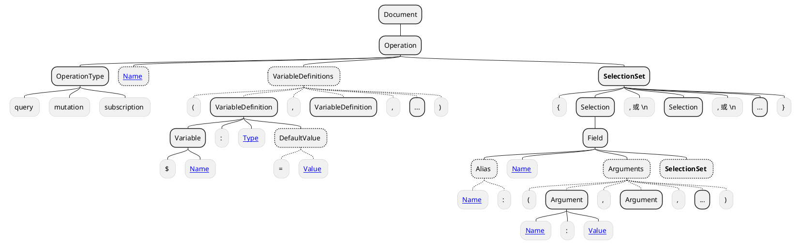
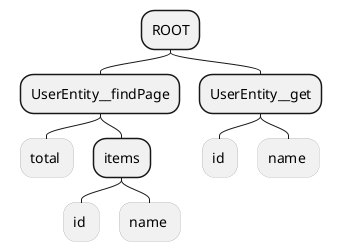
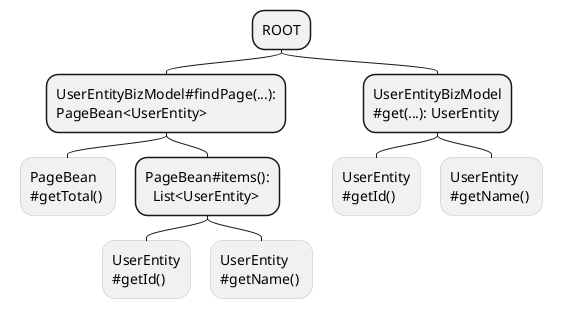

import {Table, TRow, TCol} from '@site/src/components/Table';
import Header from '@site/docs/\_header.md';

<Header />

:::warning

本文还在编写中，内容随时会发生变化，也会存在大量错误，请谨慎阅读！

:::

NopGraphQL 引擎是 Nop 平台默认的业务层实现方案，
其负责以统一且一致的形式向客户端提供对**业务对象**的操作服务（包括与第三方的数据交互），
并且还可以通过 [NopORM 引擎](./orm)实现对业务数据的增删改查操作。

<!-- https://plantuml.com/component-diagram -->

```plantuml
actor "客户端" as client
database "数据库" as db

component "NopGraphQL 引擎" as graphql #yellow
component "[[./orm NopORM 引擎]]" as orm
component "第三方" as other

client -right-> graphql: 调用 GrapQL 接口

graphql -right-> other: 接口调用
graphql -down-> orm: ORM 增删改查

orm <-right-> db: 存取数据

graphql -> client: 返回 JSON 数据
orm -> graphql: 返回 ORM 实体
```

与传统的 MVC 架构模式不同的是，NopGraphQL
引擎同时具备控制器层（Controller）和服务层（Service）的能力，相比 MVC 模式要少一个层级，
从而使得应用的层级结构更加简单明了。并且，由于 NopGraphQL 引擎自身是
[框架中立](https://gitee.com/canonical-entropy/nop-entropy/blob/master/docs/theory/framework-agnostic.md)
的，没有依赖于 Web Servlet、Hibernate 等具体实现，
因此，在自动化测试、非 Web 应用开发以及与其他框架集成等方面，具有更加灵活的优势。

## 术语解释 {#terms}

- **客户端**：浏览器、第三方应用等服务接口调用的发起方，均统称为客户端；
- **业务对象**：描述业务数据的**结构**和相关**业务操作函数**的对象，称为业务对象；
- **业务操作函数**：针对业务数据进行业务处理的函数，在 Java 中，其为定义在类上的方法，
  在 XLang 中，其为 XLib 函数；
- **元数据**：用于<u>描述某类数据的结构</u>的数据；
- **GraphQL 字段树**：由 GraphQL Field（GraphQL 字段）形成的层级嵌套结构是树形的，
  因此，称 GraphQL 字段组成的结构为**字段树**；
- **GraphQL 字段取值函数**：在 GraphQL Field 上绑定的用于获取字段值的函数；
- **GraphQL 根字段**：在 GraphQL Operation 中，处于**第一层级**的 GraphQL 字段，
  在同一 GraphQL Operation 中可以包含多个根字段，也表示有多棵以根字段为根节点的**字段树**；
- **GraphQL 操作字段**：在 GraphQL Operation 中，取值函数被映射到**业务操作函数**的字段，
  称为操作字段。仅有根字段才能是操作字段；
- **GraphQL 对象类型**：对于 GraphQL 中非标量类型的字段结构的描述，
  用于限定在 GraphQL Document 中字段的可选子字段，确保 GraphQL Document 的有效性；

## 关于 GraphQL {#about-graphql}

> - 关于 GraphQL 的详细介绍请阅读 [《GraphQL 从入门到起飞》](https://juejin.cn/post/6897173001373483021)
> - [Nop 平台采用 GraphQL 作为服务实现的原因？](https://chatglm.cn/share/Fj0iT)

顾名思义，NopGraphQL 引擎是 Nop 平台提供的 [GraphQL](https://graphql.org/learn/) 的服务端实现，
其会根据客户端给定的
[GraphQL Document](https://spec.graphql.org/October2021/#sec-Document)（GraphQL 文档）执行
[GraphQL Operation](https://spec.graphql.org/October2021/#sec-Language.Operations) 并沿着给定的
[GraphQL Field](https://spec.graphql.org/October2021/#sec-Language.Fields)（GraphQL 字段）树形结构做
GraphQL 字段取值，再将字段取值结果返回给客户端。此外，NopGraphQL 也对 GraphQL 做了相关的增强，并去掉了一些无关的设计，
从而使得 GraphQL 能够更好地适应 Nop 平台的要求。

GraphQL Document 主要的语法结构如下：



例如，在 GraphQL Document 中定义一个 `OperationType` 为 `query`，
但未指定 `Name` 的 `Operation`:

<!-- prettier-ignore -->
```graphql {6,12,19,23}
# 定义 Operation
query (
  # 定义 VariableDefinition，
  # 其中，QueryBeanInput 为
  # NopGraphQL 的内置输入类型
  $query: QueryBeanInput
) {
  # 定义 Field
  UserEntity__findPage(
    # 定义 Argument，并引用 Operation
    # 中的变量 $query 作为参数 query 的值
    query: $query
  ) {
    total
    items {
      id, name
      # 定义指定了 Alias 的 Field，
      # 返回结果使用 roles 作为属性名
      roles: roleList(limit: 10) {
        items {
          id
          # 返回结果使用 roleName 作为属性名
          roleName: name
        }
      }
    }
  }
}
```

此处为 GraphQL Operation 指定了一个类型为
`QueryBeanInput`（其为 NopGraphQL 内置的
[GraphQL 输入类型](https://graphql.org/learn/schema/#input-types)）的变量
`$query`，该变量需由客户端随 GraphQL 服务调用一起回传给服务端，
再由服务端将其转换（采用 JSON 反序列化等方式）为 `QueryBeanInput` 对象，
而在 GraphQL 字段的参数列表中，则可以通过变量名引用转换后的变量值。

而在 GraphQL Operation 中定义的 `SelectionSet` 为 GraphQL 字段的嵌套结构，
并至上而下形成一棵树，于是，本文便称其为 **GraphQL 字段树**。GraphQL Operation
的执行过程便是沿着字段树做**字段取值**的过程，其最终将返回与 GraphQL 字段树的结构一致的数据，
比如：

```json {3,8,11}
{
  "data": {
    "UserEntity__findPage": {
      "total": 10,
      "items": [{
        "id": 123456789,
        "name": "abc",
        "roles": {
          "items": [{
            "id": 35426178,
            "roleName": "guest"
          }, { ... }, ...]
        }
      }, { ... }, ...]
    }
  }
}
```

可以看到，返回数据的**属性树**结构与 GraphQL 字段树的结构是相互对应的，并且，GraphQL
字段的名字（`Name`）或别名（`Alias`）也将被用作为返回数据的属性名（字段的别名优先于字段名）。

此外，在 GraphQL 字段上指定的参数，比如在 `roleList(limit: 10) { ... }` 上的 `limit`，
其作用是控制字段取值的结果，一般用于数据查询或者根据参数返回不同的值。
也就是，不能将 GraphQL 字段简单理解为**业务数据**的属性名，其代表的应该是一个**字段取值函数**：
取值时，需要将字段上的参数传给该字段的取值函数，再将取值函数的执行结果赋值到返回数据的同名属性上。

字段取值函数增加了字段取值的灵活性和可扩展性，并且能够支持复杂的字段取值需求，
比如，调用外部接口获取所需的数据。

在 [graphql-java](https://www.graphql-java.com/documentation/data-fetching) 等
GraphQL 实现方案中，会在每个 GraphQL 字段的字段定义上绑定相应的取值函数（默认为数据对象的 getter 方法）。
在 GraphQL 字段取值的过程中，会依次调用字段取值函数以获得字段值，再向下继续对获得的字段值做字段取值操作，
直到遇到的字段值为[标量类型](https://graphql.org/learn/schema/#scalar-types)（Scalar
types，即整型、字符、布尔等非结构化数据）时才终止。

因此，前例中的 GraphQL Document 的取值过程如下：

- 调用在 `UserEntity__findPage` 字段上绑定的取值函数，并传入参数
  `query`（其值来自于 GraphQL Operation 变量 `$query`），以得到
  `UserEntity` 的分页结果（在 NopGraphQL 中该分页结果的类型为
  `PageBean<UserEntity>`）；
-
- 继续向下取 `PageBean<UserEntity>` 的 `total` 和 `items` 属性的值。
  由于 `total` 属性为标量类型，故而，对其取值（调用 `PageBean#getTotal()`
  方法）后便会结束该方向上的字段取值过程，而 `items` 属性的类型为 `List<UserEntity>`，
  不是标量类型，则需要继续对其做字段取值；
-
- 遍历 `items` 列表元素，依次对其各个元素做字段取值：分别获取列表元素
  `UserEntity` 的 `id`、`name` 属性的值（分别调用方法 `UserEntity#getId()`
  和 `UserEntity#getName()`），而在 `UserEntity` 中只有 `roleList`
  不是标量类型，故而对其继续做字段取值；
-
- `roleList` 字段实际对应的取值函数是一个关联查询函数，用于查询与其所属的
  `UserEntity` 关联的角色列表，并且，该字段还指定了参数 `limit`，
  也就是，仅查询出关联的前 `limit` 条角色数据。因此，`roleList`
  的字段取值函数会根据传入的参数和其所属的用户信息，查询得到该字段的分页结果；
-
- 继续对 `roleList` 的分页结果做字段取值，直到遇到的字段值均为标量类型为止；
- 按字段的层级结构，组装最终的返回数据；

> 注意，若字段指定了别名，则在获得字段值后，会采用字段的别名作为返回数据的属性名。

在 GraphQL 字段取值的过程中，同一层级字段的取值是互不影响、互不关联的，
只有对下一层级字段的取值是作用在其直接父级字段值的数据对象上的，因此，父子层级的字段取值存在引用关系。
例如，对上例中的 `items` 的子层级字段 `id`、`name` 取值，实际是取 `items` 字段值中的列表元素
`UserEntity` 的 `id` 和 `name` 的属性值。

GraphQL 同级字段取值的独立性，也使得客户端能够在一个 GraphQL Operation
中同时指定多个取值字段，例如：

<!-- prettier-ignore -->
```graphql
query (
  $id: String, $id2: String, $query: String
) {
  entity1: MyEntity__get(id: $id) {
    name, children2: children {
      desc2: desc, extField
    }
  }

  entity2: MyEntity__get(id: $id2) {
    id, children { name, myName }
  }

  MyEntity__findPage(query: $query) {
    items {
      id, name, children { name, value }
    }
  }
}
```

由于在 GraphQL Operation 中的第一层级的字段之间没有相关性，
且其取值结果也不从属于某个具体的对象，故而，本文将 GraphQL Operation 的第一级字段称为
**GraphQL 根字段**。因此，在一个 GraphQL Operation 内可以有多个**根字段**，
也就存在多个以根字段为根节点的**字段树**。

> 在 NopGraphQL 中需通过配置项 `nop.graphql.query.max-operation-count`
> 指定 GraphQL Operation 中允许出现的根字段的最大数量，缺省为 `10`。

此外，需要强调的是，GraphQL 是严格区分**数据变更**和**数据查询**操作的，不涉及数据变更的操作，
均使用 `query` 类型的 GraphQL Operation，而一切涉及到数据变更（增删改）的操作，
则都必须使用 `mutation` 类型的 GraphQL Operation，并且在 `query`
操作中不能做数据变更（当然，也没有措施严格执行该约定），而在 `mutation`
操作中也一般不包含仅做数据查询的 GraphQL 字段。

> 在 `query` 内的多个 GraphQL 根字段可以并发取值，但在 `mutation`
> 中的多个 GraphQL 根字段只能按顺序执行，因为变更操作存在顺序性，前面的操作可能影响后面的操作。

下面列举一些 `mutation` 类型的 GraphQL Operation 样例，以便于了解其定义结构：

```graphql title="新增数据"
mutation {
  NopAuthUser__save(data: $data) {
    id
    name
    status
  }
}
```

```graphql title="更新数据"
mutation {
  NopAuthUser__update(data: $data) {
    id
    name
    status
  }
}
```

```graphql title="删除数据"
mutation {
  NopAuthUser__batchDelete(ids: $ids)
}
```

## 引擎实现分析 {#engine}

在对 [GraphQL](#about-graphql) 有一个基本的认知后，便可以开始深入了解
NopGraphQL 引擎的核心设计与实现了。

### 核心模型 {#engine-core-models}

```plantuml
interface "IBizObject" as biz_obj_inf {
}

class "BizObjectImpl" as biz_obj {
  bizObjName: String
  bizModel: IBizModel
  objMeta: IObjMeta
  objectDefinition: GraphQLObjectDefinition
  operations: Map<String, GraphQLFieldDefinition>
}
biz_obj_inf <|-- biz_obj


interface "IBizModel" as biz_model_inf {
}
class "BizModel" as biz_model {
  actions: List<IBizActionModel>
  loaders: List<BizLoaderModel>
}
biz_model_inf <|-- biz_model


interface "IBizActionModel" as biz_action_inf {
}
class "BizActionModel" as biz_action {
  source: IEvalAction
}
biz_action_inf <|-up- biz_action


interface "IObjMeta" as obj_meta_inf {
}
class "ObjMetaImpl" as obj_meta {
  props: List<IObjPropMeta>
}
obj_meta_inf <|-- obj_meta


interface "IObjPropMeta" as obj_prop_meta_inf {
}
class "ObjPropMetaImpl" as obj_prop_meta {
  name: String
}
obj_prop_meta_inf <|-up- obj_prop_meta


class "GraphQLObjectDefinition" as gpl_obj_def {
  objMeta: IObjMeta
  fields: List<GraphQLFieldDefinition>
}

class "GraphQLFieldDefinition" as gpl_field_def {
  propMeta: IObjPropMeta
  fetcher: IDataFetcher
}

class "GraphQLDocument" as gpl_doc {
  getOperation(): GraphQLOperation
}

class "GraphQLOperation" as gpl_op {
  getFieldSelections(): List<GraphQLFieldSelection>
}

class "GraphQLFieldSelection" as gpl_field {
  fieldDefinition: GraphQLFieldDefinition
  getSelections(): List<GraphQLFieldSelection>
}


interface "IDataFetcher" as fetcher_inf {
}
class "ServiceActionFetcher" as fetcher_biz_action {
}
class "BeanPropertyFetcher" as fetcher_call_getter {
}
class "EvalActionDataFetcher" as fetcher_biz_loader {
}
fetcher_inf <|-- fetcher_biz_action
fetcher_inf <|-- fetcher_call_getter
fetcher_inf <|-- fetcher_biz_loader

biz_obj "1" *-- "1" biz_model: 包含 >
biz_obj "1" *-- "0..1" obj_meta: 包含 >
biz_obj "1" *-right- "1" gpl_obj_def: 包含 >

biz_model "1" *-- "*" biz_action: 包含 >
obj_meta "1" *-- "*" obj_prop_meta: 包含 >

gpl_obj_def "1" *-- "*" gpl_field_def: 包含 >
gpl_field_def "1" *-- "0..1" fetcher_inf: 包含 >

gpl_doc "1" *-- "1" gpl_op: 包含 >
gpl_op "1" *-- "*" gpl_field: 包含 >
gpl_field "1" *-left- "1" gpl_field_def: 包含 >
```

> 注意，为了确保类图的清晰和简洁性，部分类的结构做了些许变形，请以 NopGraphQL 的最终代码为准。

从以上的类图可以发现，NopGraphQL 的核心模型是被明确地分为了两个部分，
一个是 `IBizObject`，一个是 `GraphQLDocument`，
前者描述的是**业务对象**的组成结构，后者描述的是 GraphQL Document 的组成结构。

NopGraphQL 的功能设计和实现是围绕业务对象展开的，而 GraphQL Document
是服务端与客户端之间业务数据和业务操作的一种交互形式，其本质只是业务对象的一种表现方式。

业务对象 [`IBizObject`](#biz-object) 主要由 [`IBizModel`](#biz-model)（**业务模型**）和
[`IObjMeta`](#obj-meta)（**业务对象元数据**）组成。
前者定义了一组与业务对象相关的**业务操作函数** `actions`（由 `IBizActionModel` 模型描述），
以及一组与 GraphQL 字段相对应的数据加载函数 `loaders`（由 `BizLoaderModel` 模型描述）；
而后者则描述了业务数据的结构，主要是业务数据的属性（由 `IObjPropMeta` 模型描述）集合。
其中，<u>`IObjMeta` 不是必须的</u>，因为，业务数据可能只是简单类型，并没有明确的结构，
但 <u>`IBizModel` 则是必须的</u>，因为，不需要做任何操作的业务对象，是不需要由应用系统管理的，
其存在没有意义。

> 业务模型的数据加载函数 `loaders` 将被一一封装为字段取值函数 `EvalActionDataFetcher`，
> 并与相应的 GraphQL 字段定义绑定。

GraphQL Document 是客户端所提供的 GraphQL 文本内容，其解析后由 `GraphQLDocument` 模型描述。
`GraphQLDocument` 仅对应唯一的 `GraphQLOperation`（用于描述 GraphQL Operation），
并在 `GraphQLOperation` 中引用 GraphQL 根字段 `GraphQLFieldSelection`，而
`GraphQLFieldSelection` 自身为嵌套定义结构，持有子层级的 `GraphQLFieldSelection`
字段列表，因此，能够完整描述 GraphQL Document 的字段树结构。

传统的 GraphQL 在使用前，还必须为 GraphQL Document 定义相应的
[GraphQL Schema](https://graphql.org/learn/schema/)（GraphQL 模式），
以用于校验客户端提交的 GraphQL Document 的有效性。而在 GraphQL Schema 中最主要的组成部分为
[GraphQL Object Type](https://graphql.org/learn/schema/#object-types-and-fields)（GraphQL
对象类型），其用于描述字段的类型和结构，如以下示例中的 `UserEntity` 和 `PageBean_UserEntity`：

```graphql
type UserEntity {
  id: Long!
  name: String!
}

type PageBean_UserEntity {
  total: Long!
  items: [UserEntity]
}
```

对于任意层级的非标量类型的字段，在 GraphQL Document 中必须为其指定子字段，
且其子字段的字段名、字段类型也必须与其 **GraphQL 对象类型**相同，
因此，根据 GraphQL 对象类型便可以实现对 GraphQL Document 的校验。

而在 NopGraphQL 中，则进一步要求 GraphQL 对象类型都必须定义
[`IObjMeta`](#obj-meta)（**业务对象元数据**），用于描述 GraphQL 对象类型的结构。

`IObjMeta` 主要包含的是 `IObjPropMeta`（**业务对象属性元数据**）列表，
因此，可以等价构造出 GraphQL 对象类型 `GraphQLObjectDefinition`，
并相应地为其构造字段定义 `GraphQLFieldDefinition` 列表。`GraphQLObjectDefinition`
可以根据 `IObjMeta` 自动推导生成，故而，并不需要手工编写 GraphQL Schema。

此外，在构造 `GraphQLFieldDefinition` 的过程中，还会将其与相应的字段取值函数 `IDataFetcher`
进行绑定，用以支持一些自定义的字段取值需求。

> 一般不需要为字段定义 `GraphQLFieldDefinition` 显式绑定取值函数 `IDataFetcher`，NopGraphQL
> 默认会采用对象属性的 getter 方法作为其取值函数（也即 `BeanPropertyFetcher`）。

与一般 GraphQL 的服务端实现不同的是，NopGraphQL 引擎要求客户端提供的
GraphQL Document 必须为如下形式：

<!-- prettier-ignore -->
```graphql {2}
query ( $query: QueryBeanInput ) {
  UserEntity__findPage( query: $query ) {
    # ...
  }
}
```

其中，GraphQL 根字段名字（如 `UserEntity__findPage`）的结构必须是以双下划线 `__`
为分隔符的固定形式：在分隔符之前的部分对应的是业务对象的名字
`BizObjectImpl#bizObjName`（如 `UserEntity`），
而分隔符之后的部分对应的则是在 `IBizModel` 上定义的业务操作函数的名字（如 `findPage`），
并且，操作函数只能是被标注为 GraphQL `query` 或 `mutation` 的函数。

> `query` 函数由注解 `@BizQuery` 标注，而 `mutation` 函数则由注解 `@BizMutation`
> 标注。这两类操作函数均将被封装为字段取值函数 `ServiceActionFetcher`，并与 GraphQL
> 根字段的字段定义绑定。

也就是，NopGraphQL 是以调用业务对象的查询或变更函数为出发点进行 GraphQL 字段取值的，
因此，本文将<u>取值函数被映射到业务操作函数的 GraphQL 字段</u>称之为 **GraphQL 操作字段**，
并且，**只有 GraphQL 根字段才能是操作字段**。

鉴于操作字段的特殊性，NopGraphQL 会将定义在 `IBizModel` 中的所有 GraphQL `query`
和 `mutation` 函数收集起来，并构造为 GraphQL 操作字段，再单独记录到
`BizObjectImpl#operations` 中，而描述业务数据结构的 GraphQL 对象类型
`GraphQLObjectDefinition` 则会被记录在 `BizObjectImpl#objectDefinition` 上。

不过，`GraphQLDocument` 代表的是客户端提交的 GraphQL Document 的对象实例，
其主要作用是做字段取值，而操作字段与普通字段在取值方式上是一致的（`IDataFetcher` 屏蔽了实现上的差异），
所以，并不需要像 `BizObjectImpl` 那样明显区分二者。
只是在[初始化 `GraphQLDocument`](#engine-init-graphql-doc) 时，
根字段的字段定义 `GraphQLFieldSelection#fieldDefinition` 需要单独从
`BizObjectImpl#operations` 中取出，而其他字段则直接根据字段名字从
`BizObjectImpl#objectDefinition` 中取出即可。

### 运行流程 {#engine-how-to-run}

虽然 NopGraphQL 引擎是 GraphQL 的服务端实现，
但其满足可逆计算理论所提出的[形式等价变换](https://gitee.com/canonical-entropy/nop-entropy/blob/master/docs/theory/graphql-vs-rest.md)，
可以将 REST、gRPC 等协议等价变换为 GraphQL 协议，
所以，其同样支持 REST、gRPC 等形式的服务调用。

```plantuml
actor "GraphQL\nREST\ngRPC\n..." as client
control "[[#engine-parse-graphql-doc 解析 GraphQL Document]]" as parse_doc
control "[[#engine-init-graphql-doc 初始化 GraphQLDocument]]" as init_doc
control "[[#engine-fetch-graphql-field-data 取 GraphQLDocument 字段值]]" as fetch_data

client -right-> parse_doc: 提交 GraphQL Document
parse_doc -down-> init_doc: 生成 GraphQLDocument
init_doc -left-> fetch_data: 提供 GraphQLDocument
fetch_data -up-> client: 返回字段取值结果
```

如上图所示，客户端可以以 GraphQL、REST、gRPC 等形式发起接口调用，
在 NopGraphQL 中会将不同形式的调用所携带的数据统一转换为 `GraphQLDocument`
对象，从而在引擎内部中便只需专注于对 `GraphQLDocument` 的处理即可。

> 为了便于清晰阐述 NopGraphQL 的运行逻辑，本文将以 GraphQL 形式的调用为主，
> 而对 REST 和 gRPC 的形式转换，则可以分别阅读 `GraphQLWebService#runRest`
> 和 `GraphQLServerCallHandler#startCall` 的实现代码。

总体上，可以将 NopGraphQL 引擎的运行过程分为以下几个阶段：

- [解析 GraphQL Document](#engine-parse-graphql-doc):
  将客户端提交的 GraphQL Document 文本解析为 `GraphQLDocument` 对象；
- [初始化 `GraphQLDocument`](#engine-init-graphql-doc):
  为 `GraphQLDocument` 对象补充字段定义，并校验其结构的完整性和有效性;
- [取 `GraphQLDocument` 字段值](#engine-fetch-graphql-field)：沿着 `GraphQLDocument`
  的字段树，依次取字段值，并按字段树的结构构造返回数据；

#### 解析 GraphQL Document {#engine-parse-graphql-doc}

假设客户端向 NopGraphQL 提交的 GraphQL Document 如下：

<!-- prettier-ignore -->
```graphql
query ($query: QueryBeanInput, $id: String) {
  UserEntity__findPage(query: $query) {
    total
    items { id, name }
  }

  UserEntity__get(id: $id) {
    id, name
  }
}
```

则客户端需以 JSON 对象形式，向服务端同时回传以上 GraphQL Document
的文本内容和变量 `$query`、`$id` 的值：

```json
{
  // GraphQL Document 的文本内容
  "query": "query ($query: QueryBeanInput, $id: String) { ... }",
  // 携带在 GraphQL Operation 上声明的变量的值，
  // 但是，需去掉变量名开头的 `$`
  "variables": {
    "query": { ... },
    "id": 123456
  }
}
```

NopGraphQL 在接收到客户端的调用请求后，将按照以下过程解析 GraphQL Document 文本，
从而得到原始的 `GraphQLDocument` 对象：

<!-- https://plantuml.com/sequence-diagram -->

```plantuml
autonumber "<b>[000]"

entity "客户端" as client
entity "GraphQLWebService" as service
entity "GraphQLEngine" as engine
entity "GraphQLDocumentParser" as parser

client -> service: 提交 JSON 数据：\n{ query: "query ...",\n  variables: { ... } }
activate service
  service -> service: 反序列化 JSON 字符串为\nGraphQLRequestBean

  service -> engine: 提供参数\nGraphQLRequestBean
  activate engine
    engine -> engine: 获取 GraphQL Document 文本：\nGraphQLRequestBean#query

    engine -> engine: 调用 ~#parseOperation(query)
    activate engine
      engine -> engine: 调用\n~#parseOperationFromText(\n  query\n)
      activate engine
        engine -> parser: 提供参数 query
        activate parser
          parser -> parser: 调用\n~#parseFromText(query)
          activate parser
            parser -> parser: 解析 query 文本
            parser -> parser: 返回 GraphQLDocument
          deactivate parser

          parser -> engine: 返回 GraphQLDocument
        deactivate parser

        engine -> engine: <color:red>初始化 GraphQLDocument</color>
      deactivate engine
    deactivate engine
  deactivate engine
deactivate service
```

其中，**解析 query 文本**是对 [GraphQL 语法树](#about-graphql)的解析，
若想了解其详细的解析逻辑，可以阅读 `GraphQLDocumentParser#doParse` 的实现代码，
本文不再对其做单独分析。

通过以上过程得到的 `GraphQLDocument` 对象仅包含 GraphQL Document 的结构信息，
其各层级的字段还未与具体的字段定义绑定，并且，其结构的完整性、是否包含无效字段等也未作检查，
因此，还需要对其做进一步的初始化。

#### 初始化 GraphQLDocument {#engine-init-graphql-doc}

在[《核心模型》](#engine-core-models)章节中已经提到 NopGraphQL 要求
GraphQL Document 的根字段必须为**操作字段**，也就是，根字段的取值函数映射的是业务对象的操作函数，
而且，根字段的名字必须为 `{bizObjName}__{bizAction}` 形式，如 `UserEntity__findPage`，
其中，双下划线 `__` 为固定的分隔符，其左侧的 `{bizObjName}` 表示业务对象
[`IBizObject`](#biz-object) 的名字，如 `UserEntity`，而其右侧的 `{bizAction}`
则表示在该业务对象的业务模型 [`IBizModel`](#biz-model) 上定义的操作函数的名字，如 `findPage`。

> 在 `{bizObjName}` 和 `{bizAction}` 对应的名字中不能再出现双下划线，
> 但非连续的单下划线则是被允许的。

因此，对 `GraphQLDocument` 的初始化也将从<u>对 GraphQL 根字段名字的拆解</u>开始：

```plantuml
state "GraphQLEngine\n~#resolveSelections(doc)" as call_engine_resolveSelections
state "GraphQLSelectionResolver#resolveSelection(doc)" as call_resolver_resolveSelection: 从 doc 中得到 GraphQL Operation 对象 <b>op:GraphQLOperation</b>

[*] -down-> call_engine_resolveSelections: doc:GraphQLDocument
call_engine_resolveSelections -> call_resolver_resolveSelection: doc
call_resolver_resolveSelection -down-> call_resolver_resolveOperation: (doc, op)

state "GraphQLSelectionResolver#resolveOperation(doc, op)" as call_resolver_resolveOperation {
  state "遍历 op 的根字段列表：\nop.getSelectionSet().getSelections()" as get_field_from_op: 定义循环变量为 <b>field:GraphQLFieldSelection</b>
  state " " as split_objName_from_op: 从 field.name 中取出 **{bizObjName}** 部分\n并定义为变量 <b>objName</b>
  state has_op_field <<choice>>

  [*] -right-> get_field_from_op: op
  get_field_from_op -right-> has_op_field

  has_op_field -right-> [*]: 遍历结束
  has_op_field -down-> call_engine_getOperationDefinition: field

  call_engine_getOperationDefinition -down-> split_objName_from_op
  split_objName_from_op -down-> call_resolver_resolveFieldSelection: (objName, fieldDef, field)

  state "获取根字段定义：GraphQLEngine~#getOperationDefinition(field.name)" as call_engine_getOperationDefinition {
    [*] -right-> call_bizObj_getOperationDefinition: field.name
    call_bizObj_getOperationDefinition -down-> [*]: fieldDef

    state "BizObjectManager#getOperationDefinition(field.name)" as call_bizObj_getOperationDefinition {
      state " " as split_field_name: 按照 **{bizObjName}__{bizAction}**\n形式从 field.name 中提取出\n**bizObjName** 和 **bizAction**
      state "<color:red>BizObjectManager\n<color:red>~#getBizObject(bizObjName)" as call_biz_obj_man_getBizObject: 根据 bizObjName 得到业务对象\n<b>bizObj:IBizObject</b>
      state "bizObj.getOperationDefinition(bizAction)" as call_biz_obj_getOperationDefinition: 根据 bizAction 获取根字段 **{bizObjName}__{bizAction}**\n的字段定义 <b>fieldDef:GraphQLFieldDefinition</b>

      [*] -right-> split_field_name: field.name
      split_field_name -down-> call_biz_obj_man_getBizObject: (bizObjName, bizAction)
      call_biz_obj_man_getBizObject -left-> call_biz_obj_getOperationDefinition: (bizObj, bizAction)
      call_biz_obj_getOperationDefinition -down-> [*]: fieldDef
    }
  }

  state "递归初始化字段：GraphQLSelectionResolver~#resolveFieldSelection(objName, fieldDef, field)" as call_resolver_resolveFieldSelection {
    state "field.setFieldDefinition(fieldDef)" as call_field_setFieldDefinition: 为字段 <b>field</b> 绑定字段定义 <b>fieldDef</b>
    state " " as validate_field_args: 为 field 补充字段参数定义\nGraphQLArgumentDefinition
    state top_has_sub_field <<choice>>

    state "fieldDef.getType().getNamedTypeName()" as call_fieldDef_getType: 根据字段定义 fieldDef 得到当前字段对应的\n业务对象名字 **objName**
    state "GraphQLEngine#getTypeDefinition(objName)" as call_engine_getTypeDefinition: 得到业务对象 objName 的 GraphQL 对象类型实例\n<b>objDef:GraphQLObjectDefinition</b>（根据 IObjMeta 生成）
    state "遍历 field 的子字段列表：field.getSelections()" as get_field_from_field: 定义循环变量为 <b>subField:GraphQLFieldSelection</b>
    state "objDef.getField(subField.name)" as call_obj_def_getField: 从 objDef 中获取子字段 subField 的字段定义\n<b>subFieldDef:GraphQLFieldDefinition</b>
    state has_sub_field <<choice>>
    state start <<start>>
    state end0 <<end>>
    state end1 <<end>>

    start -right-> call_field_setFieldDefinition: (objName, fieldDef, field)
    call_field_setFieldDefinition -right-> validate_field_args
    validate_field_args -down-> top_has_sub_field

    top_has_sub_field -left-> end0: 无子字段
    top_has_sub_field -down-> call_fieldDef_getType
    call_fieldDef_getType -down-> call_engine_getTypeDefinition: objName

    call_engine_getTypeDefinition -left-> get_field_from_field: (objDef, field)
    get_field_from_field -up-> has_sub_field

    has_sub_field -right-> end1: 遍历结束
    has_sub_field -up-> call_obj_def_getField: (objDef, subField.name)

    call_obj_def_getField -up-> start: (objDef.name, subFieldDef, subField)
  }
}
```

注意，由于 NopGraphQL 对 `GraphQLDocument` 的校验，主要是检查字段是否存在、字段树深度是否超出限制等，
因此，本章节不会对其校验逻辑进行展开分析，详细的处理逻辑可以按照上图中的代码调用链查看具体的代码实现进行了解。

从[《核心模型》](#engine-core-models)章节可以了解到 GraphQL
根字段（也就是操作字段）和普通字段的字段定义在 `IBizObject` 中是分开记录的，
因此，NopGraphQL 对字段的初始化也是明显地分为了两个阶段：

- 第一个阶段是调用 `GraphQLEngine#getOperationDefinition`
  获取根字段的字段定义；
- 第二个阶段是调用 `GraphQLSelectionResolver#resolveFieldSelection`
  将字段与其字段定义绑定，并补充字段参数定义、参数校验等，再递归初始化子字段；

也就是，首先需要通过根字段的名字得到根字段定义，然后再按照普通字段的方式对根字段及其子字段进行递归初始化。

根字段的字段定义直接调用其对应业务对象 `bizObj` 的 `getOperationDefinition` 方法即可获得。

> `bizObj` 是根据业务对象的名字 `bizObjName` 调用方法 `BizObjectManager#getBizObject`
> 获得的，而该方法只是从缓存中获取对应的 `IBizObject` 的实例而已，详细的 `IBizObject`
> 的构造逻辑请阅读章节[《BizObject》](#biz-object)。

而要获得子字段的定义，则需要先通过当前字段 `field` 的字段定义 `fieldDef` 得到字段所对应的业务对象名字
`objName`（通过调用 `fieldDef.getType().getNamedTypeName()` 获得），再调用
`GraphQLEngine#getTypeDefinition(objName)` 得到当前字段的 **GraphQL 对象类型**实例 `objDef`，
最后，才能根据子字段名字从 `objDef` 中得到（对应调用 `objDef#getField`）其字段定义。

在找到 GraphQL 字段的字段定义后，便可以将字段定义与其进行绑定，以便于后续做字段取值，
并可以继续进行字段参数的有效性校验等初始化工作（注意，根字段与其子字段的初始化过程是相同的）。
若不能为 GraphQL 字段找到其字段定义，则 GraphQL Document 必然不是有效的，直接抛出异常即可。

在沿着 GraphQL Document 字段树完成对 `GraphQLDocument` 的字段初始化后，
下面便可以对 `GraphQLDocument` 进行字段取值了。

#### 取 GraphQLDocument 字段值 {#engine-fetch-graphql-field}

在完成对 `GraphQLDocument` 的[初始化](#engine-init-graphql-doc)后，其各级字段
`GraphQLFieldSelection` 便与对应的字段定义 `GraphQLFieldDefinition` 绑定在了一起，
通过调用在字段定义上的取值函数 `GraphQLFieldDefinition#fetcher`，便可以得到与
GraphQL Document 所对应的返回数据。

以下面的 GraphQL Document 为例：

<!-- prettier-ignore -->
```graphql
query ($query: QueryBeanInput, $id: String) {
  UserEntity__findPage(query: $query) {
    total
    items { id, name }
  }

  UserEntity__get(id: $id) {
    id, name
  }
}
```

其构成的 GraphQL 字段树和字段取值函数树如下：

<Table head={['GraphQL 字段树', 'GraphQL 字段取值函数树']}>

<TRow><TCol>



</TCol><TCol>



</TCol></TRow>

</Table>

从上图中可以发现，沿着 GraphQL 字段树取值，其本质就是在自上而下地调用字段取值函数，
并且下层子树的字段取值是依赖于其父字段的取值结果的，一般会在父字段的结果对象上做属性取值。

> 更加复杂的字段取值可以阅读章节[《@BizLoader》](#biz-loader)以及 XMeta 的配置属性
> [&lt;transformOut />](../../manual/xmeta#attr_props_prop_transformOut)
> 与 [&lt;getter />](../../manual/xmeta#attr_props_prop_getter)。

字段取值函数 `GraphQLFieldDefinition#fetcher` 的类型为 `IDataFetcher`，其包含多种实现，
其中，最主要的实现为：

- `BeanPropertyFetcher`: 调用 Java Bean 上的 geter 方法（如
  `PageBean#getTotal()`、`UserEntity#getId()` 等）获取对象的属性值，
  该属性值即为对应字段的字段值；
- `ServiceActionFetcher`: 调用 [`IBizModel`](#biz-model) 上的操作函数（如
  `UserEntityBizModel#findPage(...)`、`UserEntityBizModel#get(...)`
  等）得到函数的返回值，该返回值即为对应字段的字段值。并且，操作函数所需的参数均来自于字段参数；

GraphQL 根字段的字段取值函数均为 `ServiceActionFetcher` 类型，而其他字段则一般默认采用
`BeanPropertyFetcher` 作为其字段取值函数。

> 字段的默认取值函数的确定逻辑见 `GraphQLExecutor#hookFetch`。

需要注意的是，在[《核心模型》](#engine-core-models)章节中已经强调：
字段的取值结果类型必须定义对应的业务对象元数据 [`IObjMeta`](#obj-meta)。而上例中的根字段
`UserEntity__findPage` 的取值结果为 `PageBean<?>` 类型，其并不是一个业务对象。
为此，NopGraphQL 对 `PageBean` 做了专门的处理，从而为其单独构造 `GraphQLObjectDefinition`，
以确保字段取值的一致性。

> 对 `PageBean` 的处理逻辑详见 `ReflectionGraphQLTypeFactory#buildPageBeanType` 的实现。

在完成对 `GraphQLDocument` 的取值后，NopGraphQL 最终会以其取值结果构造
`GraphQLResponseBean` 对象作为服务调用的结果返回给客户端。而在
`GraphQLResponseBean#data` 属性上记录的便是 `GraphQLDocument` 的取值结果：

```json
{
  "data": {
    "UserEntity__findPage": {
      "total": 10,
      "items": [{
        "id": 1232412,
        "name": "张三"
      }, {
        "id": 1232413,
        "name": "李四"
      }, ...]
    },
    "UserEntity__get": {
      "id": 1232414,
      "name": "王五"
    }
  }
}
```

## BizObject {#biz-object}

`IBizObject` 的构造过程如下：

```plantuml
autonumber "<b>[000]"

entity "BizObjectManager" as biz_obj_man
entity "BizObjectBuilder" as biz_obj_builder
entity "ObjMetaToGraphQLDefinition" as obj_meta_gpl_def
entity "BizModelToGraphQLDefinition" as biz_model_gpl_def

biz_obj_man -> biz_obj_man: ~#getBizObject()
activate biz_obj_man
  biz_obj_man -> biz_obj_builder: 传参 bizObjName
  activate biz_obj_builder
    biz_obj_builder -> biz_obj_builder: ~#buildBizObject(\n  bizObjName\n)

    activate biz_obj_builder
      == 构造 IBizObject ==

      biz_obj_builder -> biz_obj_builder: ~#loadBizObjFromModel(\n  bizObjName\n)

      activate biz_obj_builder
        biz_obj_builder -> biz_obj_builder: ~#loadBizModel(bizPath)
        activate biz_obj_builder
          biz_obj_builder -> biz_obj_builder: 根据 bizPath\n加载 IBizModel
          biz_obj_builder -> biz_obj_builder: 返回 IBizModel
        deactivate biz_obj_builder

        biz_obj_builder -> biz_obj_builder: ~#loadObjMeta(metaPath)
        activate biz_obj_builder
          biz_obj_builder -> biz_obj_builder: 根据 metaPath\n加载 IObjMeta
          biz_obj_builder -> biz_obj_builder: 返回 IObjMeta
        deactivate biz_obj_builder

        biz_obj_builder -> biz_obj_builder: 通过 IObjMeta\n和 IBizModel\n构造 IBizObject
        biz_obj_builder -> biz_obj_builder: 返回 IBizObject
      deactivate biz_obj_builder

      == IObjMeta 转换为 GraphQLObjectDefinition ==

      biz_obj_builder -> obj_meta_gpl_def: 传参 IObjMeta
      activate obj_meta_gpl_def
        obj_meta_gpl_def -> obj_meta_gpl_def: ~#toObjectDefinition(IObjMeta)

        activate obj_meta_gpl_def
          obj_meta_gpl_def -> obj_meta_gpl_def: 构造 GraphQLObjectDefinition

          loop IObjPropMeta in IObjMeta
            obj_meta_gpl_def -> obj_meta_gpl_def: ~#toFieldDefinition(IObjPropMeta)

            activate obj_meta_gpl_def
              obj_meta_gpl_def -> obj_meta_gpl_def: 根据 IObjPropMeta\n构造 GraphQLFieldDefinition

              obj_meta_gpl_def -> obj_meta_gpl_def: 返回 GraphQLFieldDefinition
            deactivate obj_meta_gpl_def

            obj_meta_gpl_def -> obj_meta_gpl_def: GraphQLObjectDefinition\n绑定 GraphQLFieldDefinition
          end

          obj_meta_gpl_def -> obj_meta_gpl_def: 返回 GraphQLObjectDefinition
        deactivate obj_meta_gpl_def

        obj_meta_gpl_def -> biz_obj_builder: 返回\nGraphQLObjectDefinition
      deactivate obj_meta_gpl_def

      biz_obj_builder -> biz_obj_builder: IBizObject 绑定\nGraphQLObjectDefinition

      == 向 GraphQLObjectDefinition 补充字段加载器 ==

      biz_obj_builder -> biz_obj_builder: 合并 @BizModel 标注的\n业务模型中的字段加载器到\nGraphQLObjectDefinition

      biz_obj_builder -> biz_obj_builder: ~#buildBizLoaders(IBizModel)
      activate biz_obj_builder
        loop BizLoaderModel in IBizModel
          biz_obj_builder -> biz_model_gpl_def: 传参 BizLoaderModel

          activate biz_model_gpl_def
            biz_model_gpl_def -> biz_model_gpl_def: ~#toBuilder(\n  BizLoaderModel\n)

            activate biz_model_gpl_def
              biz_model_gpl_def -> biz_model_gpl_def: 构造 GraphQLFieldDefinition
              biz_model_gpl_def -> biz_model_gpl_def: 根据 BizLoaderModel\n构造 EvalActionDataFetcher
              biz_model_gpl_def -> biz_model_gpl_def: GraphQLFieldDefinition\n绑定 EvalActionDataFetcher

              biz_model_gpl_def -> biz_model_gpl_def: 返回 GraphQLFieldDefinition
            deactivate biz_model_gpl_def

            biz_model_gpl_def -> biz_obj_builder: 返回 GraphQLFieldDefinition
          deactivate biz_model_gpl_def
        end

        biz_obj_builder -> biz_obj_builder: 返回 XBiz 模型中的\n数据加载器字段列表
      deactivate biz_obj_builder

      biz_obj_builder -> biz_obj_builder: 合并 XBiz 模型中的字段加载器\n到 GraphQLObjectDefinition

      == IBizActionModel 构造第一级 GraphQL Field Selection ==

      biz_obj_builder -> biz_obj_builder: 传参\n(IBizObject, IBizModel)
      activate biz_obj_builder
        biz_obj_builder -> biz_obj_builder: ~#buildOperations(\n  IBizObject, IBizModel\n)

        activate biz_obj_builder
          loop IBizActionModel in IBizModel
            biz_obj_builder -> biz_model_gpl_def: 传参 IBizActionModel

            activate biz_model_gpl_def
              biz_model_gpl_def -> biz_model_gpl_def: ~#toOperationDefinition(\n  IBizActionModel\n)

              activate biz_model_gpl_def
                biz_model_gpl_def -> biz_model_gpl_def: 构造 GraphQLFieldDefinition
                biz_model_gpl_def -> biz_model_gpl_def: 根据 IBizActionModel\n构造 IServiceAction
                biz_model_gpl_def -> biz_model_gpl_def: 根据 IServiceAction\n构造 ServiceActionFetcher
                biz_model_gpl_def -> biz_model_gpl_def: GraphQLFieldDefinition\n绑定 ServiceActionFetcher

                biz_model_gpl_def -> biz_model_gpl_def: 返回 GraphQLFieldDefinition
              deactivate biz_model_gpl_def

              biz_model_gpl_def -> biz_obj_builder: 返回 GraphQLFieldDefinition
            deactivate biz_model_gpl_def

            biz_obj_builder -> biz_obj_builder: IBizObject 绑定第一级字段\nGraphQLFieldDefinition
          end

          biz_obj_builder -> biz_obj_builder
        deactivate biz_obj_builder

        biz_obj_builder -> biz_obj_builder
      deactivate biz_obj_builder

      == 结束 ==
      biz_obj_builder -> biz_obj_builder: 返回 IBizObject
    deactivate biz_obj_builder

    biz_obj_builder -> biz_obj_man: 返回 IBizObject
  deactivate biz_obj_builder

  biz_obj_man -> biz_obj_man: 返回 IBizObject
deactivate biz_obj_man
```

在构造 `GraphQLObjectDefinition` 的过程中，`ObjMetaToGraphQLDefinition#toFieldDefinition`
只会遍历在 `IObjMeta` 中的 `IObjPropMeta` 列表，若 `IObjPropMeta` 关联的是其他类型的业务对象，
则仅需以该业务对象的名字构造 `GraphQLNamedType`（`GraphQLTypeHelper#namedType`）即可，
不会对其做深度遍历，仅在 GraphQL 字段取值时，再根据其名字得到 `GraphQLObjectDefinition`
进而做深度遍历取值。

> 详细处理逻辑见 `ObjMetaToGraphQLDefinition#toGraphQLType`。

## BizModel {#biz-model}

BizModel 的主要功能就是向外部提供业务处理函数，实现对业务数据的增删改查。
本文中，将这些处理函数称之为**操作函数**，并可以分为以下几类：

- **GraphQL 查询函数**：标注了 `@BizQuery` 的函数，仅用于做无副作用的数据查询，默认不会开启数据库事务，
  用在 `query` 类型的 GraphQL Operation 中；
- **GraphQL 变更函数**：标注了 `@BizMutation` 的函数，仅用于对数据的增删改，默认会开启数据库事务，
  用在 `mutation` 类型的 GraphQL Operation 中；
- **GraphQL 字段加载函数**：标注了 `@BizLoader` 的函数，其只用于为定义在 XMeta
  中的同名属性提供自定义的、应对复杂需求的 GraphQL 字段加载支持，从而提供更为强大和灵活的 GraphQL 字段取值能力；
- **内部函数**：标注了 `@BizAction` 的函数，在启用了 maker checker 机制后，用于检查操作是否合法等。
  详细说明见 [@BizAction](#biz-action)；

注意，以上操作函数，只有 GraphQL 查询和变更函数可以被客户端直接指定而进行调用，
其余的只会在 GraphQL 字段取值过程中被间接调用，不能被客户端指定调用。

BizModel 可以 Java Class 强类型方式定义其操作函数：

```java {1,4-5,12,20-21,26}
@BizModel("UserEntity")
public class UserEntityBizModel {

  @BizQuery
  @GraphQLReturn(bizObjName = BizConstants.BIZ_OBJ_NAME_THIS_OBJ)
  public UserEntity getUserByOpenId(
    @Name("openId") String openId
  ) {
    // ...
  }

  @BizMutation
  public void resetUserPassword(
    @Name("userId") String userId,
    @Name("password") String password
  ) {
    // ...
  }

  @BizLoader
  @GraphQLReturn(bizObjName = "RoleEntity")
  public List<RoleEntity> roles(@ContextSource UserEntity user) {
    // ...
  }

  @BizAction
  protected void doSomething(
    @Name("userId") String userId
  ) {
    // ...
  }
}
```

除内部函数 `@BizAction` 以外，如果函数返回的数据是业务对象实体类型，
则一般需要通过 `@GraphQLReturn` 指定其业务对象名，如
`@GraphQLReturn(bizObjName = "RoleEntity")`。
而若是返回的业务对象名与当前 BizModel 映射的业务对象名相同，则为 `bizObjName`
赋值常量 `BizConstants.BIZ_OBJ_NAME_THIS_OBJ` 即可。

> - `@BizAction` 函数仅在内部调用，不会参与 GraphQL 字段选择，不需要标注 `@GraphQLReturn`；
> - 若在业务对象实体的 Java Class 上已经添加了注解 `@BizObjName("Xxx")`，
>   则对于返回集合或实体的函数，均不需要添加注解 `@GraphQLReturn`；
> - 若是在泛型的 BizModel 上定义的公共函数，如 Nop 内置的 `CrudBizModel`，
>   则必须配置注解 `@GraphQLReturn`；
> - 如果操作函数的返回值类型为 `CompletionStage`，则表示该方法异步执行；

BizModel 可以不继承任何基类，也不需要实现任何接口，更不需要对返回结果做 JSON
序列化（统一采用 GraphQL 字段取值机制）。其就是直接向客户端提供服务函数的服务层模型。
仅需要在类上标注 `@BizModel` 以指定其业务对象名，再在其所在工程模块的 `*.beans.xml`
中注册即可，NopGraphQL 将会自动完成扫描、加载和合并工作。

BizModel 的操作函数还可以定义在不同的 Java Class 中，只要 `@BizModel`
指示的业务对象名相同，NopGraphQL 便会将它们的操作函数合并在一起，这便为强类型定义 BizModel
的方式提供了基本的扩展机制。

> 同名操作函数通过注解 `@Priority` 指定优先级，优先级高的将覆盖优先级低的操作函数。

### XBiz {#xbiz}

除了以强类型方式定义操作函数以外，NopGraphQL 还支持以 DSL 模型 XBiz 来定义 BizModel，
再通过 Nop 提供的差量能力，让 BizModel 具备更加强大的扩展能力。

XBiz 模型定义在 VFS（Nop 虚拟文件系统）文件
`_vfs/{一级子目录名}/{二级子目录名}/model/{bizObjName}/{bizObjName}.xbiz`
中（一二级子目录名中不能包含短横线 `-`，且字母为小写形式）：

```xml {6,9,18,29,41,44} title="_vfs/nop/demo/model/UserEntity/UserEntity.xbiz"
<biz xmlns:x="/nop/schema/xdsl.xdef"
     x:schema="/nop/schema/biz/xbiz.xdef"
>

  <actions>
    <query name="getUserByOpenId">
      <arg name="openId" type="String" mandatory="true"/>

      <return type="io.nop.demo.entity.UserEntity"/>

      <source>
        <c:script>
          return user;
        </c:script>
      </source>
    </query>

    <mutation name="resetUserPassword">
      <arg name="userId" type="String" mandatory="true"/>
      <arg name="password" type="String" mandatory="true"/>

      <source>
        <c:script>
          // update password
        </c:script>
      </source>
    </mutation>

    <action name="doSomething">
      <arg name="userId" type="String" mandatory="true"/>

      <source>
        <c:script>
          // do something
        </c:script>
      </source>
    </action>
  </actions>

  <loaders>
    <loader name="roles">
      <arg name="user" kind="ContextSource" type="io.nop.demo.entity.UserEntity"/>

      <return type="List&lt;io.nop.demo.entity.RoleEntity>"/>

      <source>
        <c:script>
          return user.roles;
        </c:script>
      </source>
    </loader>
  </loaders>
</biz>
```

> 有关 XBiz 模型的结构说明请祥见参考手册 [XBiz 模型](../../manual/xbiz)。

在 XBiz 模型上定义的操作函数也将会和强类型方式定义的操作函数合并，并且，XBiz 中的操作函数优先级最高，
在 Java Class 中定义的同名操作函数将被直接覆盖。

XBiz 模型极大地增强了业务系统的可扩展性，例如，在 xbiz 文件中，仅通过如下方式便可引入逻辑编排：

```xml
<biz>
  <x:post-extends>
    <biz-gen:TaskFlowSupport xpl:lib="/nop/core/xlib/biz-gen.xlib"/>
  </x:post-extends>

  <actions>
    <mutation name="callTask" task:name="test/DemoTask"/>
  </actions>
</biz>
```

`<x:post-extends />` 标签中的 xlib 函数将在 XBiz 模型解析的过程中自动执行。
`<biz-gen:TaskFlowSupport />` 函数会对指定了 `task:name` 的操作函数节点进行变换，
从而自动生成调用 `ITaskFlowManager` 做逻辑编排的代码。

### @BizLoader {#biz-loader}

> 注意，如果在 `BizObjectBuilder#buildBizLoaders` 初始化 `@BizLoader`
> 之前，字段已经指定了不为 `null` 且不为 `BeanPropertyFetcher` 的字段取值函数，
> 则 `@BizLoader` 函数将被忽略。

`@BizLoader` 的作用是在 BizModel 上为已定义（必须在 XMeta 中定义）的
GraphQL 字段提供定制的加载器，从而实现一些复杂的数据加载逻辑，或者批量加载逻辑：

```java
@BizModel("UserEntity")
public class UserEntityBizModel {

  @BizLoader
  @GraphQLReturn(bizObjName = "RoleEntity")
  public List<RoleEntity> roles(@ContextSource UserEntity user) {
    // ...
  }
}
```

> 简单的字段取值，可以通过
> [XMeta 模型 - &lt;getter />](../../manual/xmeta#attr_props_prop_getter)
> 实现。

在 `@BizLoader` 函数上以 `@ContextSource` 标注的参数为业务对象实体类型时，
则会逐个对实体进行该函数的调用，而若其参数为业务对象实体的 `List` 类型，则 NopGraphQL 将采用
[DataLoader](https://www.graphql-java.com/documentation/batching/) 进行批量加载：

```java
@BizModel("UserEntity")
public class UserEntityBizModel {

  @BizLoader
  @GraphQLReturn(bizObjName = "RoleEntity")
  public List<List<RoleEntity>> roles(
    @ContextSource List<UserEntity> users
  ) {
    // 遍历 users 列表，并查询每个 user 所关联的 role 列表，
    // 再将每个 user 的 role 列表按照与其在 users 中相同的顺序插入到结果列表中
  }
}
```

若是在 GraphQL Operation 中有多个 GraphQL Field Selection，并且都会取 `UserEntity`
的 `roles` 字段，如：

<!-- prettier-ignore -->
```graphql
query ($query: QueryBeanInput, $id: String) {
  UserEntity__findPage(query: $query) {
    total
    items { id, name, roles {id, name} }
  }

  UserEntity__get(id: $id) {
    id, name, roles {id, name}
  }
}
```

那么，NopGraphQL 将会按加载顺序依次收集所有 `roles` 字段的上一级对象实例到 `List` 集合中，
并作为 `@ContextSource` 所标注位置的参数传递给 `@BizLoader` 加载函数。

也就是在上例中，参数 `List<UserEntity>` 会同时包含 `UserEntity__findPage`
和 `UserEntity__get` 所得到的 `UserEntity` 实例。因此，在加载函数中，需以
`UserEntity` 实例为 Map Key，以其 `RoleEntity` 列表为 Map Value，
再按照 `UserEntity` 在参数中的顺序，将其 `RoleEntity` 列表插入到返回结果列表中，
这样才能准确还原二者的数据关联。

在为 `@BizLoader` 加载函数构造 GraphQL 字段取值函数时，会根据 `@ContextSource`
标注的参数是否为 `List` 来确定是否启用 DataLoader 机制进行批量加载，若该参数为 List 类型，
则构造取值函数 `BeanMethodBatchFetcher`。

> 详细处理逻辑见 `ReflectionBizModelBuilder#buildFetcher`。

在 `BeanMethodBatchFetcher` 被调用以获取字段值时，其会构造一个 `BatchLoader` 函数并创建
`DataLoader` 实例 `loader`，再调用 `DataLoader#load` 返回一个 `CompletableFuture`:

```java
public Object get(IDataFetchingEnvironment env) {
  // 参数 keys 为收集到的 List<UserEntity> 列表
  BatchLoader<Object, Object> batchLoader = keys -> {
    // 在 @ContextSource 所标注的位置赋值 List<UserEntity>
    args[sourceIndex] = keys;

    return FutureHelper.futureCall(() ->
      // function 为 @BizLoader 函数
      // bean 为 @BizLoader 函数所在的 BizModel 实例
      function.invoke(bean, args, context.getEvalScope())
    );
  };

  DataLoader<Object, Object> loader =
    DataLoaderFactory.newDataLoader(batchLoader);

  IGraphQLExecutionContext context =
    env.getGraphQLExecutionContext();
  // 向 IGraphQLExecutionContext 注册 DataLoader
  context.registerDataLoader(
    "io.nop.demo.service.entity.UserEntityBizModel@roles",
    loader
  );

  // env.getSource() 为当前字段所在的上一级字段的取值结果，
  // 也就是 UserEntity
  return loader.load(env.getSource());
}
```

下面先对 Promise 的工作原理做一个简单说明，再解释 `DataLoader`
如何起到收集和结果再组织的效果的。

Promise 为异步操作最终完成或失败的对象，用于解决异步回调函数嵌套的问题，
在 Java 中，该对象为 `CompletableFuture`。关于 Promise 需要了解以下事实：

- Promise 为链式调用，用于指定异步操作成功或失败后要执行的函数，
  在链式调用函数内也可以返回新的 Promise，从而执行新的异步回调处理；
- 构造的 Promise 不会立即执行，在最终需要获取该 Promise 处理结果的位置，
  需要显式等待该 Promise 执行结束：
  - 在 Nop 中，通过 `FutureHelper#syncGet` 等待异步处理结果
  - 在 Nop 中，调用 `FutureHelper#waitAll` 不是要立即等待异步处理结果返回，
    而是构造一个等待参数中其他 Promise 执行结束的新的 Promise
  - 在 Nop 中，通过 `FutureHelper#toCompletionStage` 构造的是一个即时
    Promise（`ResolvedPromise`），即，立即返回结果，不会等待
- 若要让 Promise 执行结束以触发后续的链式调用，则需要在持有其实例的线程中显式调用
  `CompletableFuture#complete`、`CompletableFuture#completeExceptionally`
  等方法，并回传处理结果或处理异常。也可以在当前线程内的其他持有该 Promise
  实例的位置进行调用，其都会触发链式调用；

在以上事实的基础上，可以清楚解释 `DataLoader` 批处理的过程：

- 在 `@BizLoader` 函数对应的 GraphQL 字段上会绑定 `BeanMethodBatchFetcher`
  类型的字段取值函数；
- 在取值上述字段时，会调用 `BeanMethodBatchFetcher` 构造 `DataLoader`，
  并得到 `DataLoader#load` 函数所生成的 Promise:
  - `DataLoader` 由批加载函数 `BatchLoader` 构成，而 `BatchLoader`
    则会实际调用 `@BizLoader` 函数
  - Promise 的构造路径为 `DataLoader#load` -> `DataLoaderHelper#load`
    -> `DataLoaderHelper#queueOrInvokeLoader`
  - 在 `DataLoaderHelper#queueOrInvokeLoader` 中不仅构造了
    Promise，还会在队列 `DataLoaderHelper#loaderQueue` 中记录了以
    `DataLoader#load` 输入参数为 key 的 `LoaderQueueEntry`
    对象（也即是**收集批处理函数的入参的列表元素**），
    而在 `LoaderQueueEntry` 中会持有构造的 Promise 实例
- 在字段取值的上下文 `GraphQLExecutionContext` 中注册 `DataLoader`；
- NopGraphQL 会在 `DataLoader#load` 返回的 Promise 上添加链式调用，
  用于当前字段的子字段的取值；
- 在 `GraphQLExecutor#invokeOperations` 完成对 GraphQL Document
  字段取值的 Promise 的构造后，调用 `GraphQLExecutionContext#dispatchAll`
  以触发在其中注册的所有 `DataLoader` 的 `dispatch` 函数调用；
- `DataLoader#dispatch` 最终会调用 `DataLoaderHelper#dispatchQueueBatch`，
  并在其中先调用 `BatchLoader` 以得到批处理结果，再按批处理函数的入参元素顺序依次得到在
  `LoaderQueueEntry` 中绑定的 Promise 实例和入参元素对应的批处理结果，
  然后，调用 `CompletableFuture#complete` 结束 Promise 并回传批处理结果到链式调用函数中；
- `@BizLoader` 函数对应的 GraphQL 字段取值过程得以继续，直到子字段取值全部结束；

也就是，DataLoader 通过 `DataLoaderHelper#loaderQueue`
队列可以做全局的批处理参数的收集，并在执行批处理函数后，
按照参数的顺序将对应的结果会传给每个字段对应的 Promise 实例，再由 Promise 继续后续的链式调用，
从而保证了任意层级的批处理结果的准确赋值。

需要注意的是，`GraphQLExecutor#dispatchAll` 确保了批量加载字段可以嵌套，
但是在批量加载字段的任意父级字段的取值结果都不能是在线程内结束的 Promise，
否则，虽然 NopGraphQL 能够在线程结束后收集到 `DataLoader`，
但却没有机会在线程结束后调用 `GraphQLExecutor#dispatchAll`，
也就不会执行批量加载，进而造成接口无响应（其会一直等待批量加载的结束）。

### @BizAction {#biz-action}

:::warning

maker checker 机制还不完善，这里仅用于对 `@BizAction` 的使用描述。

:::

在启用 maker checker 机制后，`@BizAction` 函数将作为 tryAction 替代对 `@BizMakerChecker`
所标注函数的执行，适用于对业务对象的变更需要进行审批的场景。

> 开启 maker checker 机制，需要设置全局变量 `nop.graphql.maker-checker.enabled`
> 为 `true`，并在 `*.beans.xml` 中注册一个 `IMakerCheckerProvider` 类型的 Java Bean。

`@BizMakerChecker` 仅适用于对 `@BizMutation` 函数的调用控制：

```java
@BizModel("UserEntity")
public class UserEntityBizModel {

  @BizMutation
  @GraphQLReturn(bizObjName = BizConstants.BIZ_OBJ_NAME_THIS_OBJ)
  @BizMakerChecker(tryMethod = "trySave")
  public UserEntity save(
    @Name("data") Map<String, Object> data,
    IServiceContext context
  ) {
    return doSave(data, null, this::defaultPrepareSave, context);
  }

  @BizAction
  public Object trySave(
    @Name("data") Map<String, Object> data,
    FieldSelectionBean selection,
    IServiceContext context
  ) {
    // 审批检查
  }
}
```

> 注意，作为 `BizMakerChecker#tryMethod` 函数，`@BizAction` 函数的参数均固定为
> `(字段参数, FieldSelectionBean, IServiceContext)`。

`BizMakerChecker#tryMethod` 指定的是当前 BizModel 中用于做前置处理的 `@BizAction` 函数名，
在对 GraphQL 根字段 `UserEntity__save` 做字段取值调用时，会替换执行 `UserEntityBizModel#trySave`
函数以进行审批检查。

`UserEntityBizModel#trySave` 的执行结果将被构造为 `SendForCheckRequest`
后，作为参数传给 `IMakerCheckerProvider#sendForCheckAsync`，
其将相关信息保存到审批表中之后，会返回对应的审批编号，并将该审批编号直接作为 GraphQL
接口调用的结果返回给客户端，不再执行后续的字段取值。

剩下的，便需要高权限的用户，通过其他已授权的 BizModel 操作函数进行审批和数据入库，
对标注了 `@BizMakerChecker` 的操作函数的调用均会被无条件替换为 `BizMakerChecker#tryMethod`
所指定的 `@BizAction` 函数。

> 可以通过阅读 `GraphQLExecutor#invokeOperationOrTry`、`ObjectDefinitionExtProcessor#initMakerChecker`
> 与 `MakerCheckerTryServiceAction#sendForCheck` 的代码实现了解 maker checker 机制的处理逻辑。

`@BizAction` 函数还可以与 `<observe />`、`<interceptor />` 配合，但 Nop 还未提供相关的实现，暂时不做分析。

### 操作函数参数列表 {#biz-op-func-args}

`BizQuery`/`BizMutation`/`@BizAction` 操作函数（针对 GraphQL 根字段）的参数如下：

<!-- prettier-ignore -->
| 类型 | 注解 | 说明 |
| ---- | --- | --- |
| `IServiceContext` 及其子类 |  | GraphQL 请求操作的上下文 |
| `ParsedGraphQLRequest` | `@ContextRoot` | 解析后的 GraphQL 请求，包含 `GraphQLDocument` 以及回传的变量列表。可通过 `IServiceContext#getRequest()` 获取 |
| `IContext` |  | 操作函数执行上下文。可通过 `IServiceContext#getContext()` 获取 |
| `IEvalScope` 及其子类 |  | Xpl 脚本执行的作用域。可通过 `IServiceContext#getEvalScope()` 获取 |
| `IUserContext` 及其子类 |  | 用户上下文。可通过 `IServiceContext#getUserContext()` 获取 |
| `ICache` 及其子类 |  | 用于缓存字典、关联对象等数据。可通过 `IServiceContext#getCache()` 获取 |
| `FieldSelectionBean` 及其子类 |  | 第一级 GraphQL Field Selection 的结构，含参数、子字段等信息 |
| `ApiRequest` |  | 以第一级 GraphQL 字段参数作为 `ApiRequest#data`（类型结构需与 GraphQL 字段参数一致）构造出的 `ApiRequest` 类型数据，其中，`ApiRequest#selection` 与操作函数的 `FieldSelectionBean` 类型参数相同，`ApiMessage#headers` 来自于 `IServiceContext#getRequestHeaders()` |
| 不定 | `@RequestBean` | 若第一级 GraphQL 字段参数为 `String`，且标注的参数使用了类注解 `@DataBean`，则将 GraphQL 字段参数做 JSON 反序列化为该操作函数参数 |
| 不定 | `@Name` | 映射在 GraphQL Field Selection 上指定的参数，通过 `@Name` 或定义参数的名字引用。除以上参数外，其余参数都必须标注该注解，配合注解 `@Optional`/`@Nullable` 还可以指定该参数在 GraphQL 字段参数中是否为可选或者可为 `null`，默认是必须存在且不为 `null` |

`@BizLoader` 字段加载函数（针对 GraphQL 父字段）的参数如下：

<!-- prettier-ignore -->
| 类型 | 注解 | 说明 |
| ---- | --- | --- |
| `IDataFetchingEnvironment` 及其子类 |  | 字段取值函数的取值环境 |
| 不定 | `@ContextRoot` | GraphQL 根字段的结果对象 |
| 不定 | `@ContextSource` | 当前 GraphQL 字段的父字段的结果对象。**至多只能定义一个** |
| 不定 | `@RequestBean` | 映射的 GraphQL 字段参数，其类型结构需与 GraphQL 字段参数一致 |
| `IServiceContext` 及其子类 |  | GraphQL 请求操作的上下文。可通过 `IDataFetchingEnvironment#getServiceContext()` 获取 |
| `IContext` |  | 操作函数执行上下文。可通过 `IDataFetchingEnvironment#getContext()` 获取 |
| `IEvalScope` 及其子类 |  | Xpl 脚本执行的作用域。可通过 `IDataFetchingEnvironment#getEvalScope()` 获取 |
| `IUserContext` 及其子类 |  | 用户上下文。可通过 `IDataFetchingEnvironment#getUserContext()` 获取 |
| `ICache` 及其子类 |  | 用于缓存字典、关联对象等数据。可通过 `IDataFetchingEnvironment#getCache()` 获取 |
| `FieldSelectionBean` 及其子类 |  | 当前 GraphQL 字段的结构，含参数、子字段等信息 |
| `ApiRequest` |  | 以当前 GraphQL 字段参数作为 `ApiRequest#data`（类型结构需与 GraphQL 字段参数一致）构造出的 `ApiRequest` 类型数据，其中，`ApiRequest#selection` 与字段加载函数的 `FieldSelectionBean` 类型参数相同，`ApiMessage#headers` 来自于 `IServiceContext#getRequestHeaders()` |
| 不定 | `@Name` | 映射在当前 GraphQL 字段上指定的参数，通过 `@Name` 或定义参数的名字引用。除以上参数外，其余参数都必须标注该注解，配合注解 `@Optional`/`@Nullable` 还可以指定该参数在 GraphQL 字段参数中是否为可选或者可为 `null`，默认是必须存在且不为 `null` |

## ObjMeta {#obj-meta}

一般的函数复用只是复用一模一样的处理逻辑，最多是通过几个回调函数来提供有限的扩展点，
但很多时候并不存在完全一样的处理逻辑，**我们能够抽象只是一种处理模式**。
例如，save 函数的基本处理逻辑如下：

1. 验证前台提交的字段信息
2. 对于支持逻辑删除的实体，需要检查是否存在标记为删除的实体
3. 检查数据库中不存在重复的记录，比如不允许多个用户具有同样的身份证等
4. 根据请求数据创建实体对象，对于复杂的主子表结构需要进行特殊处理

每种不同实体的 save 逻辑的整体结构是完全一致的，但具体的细节不同。
比如每个字段的类型和校验规则都不同，部分字段还需要执行转换逻辑，
将前台传入的值转换为后台要求的格式等。不同实体上用于区分唯一性的字段也不同。
在 Nop 平台中每个业务对象都可以关联一个 XMeta 文件，通过它可以定义业务对象的元数据。

> XMeta 元数据比 Java 的注解要更加灵活和强大，它支持元编程和自定义扩展，
> 通过 XDef 元模型自动进行结构校验。

使用 XMeta 还有一个好处是支持 Delta 定制。
我们在不同的应用中对于同一个业务对象可以使用不同的 XMeta 模型，
从而定制实际处理的内容。如果使用强类型的 DTO 对象就很难在不修改基础产品源码的情况下实现逻辑定制。

GraphQL 的对象组合能力与 XMeta 的对象结构抽象能力，
以及可逆计算的差量化能力结合在一起，可以将大部分 CRUD 相关的逻辑固化下来。
一般不需要编写 CRUD 相关的代码，也不需要针对不同的场景生成大量代码，
通过统一的实现即可完成主体需求，我们最多只需要向 CRUD 模型补充偏离标准 CRUD 处理过程的差量信息即可。

CrudBizModel 采用的是元数据驱动的实现方式，它会读取 xmeta 配置文件中的内容，
内置实现了数据验证、自动初始化、级联删除、逻辑删除、数据权限等多种常见需求，
所以一般情况下只需要调整 xmeta 和 xbiz 配置文件，并不需要编写定制逻辑。

1. 数据验证：类似于 GraphQL 的输出选择，NopGraphQL 可以对输入字段进行选择性验证和转换，这体现了**输入和输出的对偶性**。

   ```js
   validatedData = new ObjMetaBasedValidator(
     bizObjManager,
     bizObjName,
     objMeta,
     context,
     checkWriteAuth
   ).validateForSave(input, inputSelection);
   ```

2. 自动初始化：在 meta 中可以配置字段的 autoExpr 表达式，
   更新或者修改的时候可以根据该配置自动初始化字段值。autoExpr
   表达式可以根据数据模型中的 domain 配置自动生成。

3. 自动转换：根据 meta 中配置 transformIn 表达式，对输入的属性值进行适配转换。
   transformIn 表达式可以根据数据模型中的 domain 配置自动生成。

4. 级联删除：标记为 cascade-delete 的子表数据会随着主表数据的删除一并删除，
   而且会执行子表对应的 BizObject 业务对象上的定义的删除逻辑。

5. 逻辑删除：如果启用 delFlag 逻辑删除标记字段，则底层的 ORM
   引擎会自动将删除调用转换为修改 delFlag 的操作，并且对所有查询都自动应用
   delFlag=0 的过滤条件，除非明确在 SQL 对象上设置 disableLogicalDelete 属性。

6. 数据权限：所有读取到的实体记录都会自动验证是否满足数据权限要求。

## 数据权限控制 {#data-auth}

## 在 Biz 模型中调用 validator 模型 {#biz-validator}

Nop 平台中的后台服务函数不一定在 Java 类中实现。在进行无代码开发的时候，
后台服务函数可以写在 xbiz 模型文件中，biz 模型支持在线编辑、动态加载，
在不停机的情况下可以增加后台 GraphQL 服务函数，并立刻起效。

testValidator3 函数通过`biz:RunValidator`标签函数来装载外部的 validator 模型文件，
并执行验证逻辑。这样做的好处是未来可以通过 Delta 定制机制来修改验证逻辑，而不用修改 Demo.xbiz 文件。

```xml
<biz:RunValidator xpl:lib="/nop/core/xlib/biz.xlib"
                  validatorPath="/nop/demo/validator/process-card.validator.xml"
                  obj="${{entity,firstProductionOrder:entity.productionOrder,firstMaterial}}"/>

```

> Biz 模型是 XML 格式，因此可以通过一个可视化设计器来在线设计 Biz 模型。
> 对于具体的 Action，也可以通过可视化拖拽的方式来实现。
> 例如，将`<biz:RunValidator>`标签看作是一个组件，validatorPath 等是组件的属性，
> 可以从面板中拖拽对应的组件到 Action 容器中，从而实现可视化的逻辑编排

### 通过元编程将 Validator DSL 嵌入到 Biz 模型中

Demo.xbiz 文件中的 testValidator2 函数演示了另外一种执行 Validator 验证逻辑的方式。
它通过宏标签将 Validator 模型嵌入到 Biz 模型中，
在编译宏标签的时候将会把对应节点的内容传入 ValidatorParser 中进行解析得到 ValidatorModel，
在运行期直接使用作为全局变量存在的 ValidatorModel 即可。

```xml
<biz:Validator xpl:lib="/nop/core/xlib/biz.xlib" fatalSeverity="100"
               obj="${{entity,firstProductionOrder:entity.productionOrder,firstMaterial}}">

    <check id="checkTransferCode" errorCode="test.not-transfer-code"
           errorDescription="扫入的码不是流转码">
        <eq name="entity.flowMode" value="1"/>
    </check>
</biz:Validator>
```

<!--
## 聚合根

聚合不是为了实现事务

- 主分解维度，门面模式
  面向对象而不是面向 DTO，不是面向 ID
- 全局关系 + 内部的局部关系。不同比例尺的地图
- 信息尽在指尖
- 实体 + 延迟加载 + session 缓存：结构聚合
- BizObject: 行为聚合
- GraphQL: 结构的选择和组合

聚合根首先是逻辑的聚合，BizModel 的切片构造就是一种聚合方式，
这种做法不是传统的面向对象中的继承方式和组合方式。
另外聚合的对偶概念是动态切片，GraphQL 恰好提供了一种在获取信息时的一种动态切片能力，
使得我们可以在概念层面上维持一个庞大的聚合根概念，但是在实际层面每次都只加载少量数据。
没有对偶的切片概念，本身聚合根就会非常臃肿，成为性能的拖累。

## GraphQL 对象：BizModel {#biz-model}


- nop-graphql-core 提供了 GraphQL 的执行引擎，协调多个 DataFetcher 并行获取数据，并且提供了 RPC 调用接口封装

- nop-graphql-orm 提供了使用 NopORM 引擎实现的各种 DataFetcher

- nop-dao 提供了 JDBC 封装、事务封装以及数据库 Dialect 机制

- nop-orm-model 提供了实体模型定义，而 nop-orm-eql 提供了 EQL 语法的解析器。这两个模块可以独立于 nop-orm 引擎被使用

- nop-orm 实现了一个包含 Hibernate 和 MyBatis 所有核心功能的 ORM 引擎

- nop-biz 中的 BizObjectManager 提供了 IGraphQLSchemaLoader 接口的实现，将 GraphQL 调用映射到 BizModel 的方法上。
  这个过程类似于 REST 框架将 URL 链接映射到 Controler 类的方法上。nop-biz 模块内置了 CRUD 服务和字典表服务。

- nop-biz 通过 nop-fsm 内置了有限自动机机制，可以描述某些简单的业务流程

- nop-biz 并不强依赖于 NopIoC 容器，但是依赖 nop-ioc 模块可以利用模块内置的 beans.xml 配置。

-->

## 注意事项

## 参考资料

- [面向对象的 GraphQL](https://gitee.com/canonical-entropy/nop-entropy/blob/master/docs/dev-guide/graphql/graphql-java.md)
- [低代码平台中的分布式 RPC 框架](https://gitee.com/canonical-entropy/nop-entropy/blob/master/docs/dev-guide/microservice/rpc-design.md)
- [Nop 入门：极简服务层开发](https://gitee.com/canonical-entropy/nop-entropy/blob/master/docs/tutorial/simple/1-simple-service.md)
- [从可逆计算看后端服务函数的可扩展设计](https://gitee.com/canonical-entropy/nop-entropy/blob/master/docs/dev-guide/biz/biz-customization.md)
- [Biz 模型](https://gitee.com/canonical-entropy/nop-entropy/blob/master/docs/dev-guide/graphql/xbiz.md)
- [GraphQL 为什么流行不起来？是设计不足还是设计过度？](https://gitee.com/canonical-entropy/nop-entropy/blob/master/docs/dev-guide/graphql/qa-about-graphql.md)
- [验证模型](https://gitee.com/canonical-entropy/nop-entropy/blob/master/docs/dev-guide/biz/validator.md)
- [CrudBizModel 中的自动验证](https://gitee.com/canonical-entropy/nop-entropy/blob/master/docs/dev-guide/biz/validate.md)
