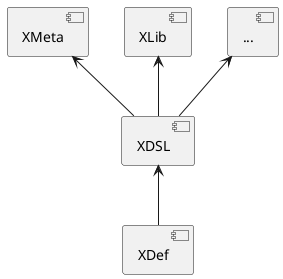

import DocCardList from '@theme/DocCardList';

XLang 是面向 DSL 的语言，其作用是为 DSL 提供底层的**Delta 差量运算**支持。

在 XLang 之上设计和构建的 DSL 是分层的，不同层级的 DSL 所描述的是不同领域的问题，
并且上层 DSL 是底层 DSL 之上的更高层级的抽象：

```plantuml
@startuml
component "XDef" as xdef
component "XDSL" as xdsl
component "XMeta" as xmeta
component "XLib" as xlib
component "..." as other

xdef -up-> xdsl
xdsl -up-> other
xdsl -up-> xlib
xdsl -up-> xmeta

@enduml
```

<DocCardList />
